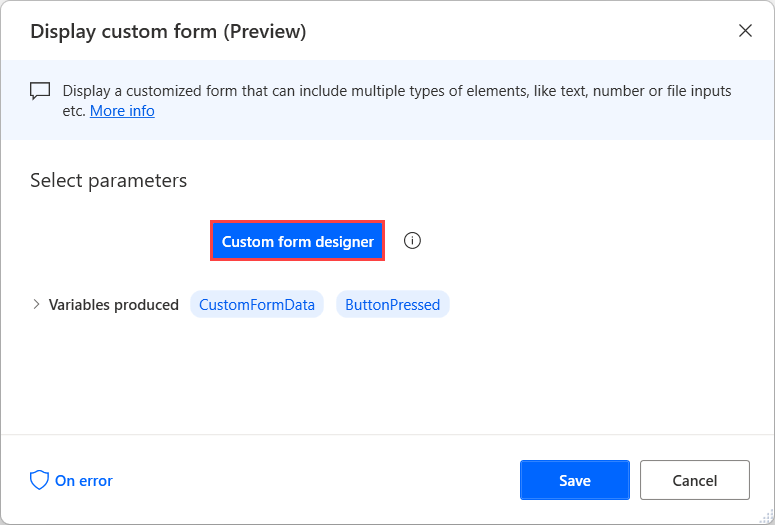
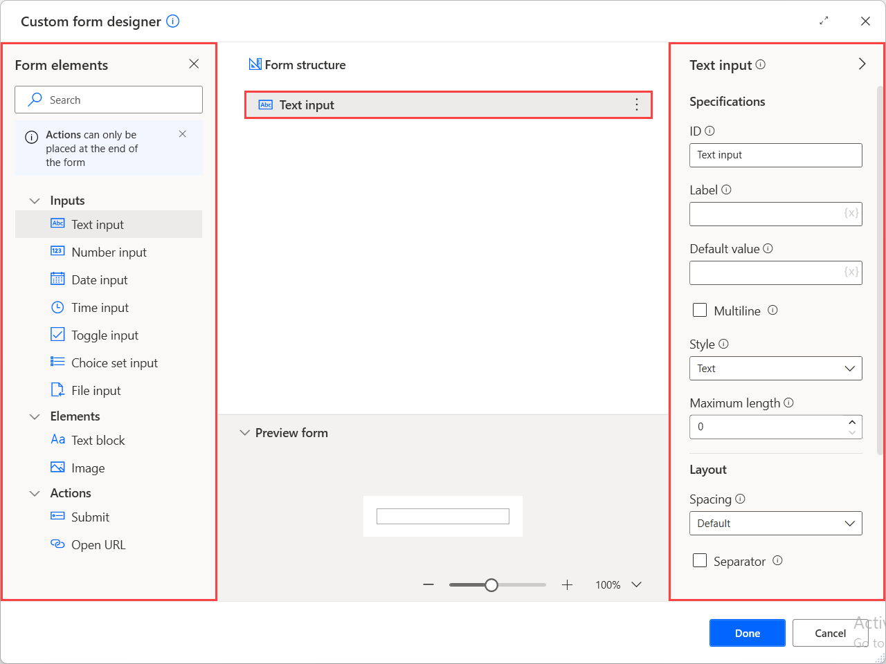
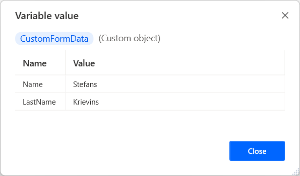
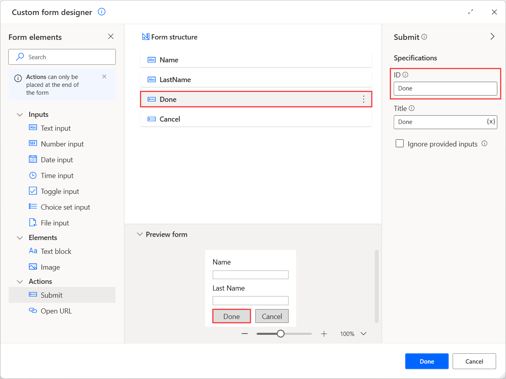
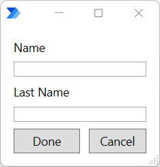

# Create custom forms

> [!NOTE]
> The **Display custom form** action is based on the Adaptive Cards technology. Refer to [this page](https://adaptivecards.io/) to find more information regarding Adaptive Cards. 

Message boxes enable you to prompt users to enter various inputs, such as text, dates, and files, or display information and results on the screen.

Although most actions of this group can handle scenarios where a single input is required, some automations may require a combination of inputs or/and outputs. The best approach to address these scenarios is the **Display custom form** action.

To create a custom form, deploy the **Display custom form** action and select the **Custom form designer** button to open the form designer.

On the left side of the designer, there's a list with all the [available input elements](#custom-form-elements) you can add to the form, such as text, date, and file inputs, and some non-interactive elements, such as texts and images. 

To add an element to the custom form, double-click it or drag and drop it in the designer's workspace area. Use the preview pane on the bottom part of the form designer to see how the configured form will look during runtime. 

After adding an element, you can handle all the [available properties](#custom-form-element-properties) on the right side of the form designer. The available properties may differ depending on the nature of the selected element. 

> [!NOTE]
> Apart from the form elements, the form designer provides some properties to configure the appearance of the parent dialog of the custom form. To configure them, select an empty space on the workspace and see the available properties on the respective pane. 

When a user populates a custom form, the provided data are stored into the **CustomFormData** custom object variable. To access the value of a specific input element stored in the custom object, use the following notation: **%CustomFormData['ElementID']%**.

> [!IMPORTANT]
> The ID of each element must be unique and can't be empty. Also, it must start with a letter and can contain Latin letters, numbers and spaces. You can't use variables in ID fields. If an invalid ID is provided, the last used valid ID will be automatically restored after closing and saving the form designer.

> [!NOTE]
> You can find more information regarding custom objects and how to handle them in [Advanced data types](variable-data-types.md#advanced-data-types).

Apart from input and non-interactive elements, the form designer provides some actions to implement additional functionality in your forms.

Consider actions as buttons that allow you to run different functions based on which button was pressed. For example, use a **Submit** action as a save button to gather and store the provided user data for later use in your flow.

> [!NOTE]
> Actions can be added only at the end of the form structure, after any other type of form element. 

Like the other elements, each action has an ID that describes it uniquely. When an action is selected, its ID is stored into the **ButtonPressed** variable. 

When a form contains multiple actions, use this variable and [conditionals](use-conditionals.md) to check which one is pressed and implement different functionality for each scenario. To find more information on implementing this behavior, refer to [Handle custom forms](how-to/handle-custom-forms.md).  

The following screenshot shows how the previously configured custom form looks when the flow runs. 

## Custom form elements

| Element name     | Type    | Specifications                                                 | Layout properties               | Validaiton properties              | Style properties | Background image |
| -----------------| ------- | -------------------------------------------------------------- | ------------------------------- | ---------------------------------- | ---| ------ |
| Custom form      | Parent dialog | Title | Minimum height in pixels, Vertical content alignment ||| URL, Fill mode, Horizontal alignment, Vertical alignment |
| Text input       | Input   | ID, Label, Default value, Multiline, Style, Maximum length     | Spacing, Separator, Height      | Validation required, Error message, Pattern | | |
| Number input     | Input   | ID, Label, Default value, Minimum value, Maximum value         | Spacing, Separator, Height      | Validation required, Error message | | |
| Date input       | Input   | ID, Label, Default value, Minimum value, Maximum value         | Spacing, Separator, Height      | Validation required, Error message | | |
| Time input       | Input   | ID, Label, Default value, Minimum value, Maximum value         | Spacing, Separator, Height      | Validation required, Error message | | |
| Toggle input     | Input   | ID, Label, Title, Default value, Value when on, Value when off | Spacing, Separator, Height Wrap | Validation required, Error message | | |
| Choice set input | Input   | ID, Label, Default value, Allow multiple selection, Style, Choices | Spacing, Separator, Height, Wrap | Validation required, Error message | | |
| File input       | Input   | ID, Label, Default value                                       | Spacing, Separator, Height | Validation required, Error message      | | |
| Text block       | Element | ID, Text | Spacing, Separator, Horizontal alignment, Height, Wrap, Maximum lines, Maximum width | | Font type, Size, Weight, Color, Subtle, Italic, Strikethrough | |
| Image            | Element | ID, URL, Alternative text | Spacing, Separator, Horizontal alignment, Height, Height in pixels, Width in pixels, Size | | Style, Background color | |
| Submit           | Action  | ID, Title, Ignore provided inputs | | | | |
| Open URL         | Action  | ID, Title, URL | | | | |

## Custom form element properties

| Property name | Optional | Accepts | Default | Description |
| -------------------| -------- | --------| ------- | ------------|
| Allow multiple selection | N/A | Boolean value | False | Allows multiple choices to be selected |
| Alternative text | Yes | Text value || Alternative text describing the image |
| Background color | Yes | Text value || Applies a background to a transparent image. This property will respect the image style. Only hex values are acceptable in this property | 
| Choices | Yes | Title and Value || Describes choices for use in the choice set. Consists of a title (text to display) and a value (raw value for the choice) |
| Color | N/A | Default, Dark, Light, Accent, Good, Warning, Attention | Default | Controls the color of text |
| Default value | Yes | Text value, Numeric value || The default value of the input element |
| Error message | Yes | Text value || Error message to display when entered input is invalid |
| Fill mode | N/A | Cover, Repeat horizontally, Repeat vertically, Repeat | | Describes how the image should fill the area |
| Font type | N/A | Default, Monospace | Default | Type of font to use for rendering |
| Height | N/A | Auto, Stretch, Pixels | Auto | Specifies the height of the element. The 'Pixels' option is available only for image elements |
| Height in pixels | No | Numeric value | 0 | Specifies the desired height of the image. The image will distort to fit that exact height. This overrides the 'Size' property. The default value of 0 determines that no particular height is specified |
| Horizontal alignment | N/A | Left, Center, Right | Text block: Left   Image: Left| Controls how this element is horizontally positioned. For custom forms, it describes how the background image should be aligned if it must be cropped or if using repeat fill mode |
| ID | No | Text value | Depends on the element | Unique identifier for the value. Used to identify collected input when the Submit action is performed. If an invalid ID is temporarily used and the form designer is closed, the last valid ID used will apply |
| Ignore provided inputs | N/A | Boolean value | False | If enabled, this action closes the form without storing the selected inputs, operating as a Cancel button |
| Italic | N/A | Boolean value | False | If enabled, italicizes the text |
| Label | Yes | Text value | | Label for this input |
| Maximum length | No | Numeric value | 0 | Specifies the maximum number of characters to collect. The default value of 0 determines that no maximum length is specified|
| Maximum lines | No | Numeric value | 0 | Specifies the maximum number of lines to display. The default value of 0 determines that no maximum lines are specified |
| Maximum value | Yes | Text value || Hint of maximum value. For date and time inputs, the value must be expressed in your machine's regional format |
| Maximum width | No | Numeric value | 0 | Specifies the maximum width of the text block in pixels. The default value of 0 determines that no maximum width is specified|
| Minimum height in pixels | No | Numeric value | 0 | Specifies the minimum height of the form. The default value of 0 determines that no minimum height is specified |
| Minimum value | Yes | Text value || Hint of minimum value. For date and time inputs, the value must be expressed in your machine's regional format |
| Multiline | N/A | Boolean value | False | If enabled, allows multiple lines of input |
| Pattern | Yes | Text value || Regular expression indicating the required format of this text input |
| Separator | N/A | Boolean value | False | When enabled, draws a separating line at the top of the element |
| Size | N/A | Text block: Default, Small, Medium, Large, Extra large   Image: Auto, Stretch, Small, Medium, Large |Text block: Default   Image: Auto | Controls the size of the text or image |
| Spacing | N/A | Default, None, Small, Medium, Large, Extra large, Padding | Default | Controls the amount of spacing between this element and the preceding element |
| Strikethrough | N/A | Boolean value | False | If enabled, crosses out the text |
| Style | N/A | Text input: Text, Tel, URL, Email   Choice set input: Compact, Expanded   Image: Default, Person | Text input: Text   Choice set input: Compact   Image: Default | The style of the text hint, choice set or image |
| Subtle | N/A | Boolean value | False | If enabled, displays text slightly toned down to appear less prominent |
| Text | Yes | Text value | New text block | Text to display |
| Title | Yes | Text value | Toggle input: New toggle input   Submit: OK | Title for the custom form or toggle or label for the button that represents this action |
| URL | Yes | Text value | | The URL of the image (for image element and custom form) or the URL to open (for Open URL action) |
| Validation required | Yes | Boolean value | False | Determines whether this input is required or not |
| Value when off | Yes | Text value | False | The value when the toggle is off |
| Value when on | Yes | Text value | True | The value when the toggle is on |
| Vertical alignment | N/A | Top, Center, Botton | | Describes how the image should be aligned if it must be cropped or if using repeat fill mode |
| Vertical content alignment | N/A | Top, Center Bottom | Top | Defines how the content should be aligned verically within the container. Only relevant for fixed-height forms, or forms with a minimum height specified | 
| Weight | N/A | Default, Lighter, Bolder | Default | Controls the weight of text |
| Width in pixels | No | Numeric value | 0 | The desired on-screen width of the image. This overrides the 'Size' property. The default value of 0 determines that no particular width is specified |
| Wrap | N/A | Boolean value | False | If enabled, allows text to wrap. Otherwise, text is clipped |

## Known issues and limitations 

- **Issue:** The preview pane seems to work as expected when the URL property contains percentage characters, but an **Invalid value** validation error occurs. 

 - **Workaround:** This issue happens because Power Automate attempts to resolve the percentage characters as variables or expressions. To resolve this case, store the URL in a variable earlier in the flow, [escape the percentage characters](variable-manipulation.md), and then use that variable in the URL property. The preview won't show the image, but it will be shown during runtime. 
