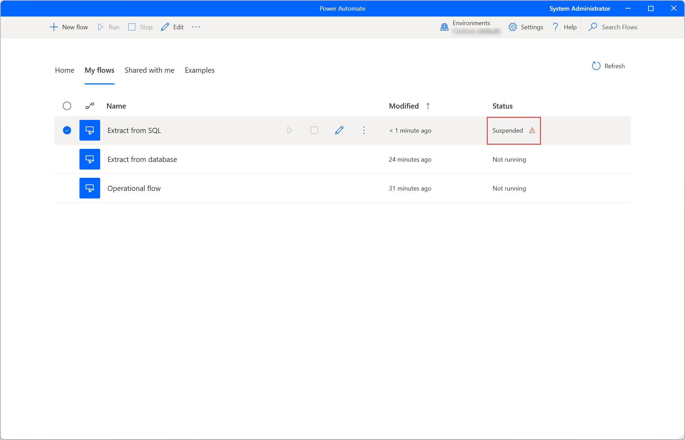
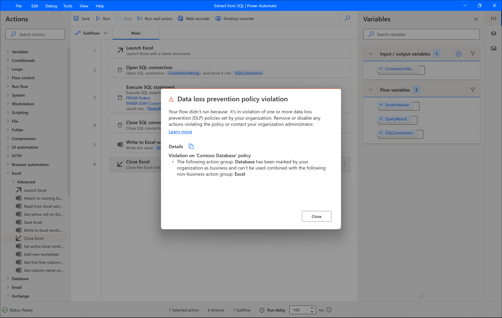
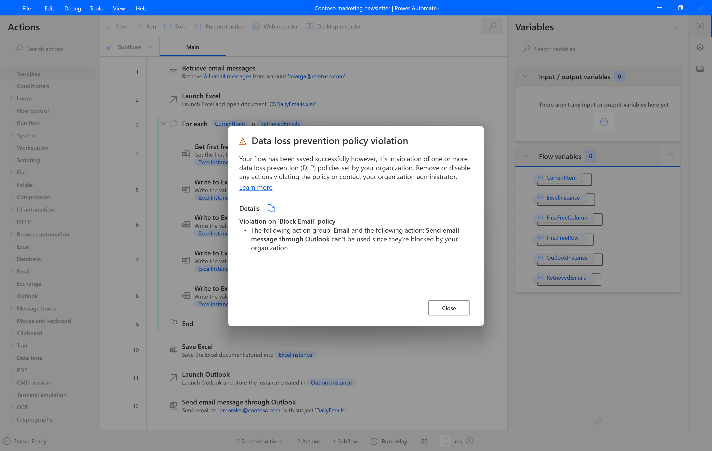
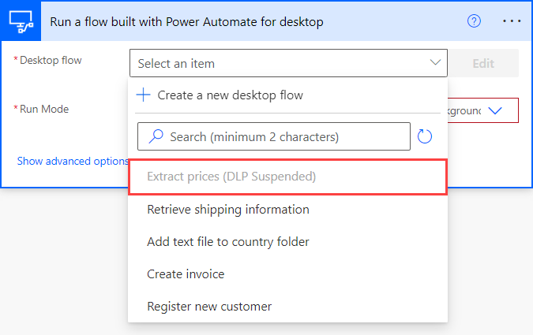

# Data loss prevention (DLP) policies (preview)
[!INCLUDE [cc-beta-prerelease-disclaimer](../includes/cc-beta-prerelease-disclaimer.md)]

Power Automate offers to administrators the option to create and enforce policies that classify desktop flows action groups as business or non-business and mark actions or action groups as blocked. That way a non-business action can't be combined with an action that has been marked as business so that to avoid data exposure outside the organization. For more details on how to form a data loss prevention (DLP) policy policy, visit the [respective topic](/power-platform/prevent-data-loss.md) under the Administer Power Platform documentation.
 
This feature will be rolling out to all cloud regions based on the following schedule.See when will the feature be fully enabled in your region in the table below. 

|Date| Available in regions|
|----|----|
|11/1|Canada|
|12/9|Switzerland , Brazil, Canada|
|12/13|Asia, UK, Australia, Japan |
|12/16 |Europe |
|12/20 |US(NAM) |
|12/22 |Government Community Cloud (GCC), Government Community Cloud - High (GCC High), Department of Defense (DoD), or China regions |

## Troubleshoot data loss prevention (DLP) policies violations

While saving a desktop flow you will be notified about the data loss prevention violations the flow includes. The same will occur while attempting to run the flow from the designer and the console. A desktop flow that violates a data loss prevention (DLP) policy will be marked as suspended and the run option will be disabled.

   

To resolve a violation navigate to the designer and delete or disable the actions causing this error.

## Business vs non-business data loss prevention policy

The business vs non-business data loss prevention policy, prevents users to use actions from the two categories on the same flow. 

For example, the flow that appears below contains the **Open SQL connection**, **Execute SQL statement** and **Close SQL connection** actions which belong to the Database actions group and the **Launch Excel**, **Write to Excel** and **Close Excel** actions that belongs to the Excel actions group. Thus it receives an error as the Database group of actions are marked as business while the Excel group is marked as non-business. 

To resolve this data loss prevention policy (DLP) violation, delete or disable actions from one of the two groups.

   

## Blocked actions and action groups data loss prevention policy

Apart from marking action groups as business and non-business, the administrator can mark action groups or particular actions as blocked. In this case these actions can't be used at all in the flow. 

In the example shown below the Email group of actions and the Send email through Outlook actions are marked as blocked.

To resolve this data loss prevention policy (DLP) violation, delete or disable all actions that are marked as blocked.

   

>[!NOTE]
>- In case a flow calls other flows using the **Run desktop flow** action, the dependent flows are not being evaluated for data loss prevention (DLP) violations. 
>- If the suspended desktop flow was used in a cloud flow, this cloud flow will be also marked as suspended. Once you have fixed the violations on your desktop flow, make sure that all your cloud flows appear on again.

>[!IMPORTANT]
>For cases that a desktop flow is suspended, it won't be able to run it. Similarly, a cloud flow using a suspend desktop flow won't be able to run either.

## Making use of suspended desktop flows in cloud flows

A suspended desktop flows due to data loss prevention (DLP) prevention policies violations won't be available to be selected. 

   

To be able to launch the desktop flow from a cloud flow, edit the desktop flow in the desktop designer and resolve the DLP violations.You will then be able to select again the desktop flow to run.

>[!IMPORTANT]
> In case a data loss prevention (DLP) policy rule is set to a desktop flow after it has been used in a cloud flow, there won't be any notification and the cloud flow will error out at that step. In case a desktop flow violates any rules and you correct it you will need to go back to the cloud flow and reselect it from the list.
