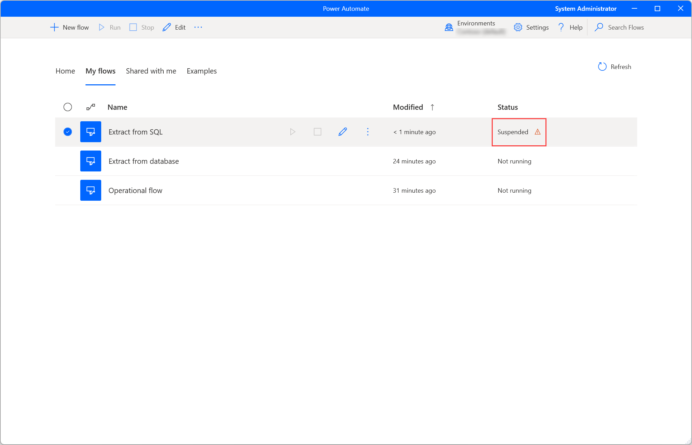
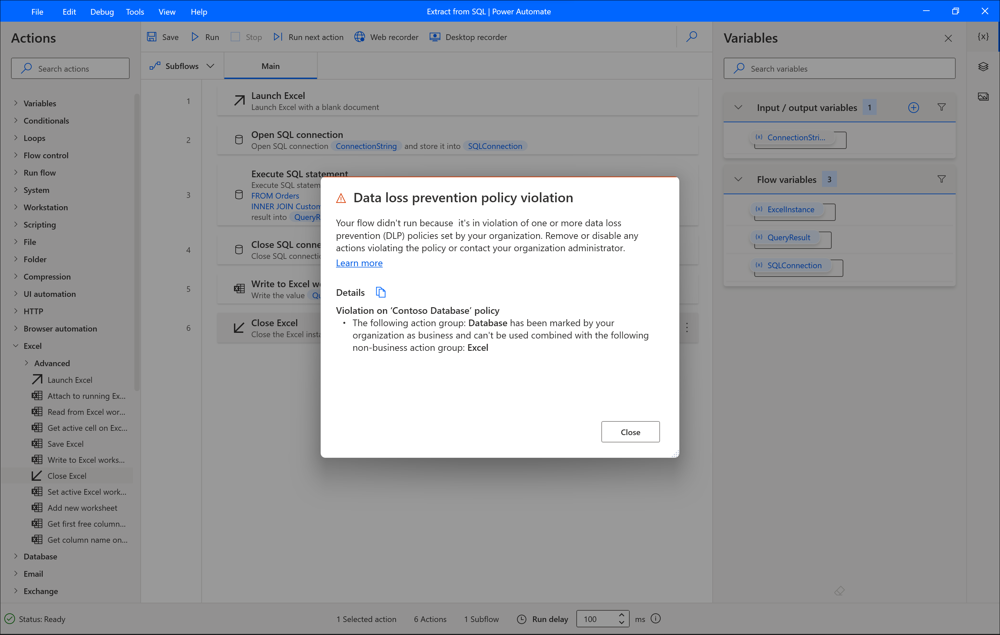
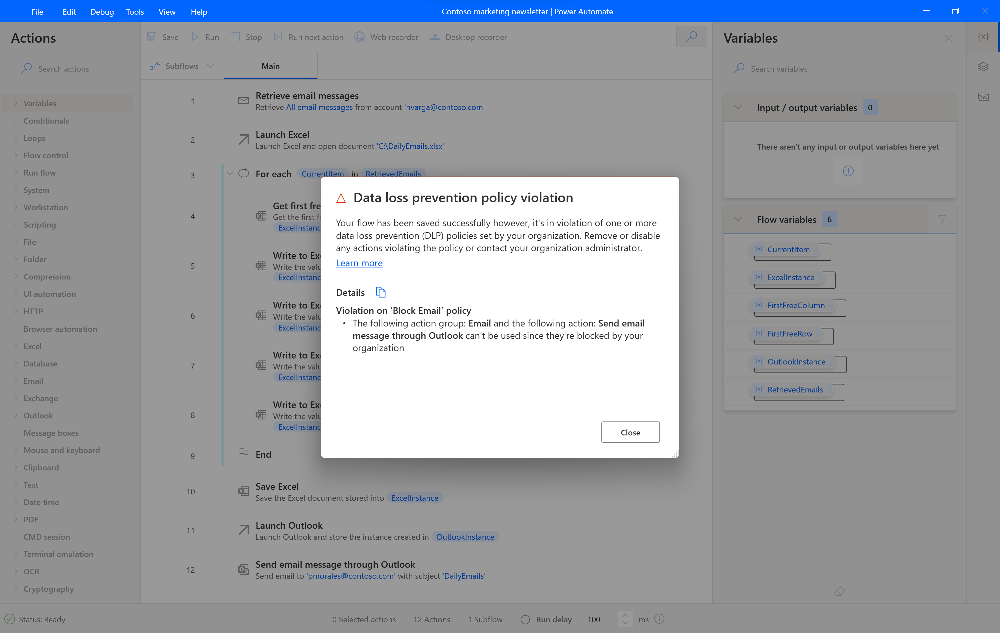
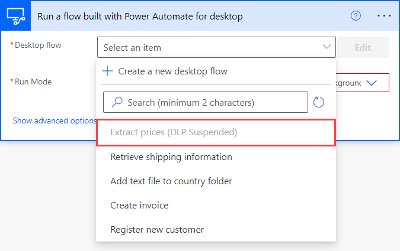

# Data loss prevention (DLP) policies

Power Automate offers administrators the option to create and enforce policies that classify desktop flows action groups as business or non-business and mark actions or action groups as blocked. That way a non-business action can't be combined with an action that has been marked as business, avoiding data exposure outside the organization. For more information about how to form a data loss prevention (DLP) policy, visit the [respective topic](../prevent-data-loss.md) under the Administer Power Platform documentation.

## Troubleshoot data loss prevention (DLP) policy violations

While saving a desktop flow, you'll be notified about the data loss prevention violations the flow includes. The same will occur while attempting to run the flow from the designer and the console. A desktop flow that violates a data loss prevention (DLP) policy will be marked as suspended and the run option will be disabled.

   

To resolve a violation, go to the designer and delete or disable the actions causing this error.

## Business vs. non-business data loss prevention policy

The business vs. non-business data loss prevention policy prevents users from using actions from the two categories on the same flow.

For example, the flow that appears below contains the **Open SQL connection**, **Execute SQL statement**, and **Close SQL connection** actions, which belong to the Database actions group. It also contains the **Launch Excel**, **Write to Excel**, and **Close Excel** actions that belong to the Excel actions group. Thus, it receives an error as the Database group of actions are marked as business, while the Excel group is marked as non-business.  

To resolve this data loss prevention policy (DLP) violation, delete or disable actions from one of the two groups.

   

## Blocked actions and action groups data loss prevention policy

Apart from marking action groups as business and non-business, the administrator can mark action groups or particular actions as blocked. In this case, these actions can't be used at all in the flow. 

In the following example, the **Email** group of actions and the **Send email through Outlook** actions are marked as blocked.

To resolve this data loss prevention policy (DLP) violation, delete or disable all actions that are marked as blocked.

   

>[!NOTE]
>
>- In case a flow calls other flows using the **Run desktop flow** action, the dependent flows aren't being evaluated for data loss prevention (DLP) violations. 
>- If the suspended desktop flow was used in a cloud flow, this cloud flow will also be marked as suspended. Once you have fixed the violations on your desktop flow, make sure that all your cloud flows appear on again.

>[!IMPORTANT]
>For cases that a desktop flow is suspended, it won't be able to run it. Similarly, a cloud flow using a suspend desktop flow won't be able to run either.

## Making use of suspended desktop flows in cloud flows

A suspended desktop flows due to data loss prevention (DLP) prevention policies violations won't be available to be selected. 

   

To be able to launch the desktop flow from a cloud flow, edit the desktop flow in the desktop designer and resolve the DLP violations. You'll then be able to select again the desktop flow to run.

>[!IMPORTANT]
> In case a data loss prevention (DLP) policy rule is set to a desktop flow after it has been used in a cloud flow, there won't be any notification and the cloud flow will error out at that step. In case a desktop flow violates any rules and you correct it you'll need to go back to the cloud flow and reselect it from the list.

## Endpoint filtering in desktop flows

Power Automate for desktop supports endpoint filtering for both browser automation and desktop UI automation. This feature enhances control, security, and compliance across desktop flows.

### Browser automation endpoint filtering

This feature improves control and security by specifying which web pages a desktop flow can access during execution. It's implemented in the **Launch Web Browser** and **Go to web page** actions. Each web page request is validated against predefined endpoint criteria before the flow proceeds with browser interactions. You define endpoints by using a URL format or web page name, and wildcards are supported for dynamic matching. This feature helps maintain compliance with organizational policies and reduces the risk of accessing unwanted or harmful content.

For more information about browser automation endpoint filtering, see [Connector endpoint filtering](/power-platform/admin/connector-endpoint-filtering#desktopflow---browser-automation).

### Desktop UI automation filtering

This feature lets you specify which applications and screens a desktop flow can interact with in Power Automate for desktop. You define endpoints by using the application's process name. For processes named `ApplicationFrameHost`, `java`, or `javaw`, which typically represent UWP or Java applications where multiple instances can share the same name, Power Automate for desktop uses both the process name and the window display name to ensure precise targeting. Wildcards are supported for flexible matching. Validation is performed on any action within the UI automation group by checking the Process and/or Name attributes in the selector of the targeted screen, which is usually the parent of the relevant UI element, to determine whether interaction is permitted.

For more information about UI automation endpoint filtering, see [Connector endpoint filtering](/power-platform/admin/connector-endpoint-filtering#desktopflow---UI-automation).

### HTTP filtering
This feature improves control and security by specifying which endpoints a desktop flow can access when using HTTP actions during execution. Each HTTP request is validated against predefined endpoint criteria before the flow proceeds. Endpoints are defined using a URL format, and wildcards are supported for dynamic matching. Validation occurs at runtime when an HTTP action is executed. This feature helps maintain compliance with organizational policies and reduces the risk of sending requests to unauthorized or harmful endpoints. Learn more about endpoint filtering in [Connector endpoint filtering](/power-platform/admin/connector-endpoint-filtering#desktopflow---HTTP).

### Related information

- [Learn more about Power Automate DLP](../prevent-data-loss.md)
- [Learn more about DLP policies](/power-platform/admin/wp-data-loss-prevention)
