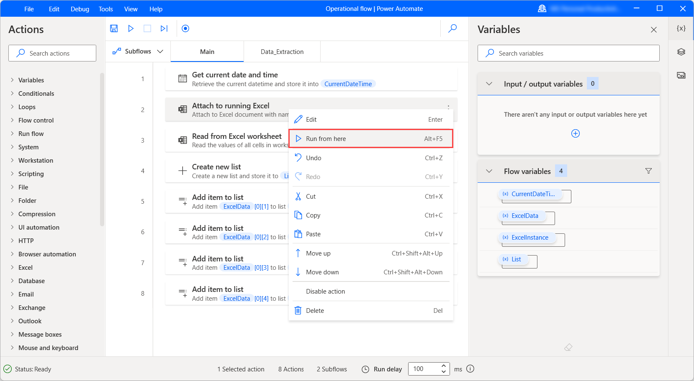

# Debug a desktop flow

It is common to have to debug flows in case there are any changes in the system or if a desktop flow cannot run because it contains errors. 
<!--note from editor: It would be good to link to the topics about these things. -->

Debug a desktop flow using the following tools:
* [Errors Pane](errors.md)
* [Breakpoints](#adding-breakpoints)
* [Run flow action by action](#run-a-desktop-flow-by-action)
* [Set the Run delay](#the-status-bar)

## Run, stop, and pause in flow designer

Select **Run** or press **F5** to run the flow. When the flow runs, **Run** becomes **Pause**. Select **Pause** or press **Ctrl + Pause** while the flow is running to pause and inspect any changes up to that point. Select **Run** while the flow is paused to resume it. The **Run next action** button and the **F10** shortcut run the flow action by action and pause it after each action completes. The **Stop** button and the **Shift + F5** shortcut stop the flow completely.

## Adding breakpoints

Click to the left of the running order number in the workspace to place a breakpoint in the flow, which appears as a red dot. Add a breakpoint to specify at which action to pause the flow. Resume running the flow by selecting **Run** or **Run next action**. Select the breakpoint to remove it.

## Run a desktop flow by action

The **Run next action** button runs the flow action by action. After each action is completed, the flow is paused. Open the variables pane to check the value of any variable at the point where it's paused. This feature is useful for debugging.

## The status bar

The status bar on the bottom of the window shows the status of the flow and the number of the selected actions. Additionally, it shows the total number of actions and subflows in the current flow. 

The **Run delay** field defines the time that the flow waits after running each action in the flow designer. You can modify the default value to increase or decrease the milliseconds that the flow waits.

The status bar also displays the number of errors, if any are present. Select the **Errors** option to pop up the **Errors pane**. 

If you search inside the flow, the status bar shows an additional field containing the number of the results. Select this field to pop up the **Find in code** pane.

## Run from here

To run the flow starting from a specific action, right-click the action and select **Run from here**. This ignores all previous actions and runs the flow from the selected action onwards.

## Power Automate reserved keywords

A certain amount of words are being used in the core of Power Automate and can't be used during development in the variable, subflow, label or error block names.
The list of these words is displayed below.

A - E|F - J|K - R|S - Z
----|-----|-----|-----
action | FALSE | label | set
and | for | loop | step
block | foreach | main | switch
call | from | mod | then
case | function | next | throw
default | global | no | times
disable | goto | not | to
else | if | on | TRUE
end | in | or | wait
error | input | output | while
exit |  | repeat | xor
|  |  |  | yes

[!INCLUDE[footer-include](../includes/footer-banner.md)]
