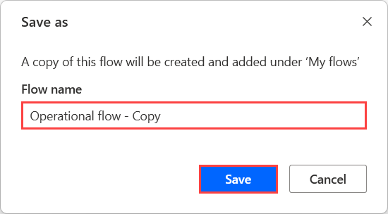
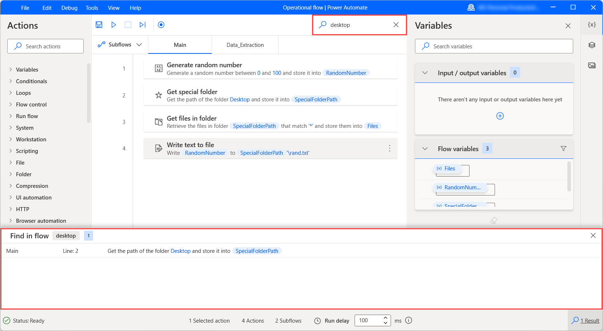

# Manage the flow designer workspace

The central pane of the flow designer is called the workspace. Workspace is the component where the series of actions that make up the flow is assembled:

During development, users can add, edit, and delete actions in the workspace.

Drag actions to rearrange them and change the order in which they run. Right-click an action and select **Enable action** or **Disable action** to enable or disable an action respectively; while running, the flow skips any disabled actions.

Copy and paste any selected actions in the workspace. You can copy and paste actions within the same subflow, among different subflows, or other open instances of flow designer.

## Setting up subflows

Subflows are groups of actions, which can be referenced as a group within a desktop flow.

Every flow contains the **Main** subflow that runs when a desktop flow starts. Any other subflows can be invoked through the **Run subflow** action:

Additionally, this action supports dynamic expressions through the toggle parameter, allowing you to use variables and dynamically invoke the corresponding subflow at runtime.

Subflows are shown in tabs, directly over the main workspace. To add a new subflow, select the subflows tab, select **+**, and enter the subflow name.

Select a subflow tab to edit the respective subflow.

### Organizing subflows

When there are dozens of subflows within your flow, you might need to reorganize or reorder your subflows in an order that makes more sense to you for flow navigation purposes.

The default sorting option follows the subflows creation original ascending order. Alternatively, you can switch to descending order, or you can instead sort by name, so that your subflows are sorted alphabetically (in ascending or descending order).

You can use a custom order for your subflows, manually reordering them in any order you'd like. Keep in mind that the **Main** subflow always remains on top of your subflows list and can't be moved.

## Saving flows

To save a flow, select **File** in the flow designer's menu bar and then pick **Save**. Alternatively, you can press the keyboard shortcut <kbd>Ctrl</kbd> + <kbd>S</kbd>.

To save the flow's current state as a new flow, select **Save as** in the **File** menu and populate a name for the new flow in the displayed dialog.

## Managing the workspace toolbar

Drag actions to rearrange them and change the order in which they run. Right-click an action and select **Enable action** or **Disable action** to enable or disable an action respectively. While a flow is running, the flow skips any disabled actions.

To select multiple actions, hold down <kbd>Ctrl</kbd>. To select multiple actions, hold down <kbd>Shift</kbd>, and select the first and last actions. Copy and paste any selected actions in the workspace.

When you copy actions, all their parameters, images, and UI elements are copied as well. You can copy and paste actions within the same subflow, among different subflows, or other flow designer instances. Apart from flows, you can paste actions in other applications in a text format, such as a text editor, to share flows' sections with others.

> [!NOTE]
> As the underlying schema of an action or the UI elements or images repository might change from one version of Power Automate for desktop to another, make sure when copying flows's sections that the source and target flow designers are on the same version. If the schema is updated on a new version and a different version's flow contents are pasted, the action or the associated UI elements or images might not be recognized.

## Searching in the flow

To search for a text string, an action or variable within the flow, use the search field at the top right of the flow designer window. You can also select <kbd>CTRL</kbd> + <kbd>F</kbd> to focus on the search field. The results pane shows all occurrences of text string by action and subflow. Double-click on a result to highlight the action that contains it.

## Using the Go to line option

The **Go to line** function navigates to a specific line within the current subflow. It can be helpful in subflows that contain a large number of actions.

Select **Edit**, then **Go to line** and enter a line. The corresponding action is highlighted.

## Using the Run from here option

To run the flow starting from a specific action, right-click the action and select **Run from here**. Power Automate ignores all the previous actions and runs the flow from the selected action onwards.

> [!NOTE]
> The **Run from here** option isn't available for actions located in loops, conditionals, or the **On block error** action.

## Record desktop flows

Power Automate enables you to record desktop flows in real time through the built-in recorder. The recorder keeps track of mouse and keyboard activity in relation to UI elements, and records each action separately. The recorder can be used to automate desktop and web applications.

To record a flow, select **Recorder** in the toolbar of the flow designer. When the recorder dialog is launched, select **Record** to start recording. To suspend the recording, select **Pause**. To add a comment to the recorded actions, select **Add a comment**.

Select the bin icon to remove individual actions, or select **Reset** to delete all the actions recorded so far. When the recording is completed, select **Done** to convert the recorded steps to desktop flow actions.

You can find more information regarding the built-in recorder in [Record desktop flows](recording-flow.md).

[!INCLUDE[footer-include](../includes/footer-banner.md)]
