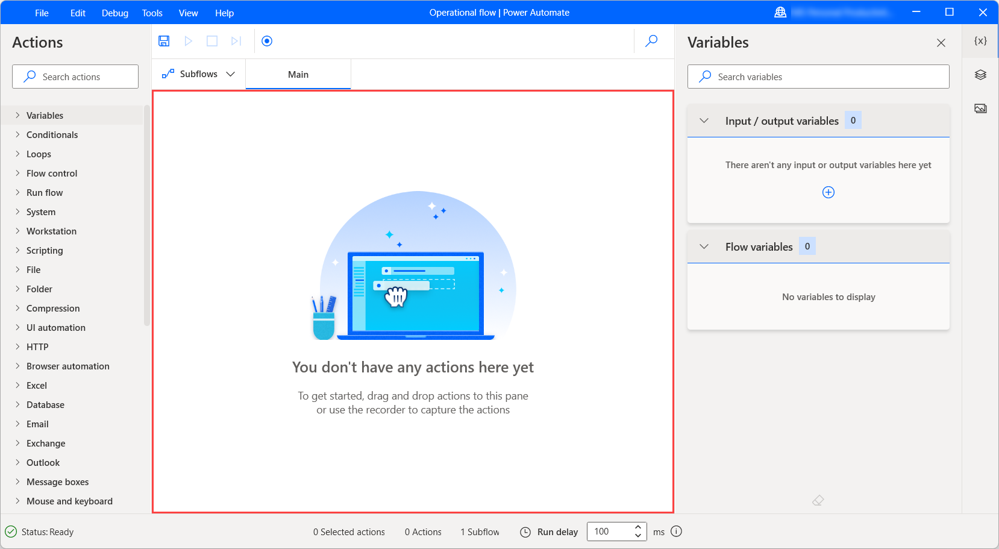

# Manage the flow designer workspace

The central pane of the flow designer is called the workspace. Here is where the series of actions that make up the flow is assembled:

During development, users may add, edit, and delete actions in the workspace.

Drag actions to rearrange them and change the order in which they run. Right-click an action and select **Enable action** or **Disable action** to enable or disable an action respectively; while running, the flow skips any disabled actions.

Copy and paste any selected actions in the workspace. This can be done within the same subflow, among different subflows, or other open instances of flow designer.

## Setting up subflows

Subflows are groups of actions, which may be referenced as a group within a desktop flow.

Every flow contains the **Main** subflow - this is the subflow that is run when a desktop flow starts. Any other subflows may be invoked through the **Run subflow** action:

Subflows are shown in tabs, directly over the main workspace. To add a new subflow, select the subflows tab, select **+**, and enter the subflow name.

Select a subflow tab to edit the respective subflow.

## Saving flows

To save a flow, select **File** in the flow designer's menu bar and then pick **Save**. Alternatively, you can press the keyboard shortcut **Ctrl +S**.

To save the flow's current state as a new flow, select **Save as** in the **File** menu and populate a name for the new flow in the displayed dialog.

## Managing the workspace toolbar

Drag actions to rearrange them and change the order in which they run. Right-click an action and select **Enable action** or **Disable action** to enable or disable an action respectively. While running, the flow skips any disabled actions.

Hold down **Ctrl** to select multiple actions. Hold down **Shift** and select the first and last actions to select a range of actions. Copy and paste any selected actions in the workspace. 

When copying actions, all their parameters, images, and UI elements are copied as well. You can copy and paste actions within the same subflow, among different subflows, or other flow designer instances. Apart from flows, you can paste actions in other applications, such as text files or chats to share flows' sections with others.

> [!NOTE]
> As an action might change from one Power Automate for desktop to another, make sure when copying flows that they are on the same version. If an action is changed and a different versions' flow is pasted, the action might not be recognized.

## Searching in the flow

To search for a text string, an action or variable within the flow, use the search field at the top right of the flow designer window. The results pane will show all occurrences of text string by action and subflow. Double-click on a result to highlight the action that contains it.

## Using the Go to line option

The Go to line function navigates to a specific line within the current subflow. This function is helpful in subflows that contain a large number of actions. 

Select **Edit**, then **Go to line** and enter a line. The corresponding action will be highlighted.

## Using the Run from here option

To run the flow starting from a specific action, right-click the action and select **Run from here**. This ignores all previous actions and runs the flow from the selected action onwards.

> [!NOTE]
> The **Run from here** option isn't available for actions located in loops, conditionals, or the **On block error** action.

## Record desktop flows

Power Automate for desktop enables you to record actions in real time through the built-in recorder. The recorder keeps track of mouse and keyboard activity in relation to UI elements, and records each action separately. The recorder can be used to automate desktop and web applications.

To record a flow, select **Recorder** in the toolbar of the flow designer. When the recorder dialog is launched, select **Record** to start recording. To suspend the recording, select **Pause**. To add a comment to the recorded actions, select **+ Comment**.

Select the bin icon to remove individual actions, or select **Reset** to delete all the actions recorded so far. When the recording is completed, select **Finish** to convert the recorded steps to Power Automate for desktop actions.

> [!NOTE]
> You can find more information regarding the built-in recorder in [Record flows in Power Automate Desktop](recording-flow.md).

[!INCLUDE[footer-include](../includes/footer-banner.md)]