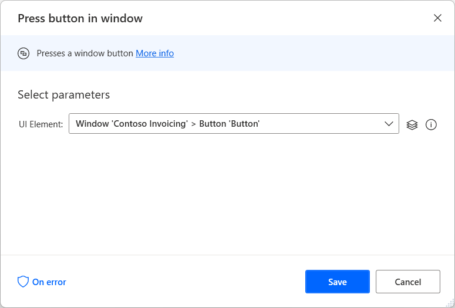

# Automate desktop applications

Power Automate offers UI automation actions to allow users to interact with Windows applications and their components by either providing input with mouse clicks and keyboard strokes or extracting data.

The actions of the Windows subcategory directly manipulate entire application windows, while form filling actions interact with more specific components, such as text fields and buttons.

UI automation actions require the window they interact with to be in the foreground, or they'll automatically bring it to the foreground.

Desktop automation can be performed by manually adding the required actions or [using the recorder](recording-flow.md). You can find a list with all the available UI automation actions in the [UI automation actions reference](actions-reference/uiautomation.md).

## Interacting with desktop applications

To identify windows and components in them, Power Automate utilizes UI elements. UI elements uniquely describe each component and can be managed through the flow designer's UI elements pane.

To configure a UI automation action, determine the specific element it will interact with.

Existing UI elements are displayed in the UI element pane, while new ones can be added directly through the action's properties or the pane. You can find more information regarding UI elements and their different types in [Automate using UI elements](ui-elements.md).

> [!NOTE]
> UI automation actions accept exclusively desktop UI elements. Therefore, UI elements captured from web applications using the UI elements pane aren't displayed in the UI automation actions.
>
>Users can capture elements from web pages through the UI element picker of UI automation actions. However, their selectors will represent desktop elements, not web elements.

To add a new UI element, highlight the appropriate element and press **Ctrl + Left click**. After adding all the elements, select **Done** to save them.

To extract a piece of data from an application window, such as its title, location, or size, use the **Get details of window** action.

On the other hand, to extract data from specific components within a window, use the **Get details of a UI element in window** action.

[!INCLUDE[footer-include](../includes/footer-banner.md)]
