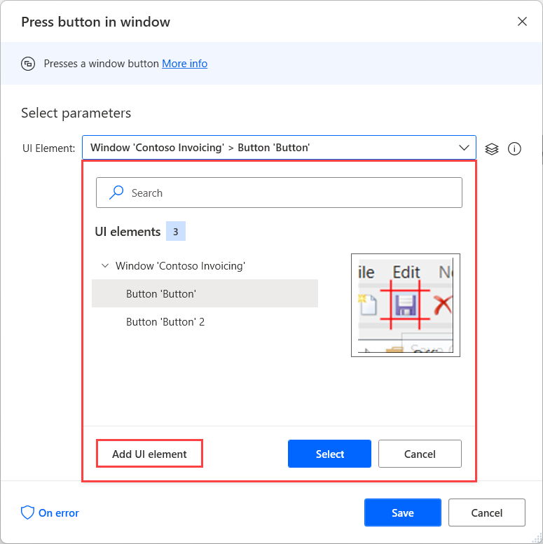
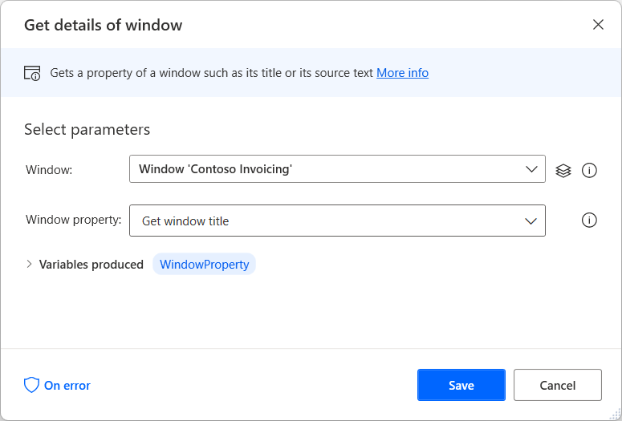
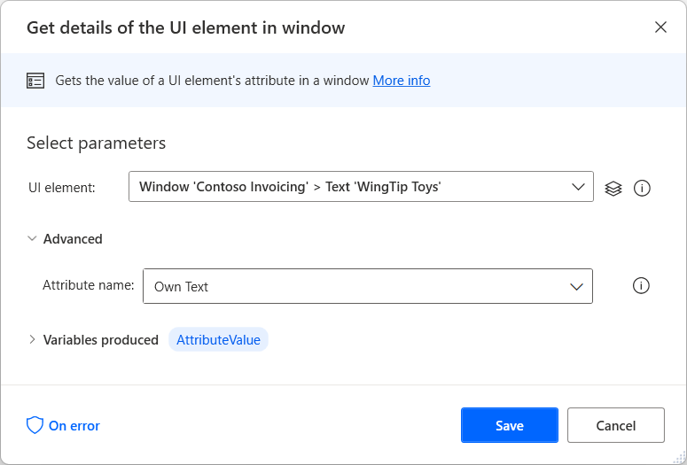

# Automate desktop flows

The flow designer includes the **UI automation** group of actions, which manipulate Windows applications and elements, by either providing input or extracting data.

Actions in the **Windows** subcategory directly manipulate entire UI windows, while **Form Filling** actions interact with more specific elements, such as text fields and buttons.

Desktop automation can be performed by either manually adding the required actions, or using the Desktop recorder.

## Interacting with desktop applications

UI automation may be performed on any UI application interface, based entirely on windows and elements in the repository.

To configure a UI action, enter the element it will interact with:

Existing UI elements may be added from the Repository, while new ones may also be added directly from the action's properties:

To add a new element, highlight it and press **Ctrl & left-click**:

After adding all the required elements, select **Done** to save them to the repository.

To extract a piece of data from a UI window, such as its title, location, or size, use the **Get details of window** action:

Alternatively, to extract data from specific elements within a window, use the **Get details of a UI element in window** action:

You'll find the list of UI automation actions available in the [Actions reference](actions-reference/uiautomation.md).

[!INCLUDE[footer-include](../includes/footer-banner.md)]