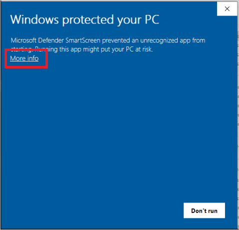
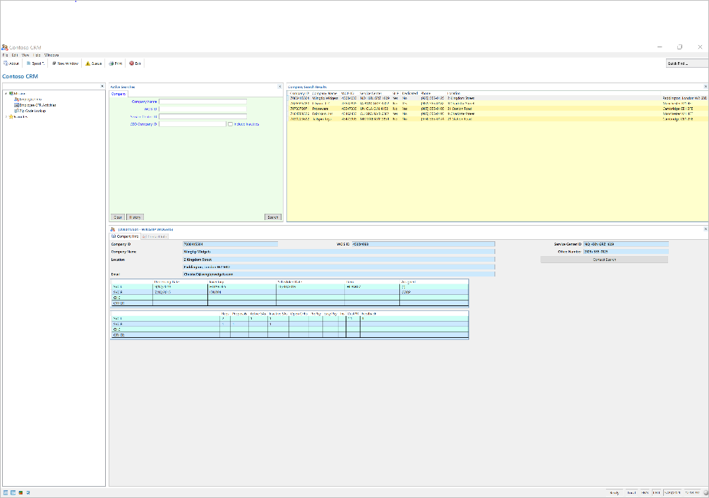

# Use RPA with Dynamics 365 Customer Service

[Dynamics 365](https://dynamics.microsoft.com/) empowers your organization to deliver operational excellence and delight every customer. To make your use of Dynamics 365 even more productive and save users time and errors, we're releasing free automation solutions that let Dynamics 365 customers automate common tasks.

This article outlines the steps you need to automate end of cycle reporting in [Dynamics 365 Customer Service](https://dynamics.microsoft.com/customer-service/overview/) and focus on higher-priority activities that require your unique creativity.

## Prerequisites

Before starting, you must prepare your environment with adequate licenses and software setup. This section provides step-by-step instructions about how to get the grounds ready.

### Software

- Install Dynamics 365 for Customer Service.

- [Install Power Automate](install.md). Power Automate will carry out the steps in Dynamics 365 as if a human were doing it in front of their computer.

- The Contoso CRM app from Microsoft. This app showcases how RPA works. You can use it as an example to build your own RPA action.

>[!IMPORTANT]
>Ensure you [get the appropriate security roles](https://go.microsoft.com/fwlink/p/?linkid=2127645) for the account that runs your automation. This account can be a dedicated one created by your admin in Microsoft Entra or an employee's account.

Use the following recommended security roles:

| **Application**                              | **Security role**                                                                                                                | **Link to documentation**                                                                                                                                                    |
|----------------------------------------------|----------------------------------------------------------------------------------------------------------------------------------|------------------------------------------------------------------------------------------------------------------------------------------------------------------------------|
| Power Platform                               | Option 1: Environment admin  Option 2: Environment maker (if the environment already has Dataverse and unattended license needed) |                                                                                                                                                                              |
| Dynamics 365 for Customer Service | D365 Customer Service administrator                                                                                              | [Enable users for Customer Service and assign roles](/dynamics365/customer-service/add-users-assign-roles) |

### Licenses

1. Get a trial license for Power Automate, if you don't have a paid license. The license you need depends on the mode in which your automations run.

   Power Automate support two modes to automate processes.

    - **Attended mode:** someone is sitting in front of their computer and watching the process run as if they were doing it manually. To run attended, users need to acquire the **Power Automate per-user license with RPA**.

    - **Unattended mode:** the process runs in the background on remote machines that users don’t see. To run unattended, users need to have acquired two licenses: **Power Automate per-user license with RPA** and the **Power Automate unattended add-on**.

    To get a trial license for **Power Automate per-user license with RPA**:

      1. Go to the Power Automate portal, navigate to **My Flows** > **Desktop flows**.
      1. Select **Start free trial now**

    Alternatively, launch Power Automate for desktop and select **Start trial** on the console on the **Premium features** dialog.

    To add a trial license for **Power Automate unattended add-on**:

      1. As an admin, you can get an RPA unattended add-on and assign it to your environment. To find more information about the RPA unattended add-on, go to [Power Automate sign-up Q&A in your organization](../organization-q-and-a.md)  

1. Get a trial license for the [Dynamics 365 for Customer Service app](https://dynamics.microsoft.com/get-started/free-trial/?appname=customerservice).

## Set up your device

Now that prerequisites are set, you are on your way to get the free solutions that automate your processes.

### Get the latest updates for your environment

1. Go to [Power Platform admin center](https://admin.powerplatform.microsoft.com), select the environment in which you're interested, and then select **Dynamics 365 apps**.

    :::image type="content" source="media/dynamics365-cs-rpa/power-platform-admin-center.png" alt-text="Screenshot of the Dynamics 365 apps option in the Power Platform admin center.":::

1. Confirm that the **Agent Productivity Tools** and **App profile manager** are updated.

    :::image type="content" source="media/dynamics365-cs-rpa/agent-productivity-tools.png" alt-text="Screenshot of the Agent Productivity Tools and App profile manager options.":::

1. If you see **Update available** for **Agent Productivity Tools** and **App profile manager**, select **Update available**.

### Install and configure Power Automate

1. Download and install Power Automate on the machine that will run the automation. You can find more information about Power Automate installation in [Install Power Automate](install.md).

1. Switch the Power Automate machine settings to the environment in which you'll install the solution.

    :::image type="content" source="media/dynamics365-cs-rpa/power-automate-machine-runtime.png" alt-text="Screenshot of the Power Automate machine runtime application.":::

1. Sign in to the [Power Automate portal](https://powerautomate.microsoft.com) to create a cloud flow with manual trigger.

    :::image type="content" source="media/dynamics365-cs-rpa/build-instant-cloud-flow-dialog.png" alt-text="Screenshot of the Build an instant cloud flow dialog.":::

1. Add the appropriate action to run desktop flows.

    :::image type="content" source="media/dynamics365-cs-rpa/run-flow-built-with-power-automate-desktop-action.png" alt-text="Screenshot of the Run a flow built with Power Automate for desktop action.":::

1. Select [**Directly to machine**](https://make.powerautomate.com/blog/connect-directly-to-machines-and-new-machine-management-for-desktop-flows/) from the list.

1. Select **Directly to machine** in the **Connect** field. Then, select the machine name on which you've installed Power Automate, and enter the machine credential (the username and password you use to sign in to the machine. To find more information about direct connectivity, see [Manage machines](manage-machines.md).

    :::image type="content" source="media/dynamics365-cs-rpa/connection-desktop-flows-action.png" alt-text="Screenshot of the connect option in Run a flow built with Power Automate for desktop action.":::

## Install and configure Contoso CRM app

1. Download the [Contoso CRM app package](https://download.microsoft.com/download/c/2/2/c22e3b45-8795-46fd-894d-ddf03b0f17cb/contoso_legancy_crm_setup.zip) on the machine where the automation runs.

1. Run **setup.exe** from the extracted package.

    The Contoso app shows you how the end-to-end automation scenario works so that you can follow the example to create your own automation.

    Select **More info** > **Run anyway** on the **Windows protected you PC** screen that appears during the installation.

   

1. When the installation is complete, run the Contoso CRM app from the Windows Start menu.

   

## Install the Dynamics 365 RPA solution

1. [Download](https://aka.ms/D365CustomerValidationRPASolution) the automation solution and save it on your machine.

1. Import the Dynamics 365 automation solution in the environment of your choice:

    1. Go to [https://powerautomate.microsoft.com](https://powerautomate.microsoft.com) and sign in using your work account.
    1. Select the environment in which you wish to work.
    1. In the vertical menu on the left of your screen, select **Solutions**.
    1. In the main bar, select **Import** then **Browse**.
    1. Navigate to the solution file you previously downloaded and double-click on it.
    1. Select **Next**.

1. Configure the connections needed to be used by the solution in the environment:

    1. For each connector the solution uses, either select an existing connection or create a new one using your Microsoft account and credentials of your choice.

    2. For the **Desktop connection** domain/username and password, ensure you use the machine's Windows credentials.

      :::image type="content" source="media/dynamics365-cs-rpa/solution-connections.png" alt-text="Screenshot of the connections that need to be configured to be used by the solution.":::

1. Go back to the tab in which you initiate the above step and select **Refresh**.

1. Select **Import**. The solution explorer shows you a message informing you that the solution is being imported. This step may take a few minutes.  

1. Open **Case entity session – default template** (or your current case entity session template), open **Agent scripts** tab, and then add **Case agent script with automation**. To find more information about session templates, go to [Manage session templates](/dynamics365/app-profile-manager/session-templates).

1. From the Dynamics 365 Customer Service app, sign in to Power Automate.

    1. From the case you're working on, select the **…** menu > **Flow**.

      :::image type="content" source="media/dynamics365-cs-rpa/d365-customer-service-app.png" alt-text="Screenshot of the Flow option in the Dynamics 365 Customer Service app.":::

1. Select **Login to Flow**.

1. Authenticate using your Dynamics 365 account.

1. Now open one of your cases using **Shift + Left Click** to launch the productivity tools panel.

   :::image type="content" source="media/dynamics365-cs-rpa/productivity-tool-panel.png" alt-text="Screenshot of the productivity tools panel.":::

1. From the **Agent Script** session in the productivity panel, you can see several agent script steps. The first step is **Run Automation to validate Customer**. Select the **Run** button and confirm it runs.

1. The automation starts on the machine where you have installed Power Automate. You can watch how the automation uses the case data, opens the Contoso CRM app, and then finishes the lookup automatically. After the automation runs, refresh the timeline to view the logs regarding the run result. Here's a demo on how it runs.

   :::image type="content" source="media/dynamics365-cs-rpa/demo.gif" alt-text="Screenshot of a demo showing the automation.":::

## Customize the automation solution

1. Now, you can start customizing the automation to meet your unique requirements. To do this, open Power Automate and select **Edit** on the **Legacy Contoso App Contact Lookup** desktop flow. You can save a copy to work on your customizations or work on the template directly.

1. Notice that there are multiple child flows. Each child flow uses the keyboard or the mouse to interact with the Contoso CRM app. You need to update the steps to interact with your legacy app.

1. After testing the desktop flow, you can save it. Now, open the cloud flow in `https://powerautomate.microsoft.com/manage/solutions` from within the solution tab -\> **Customer Service RPA solution**.

   :::image type="content" source="media/dynamics365-cs-rpa/solutions-power-automate.png" alt-text="Screenshot of the Solution tab in the Power Automate portal.":::

1. Open the cloud flow named **Automation to validate customer info** and expand each action to review. In the **Desktop flow** action, you can switch to use any desktop flow and input/output parameters. To find more information about triggering desktop flows from cloud flows, go to [Trigger desktop flows from cloud flows](trigger-desktop-flows.md).

1. Save the cloud flow. Go back to Dynamics 365 portal and trigger the agent script action to test. You'll see your customization automation running.

1. Once you finished testing, you can share the cloud flow with everyone in the organization with run-only mode and switch it to run in [unattended mode](run-unattended-desktop-flows.md). This way every agent will be able to reuse the same automation. License wise, the cloud flow should be put under a [Power Automate Process plan (previously Power Automate per flow)](/power-platform-release-plan/2019wave2/power-automate/new-licensing-options-power-automate-standalone-paid-plans#allocating-the-per-flow-plan-in-the-admin-center).

## Troubleshooting and known issues

| Known issue                                                                                            | Workaround                                                                                                                                                                                                                                                                                                      |
|--------------------------------------------------------------------------------------------------------|-----------------------------------------------------------------------------------------------------------------------------------------------------------------------------------------------------------------------------------------------------------------------------------------------------------------|
| Can't see the productivity tools panel in the Dynamics 365 customer service.                                   | Productivity tools aren't available on the home session. You need to create a new session (Shift-click on case link) to see it. Productivity tools runtime initialization is async, so wait 1 – 2 seconds on home session before creating new sessions. |
| Agent can’t see the flow                                                                               | At the first time, every agent needs to sign in to the flow from the Dynamics 365 widget.                                                                                                                                                                                                                                   |
| During installation, users get prompted multiple times to confirm the installation.              | Confirm with **yes I am sure to install** every time prompted                                                                                                                                                                                                                                                  |
| The agent script isn’t added to the current session template automatically after importing the demo solution. | Add manually the agent script to the case session template.                                                                                                                                                                                                                                                         |
|                                                                                                        |                                                                                                                                                                                                                                                                                                                 |
