# Use RPA with Dynamics 365 Customer Service

Automate common activities on Dynamics 365 Customer Service with Robotic Process Automation using Power Automate Desktop.

[Dynamics 365](https://dynamics.microsoft.com/) empowers your organization to deliver operational excellence, bringing delight to every customer. To make your use of Dynamics 365 even more productive, we are releasing the preview of free automation solutions that Dynamics 365 customers can use to automate common tasks.

This article outlines the steps needed for you to automate customer validation in [Dynamics 365 Customer Service](https://dynamics.microsoft.com/customer-service/overview/) and focus on higher-priority activities that require your unique creativity.

## Prerequisites

Here's what you need to prepare your environment.

### Software

Install the following:

- Dynamics 365 Omnichannel for Customer Service.

- Power Automate Desktop. Power Automate Desktop will carry out the steps in Dynamics 365 as if a human were doing it in front of their computer.

- The Contoso CRM app from Microsoft. This app showcases how RPA works. You can use it as an example to build your own RPA action.

>[!IMPORTANT]
>Be sure to [get the appropriate security roles](https://go.microsoft.com/fwlink/p/?linkid=2127645) for the account that runs your automation. This account can be a dedicated one that your admin in Azure Active Directory creates or an employee's account.

Use these recommended security roles.

| **Application**                              | **Security role**                                                                                                                | **Link to documentation**                                                                                                                                                    |
|----------------------------------------------|----------------------------------------------------------------------------------------------------------------------------------|------------------------------------------------------------------------------------------------------------------------------------------------------------------------------|
| Power Platform                               | Option 1: Environment admin Option 2: Environment maker (if the environment already has Dataverse and unattended license needed) |                                                                                                                                                                              |
| Dynamic 365 Omnichannel for Customer Service | D365 Customer Service administrator                                                                                              | [Enable users for Omnichannel for Customer Service and assign roles \| Microsoft Docs](https://docs.microsoft.com/dynamics365/customer-service/add-users-assign-roles) |

### Licenses

1. Get a trial license for Power Automate Desktop if you don't have a paid license.The Power Automate Desktop license you need depends on the mode in which your automations run. 

   Here are the two modes to automate processes.

   - **Attended mode**: someone is sits at computer and watches the process run as if they were doing it themselves manually. For attended mode, users must have **the Power Automate per-user license with RPA**.

   - **Unattended mode**: the process is runs in the background without any human interaction and it's not visible on the device. For attended mode, users must have two licenses.

      - **The Power Automate per-user license with RPA**
      - **The Power Automate unattended add-on**.

   Follow these steps to get a *Power Automate per-user license with RPA* to run processes in attended mode.

   1. From Power Automate, select **My Flows** > **Desktop flows**.

   1. Select **Start free trial now**.

   To add a trial license for *Power Automate unattended add-on** to run processes in unattended mode, you must ask a tenant admin to get an *RPA unattended add-on* and assign it to your environment [Power Automate sign-up Q&A in your organization](https://docs.microsoft.com/power-automate/organization-q-and-a).

1. Get a trial license for the Dynamics 365 Customer Service app.

1. To get started with [Dynamics 365 Omnichannel for Customer Service](https://dynamics.microsoft.com/get-started/free-trial/?appname=customerservice) and automate the customer validation process.

## Set up your device

Now that prerequisites are set, we are on our way to get these free solutions that automate the processes.

### Install OmniChannel

1. Install [OmniChannel](https://docs.microsoft.com/dynamics365/customer-service/omnichannel-provision-license) in your environment.

### Get the latest updates for your environment

1. Go to [Power Platform admin center](https://admin.powerplatform.microsoft.com), select the environment in which you are interested, and then select **Dynamics 365 apps** at the right side.

   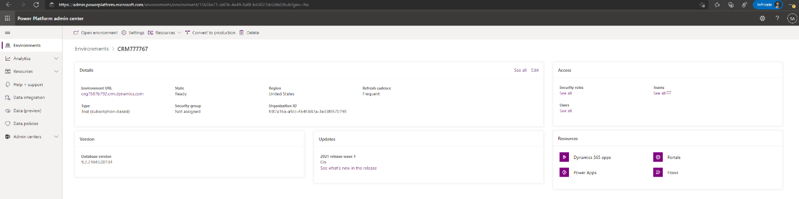

1. Confirm that the **Agent Productivity Tools** and **App profile manager** are updated.

   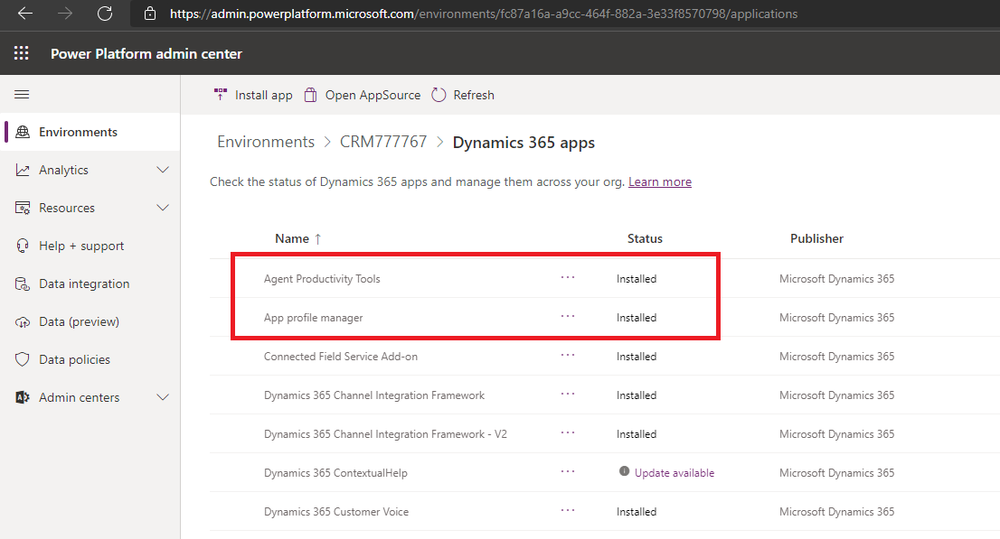

1. If you see **Update available** for **Agent Productivity Tools** and **App profile manager**, select **Update available**.

### Install and configure Power Automate Desktop

1. Download [Power Automate Desktop](https://go.microsoft.com/fwlink/?linkid=2102613) onto the machine that will run the automation then follow the installation wizard.

1. Follow the steps in the [detailed guide to install Power Automate Desktop](https://docs.microsoft.com/power-automate/desktop-flows/setup#install-power-automate-desktop-on-your-device) onto your device.

1. Change the machine settings from Power Automate Desktop to the environment to which  you will install the solution.

    

1. [Log in](http://powerautomate.microsoft.com/manage/flows) and confirm you can create a test cloud flow with a manual trigger.

    

    

1. Add a desktop flow connector.

    

1. Select [**Directly to machine (preview)**](https://flow.microsoft.com/blog/connect-directly-to-machines-and-new-machine-management-for-desktop-flows/) from the list.

1. Select the machine onto which you installed Power Automate Desktop, and then enter the machine login credentials (the username and password that you used to log into this machine). 

    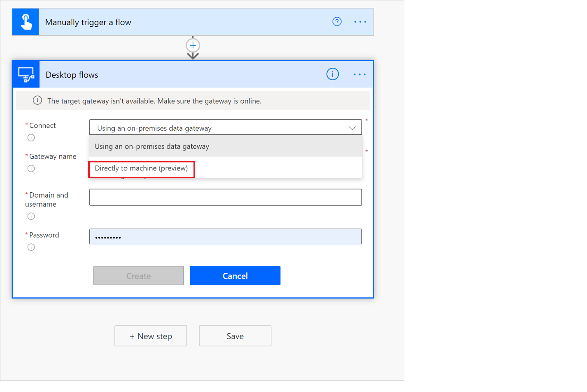

### Install and configure Contoso CRM app

1. Download and install [contoso_crm.exe](https://aka.ms/ContosoCRMApp) to the machine where the automation runs.

   This Contoso app is used to show you how the end-to-end automation scenario works so that you can follow the example to create your own automation.

   >[!NOTE]
   >Select **More info** > **Run anyway** on the **Windows protected you PC** screen that appears during the installation.

   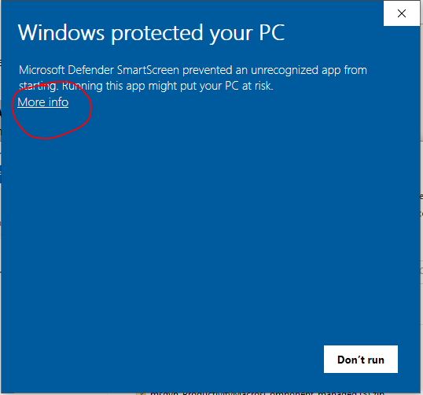

   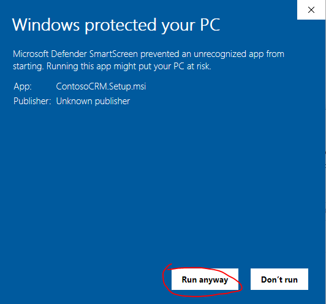

   After the installation completes, you can run the Contoso CRM app from the Start menu.

   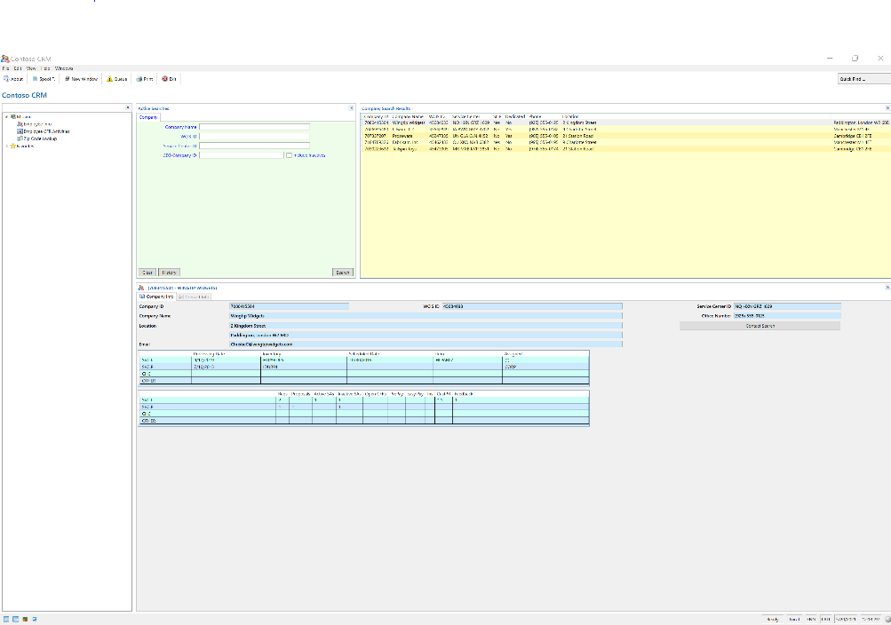

## Install the Dynamics 365 RPA solution

1. [Download the automation solution](https://aka.ms/D365CustomerValidationRPASolution) and save it on your machine.

1. Import the Dynamics 365 automation solution into the environment of your choice.

    1. Sign into [Power Automate](https://powerautomate.microsoft.com), and then log in using your work account.

    2. Select the environment that you will use from the environment picker.

    3. In the vertical menu on the left of your screen, select **Solutions**.

    4. In the horizontal menu, above the **Solutions** title, select **Import** >  **Browse**.

    5. Run the solution file you downloaded.

    6. Select **Next.**

1. Configure the connections needed to be used by the solution in the environment

    1. For each connector that the solution uses, either select an existing connection or create a new one using the Microsoft account or credentials of your choice. You will be taken to a different tab, make sure to not close the one you came from.

    2. For the **Desktop connection** domain/username and password, be sure to use the machine's Windows login credentials.

   

1. On the tab from which you initiated the previous step, select **Refresh**.

   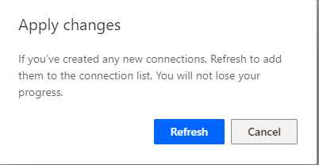

1. Select **Import.** 
   The solution explorer shows you a message that lets you know the solution is being imported. It takes a few minutes.

2. Open **Case entity session – default template** (or your current case entity session template), open **Agent scripts** tab, and then add **Case agent script with automation**.

    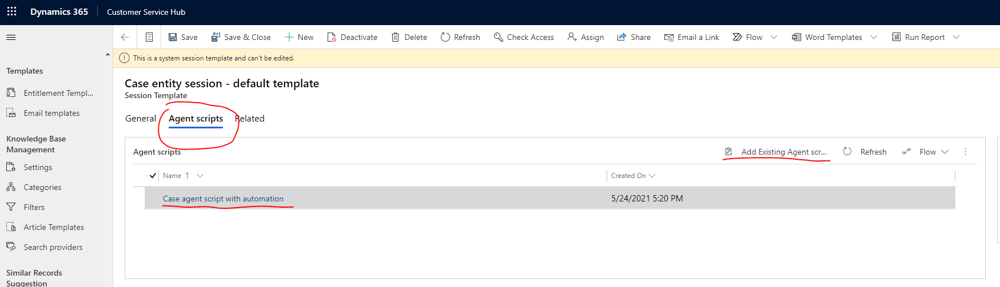

    Learn more about [session templates](https://docs.microsoft.com/dynamics365/app-profile-manager/session-templates).

3. From the Dynamics 365 Customer Service app, login to Power Automate.

    1. From the case you are working on, select the **…** menu > **Flow**.

      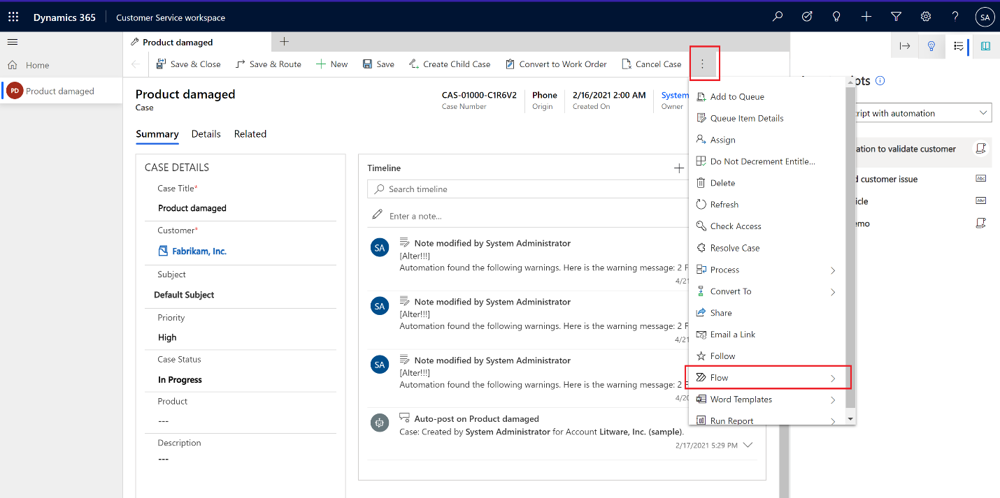

1. Select **Login to Flow**.

2. Authenticate using your Dynamics 365 account.

3. Now open one of your cases using **Shift + Left Click** to launch the productivity tools panel.

   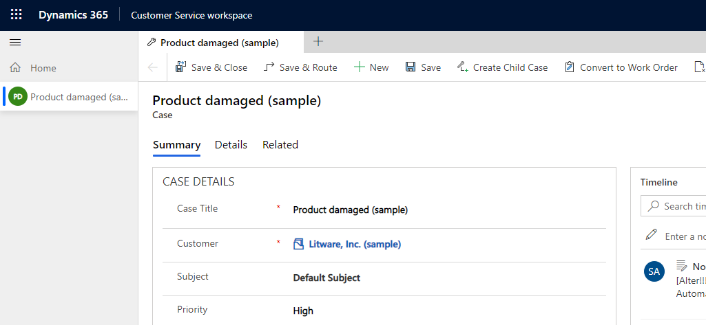

1. From the **Agent Script** session in the productivity panel, you will see several agent script steps. The first step is **Run Automation to validate Customer**. Select the **Run** button and confirm it runs.

   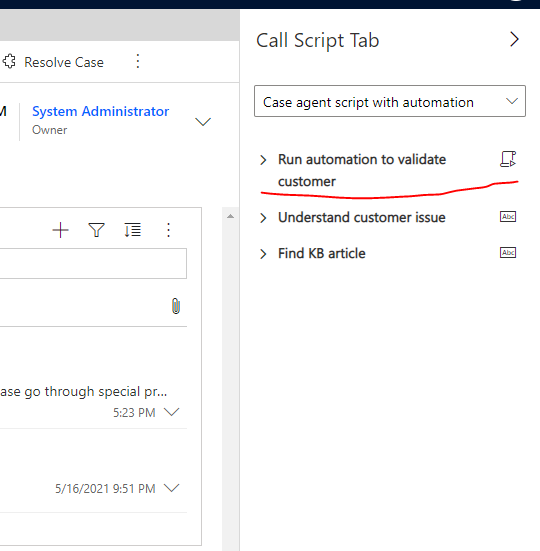

1. The automation starts on the machine where you have installed Power Automate Desktop. You can watch how the automation uses the case data, opens the Contoso CRM app, and then finishes the look up automatically. After the automation runs, refresh the timeline to view the logs regarding the run result. Here's a demo on how it runs.

   

## Customize the automation solution

1. Now you can start customizing the automation to meet your unique requirements. To do this, open Power Automate Desktop and then select **Edit** on the **Legacy Contoso App Contact Lookup** desktop flow.

   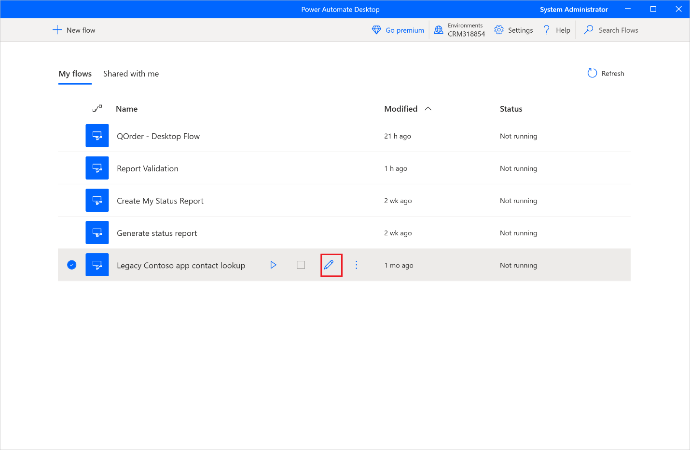

1. You can save a copy to work on your customizations or work on the template directly.

1. Notice that there are multiple child flows. Each child flow uses the keyboard or the mouse to interact with the Contoso CRM app. You need to update the steps to interact with your legacy app.

1. After you test the desktop flow, you can save it. Now open the cloud flow in <https://powerautomate.microsoft.com/manage/solutions> from within the solution tab -\> Customer Service RPA solution

    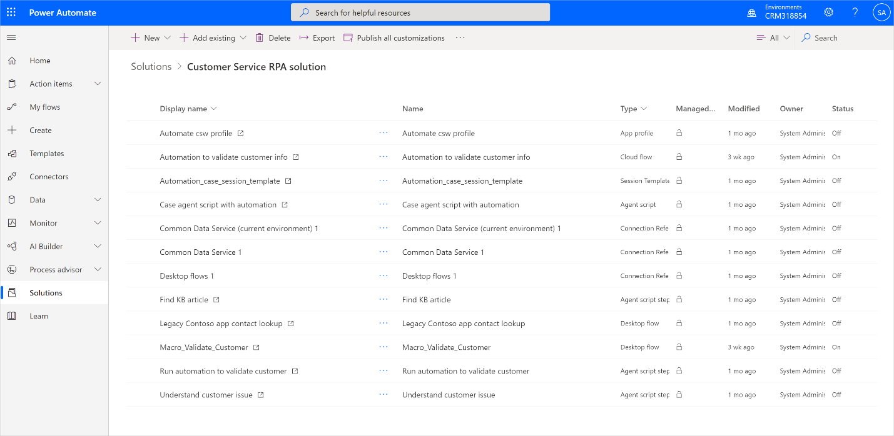

1. Open the cloud flow named “Automation to validate customer info”. Expand each action to review. In the Desktop flow action, you can switch to use any desktop flow you want and use any the input/output parameter that you want to use. To learn more, read [here](https://docs.microsoft.com/power-automate/desktop-flows/link-pad-flow-portal) on how to use desktop flow in cloud flow.

1. Now you can save the cloud flow. Go back to D365 portal and trigger the agent script action to test. You will see your customization  automation start to run.

1. Once you finished testing, you can share the cloud flow with everyone in the organization with run-only mode (click [here](https://docs.microsoft.com/power-automate/desktop-flows/run-pad-flow#unattended-mode) to learn more) and switch it to run unattended way (click [here](https://docs.microsoft.com/power-automate/desktop-flows/run-pad-flow#unattended-mode) to learn more). So that every agent will be able to reuse the same automation. License wise, the cloud flow should be put under a per flow plan (click [here](https://docs.microsoft.com/power-platform-release-plan/2019wave2/power-automate/new-licensing-options-power-automate-standalone-paid-plans#allocating-the-per-flow-plan-in-the-admin-center) to learn more)

## Troubleshooting and known issues

| Known issue                                                                                            | Workaround                                                                                                                                                                                                                                                                                                      |
|--------------------------------------------------------------------------------------------------------|-----------------------------------------------------------------------------------------------------------------------------------------------------------------------------------------------------------------------------------------------------------------------------------------------------------------|
| Did not see the productivity tools panel from D365 customer service                                    | Before xxx? You need to install Omni Channel to your environment. Productivity tools don’t show on home session. You need create a new session (Shift-click on case link) to see it. Producitivity tools runtime initialization is async. Please wait 1 – 2 seconds on home session before create new sessions. |
| Agent can’t see the flow                                                                               | Every agent needs to login flow from D365 widget for the first time                                                                                                                                                                                                                                             |
| During install, you will be prompted multiple times for the same confirmation to install.              | Confirm with “yes I am sure to install” every time prompted                                                                                                                                                                                                                                                     |
| The agent script isn’t added to current session template automatically after import the demo solution. | Manually add the agent script to case session template.                                                                                                                                                                                                                                                         |
|                                                                                                        |                                                                                                                                                                                                                                                                                                                 |
