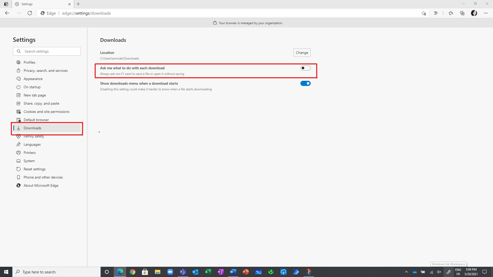
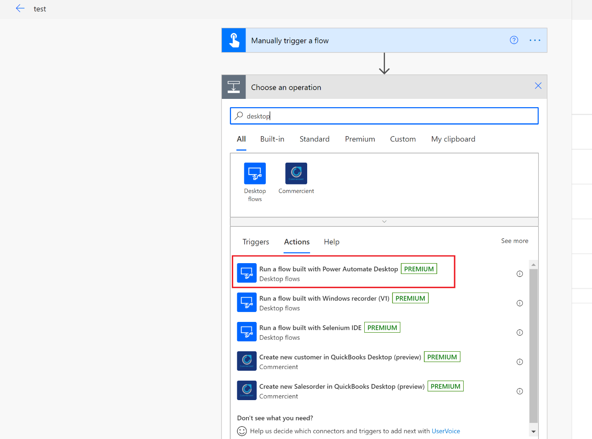
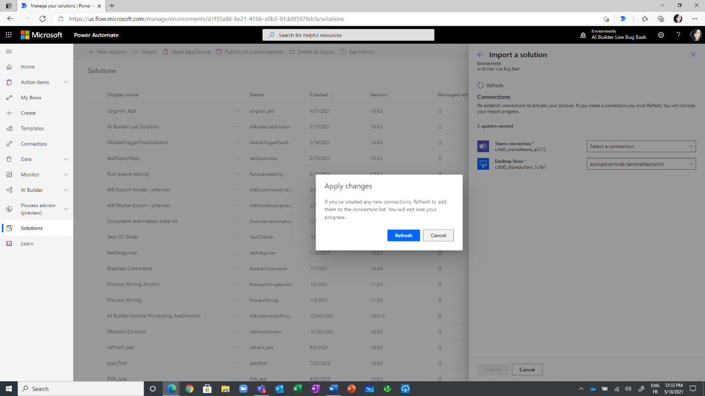
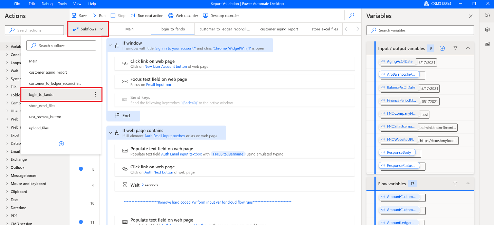
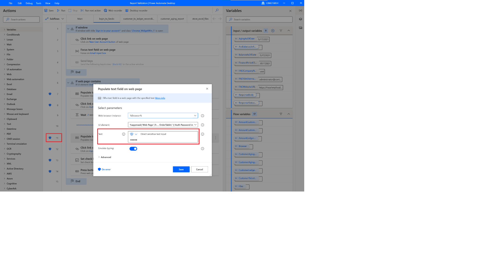

# Use RPA with Dynamics 365 Finance 

[Dynamics 365](https://dynamics.microsoft.com/) empowers your organization to deliver operational excellence and delight every customer. In order to make your use of Dynamics 365 even more productive and save users time and errors, we are releasing the preview for free automation solutions that will let customers of Dynamics 365 customers automate common tasks. 

In this documentation, we outline the steps needed for you to automate end of cycle reporting in [Dynamics 365 Finance](https://dynamics.microsoft.com/finance/overview/) and focus on higher-priority activities that require your unique creativity.  

## Prerequisites 

Before starting, we need to prepare your environment with the adequate licenses and software set-up. This section provides a step-by-step for how to get the grounds ready.   

### Software 

You will need to: 
- install the Power Automate for desktop application. Power Automate will carry out the steps in Dynamics 365 as if a human were doing it in front of their computer. 
- Set the appropriate file download configuration in the Microsoft Edge browser (available for free on Windows) to have complete automation.  
- Log out of the Dynamics 365 app you wish to automate 
- Get the appropriate security role for the automation to run 

#### Set the appropriate file download configuration on Microsoft Edge 

Edge has two ways of downloading files from the internet onto your computer 

1. Download directly on your machine, and save the file in the destination folder specified in the Edge settings 
2. Ask for the user’s permissions before downloading a file, wait for the user to accept the download, then only download the file and save it in the destination folder specified in the Edge setting.  

In order to make this process fully automated and not requiring a human in front of the computer for it to work, we need Edge to download files using the first mechanism.  

1. Open Microsoft Edge browser on your machine (using the Windows Search bar) 
2. In the top right corner of your screen, click on “…” menu 
3. Click on **Settings**
4. In the vertical menu in the left of your screen, click on Downloads 

Turn off the toggle “Ask me what to do with each download” 

Close your browser  

   

#### Log out of the Dynamics 365 app 

In order to do the full automation, please sign out of the application before you run the automation for the first time. You will need to do this if you switch between automation and your account.  

#### Get the appropriate security role set up for the account running the automation 

You will need to decide which work account will be running the automation. It can be a dedicated account created by your admin in Azure Active Directory or the account of an existing employee. For the account you end up choosing, you need to check that it has the appropriate security roles so that it can access the surfaces you are automating. Go to [Managing security roles in Dynamics 365](https://go.microsoft.com/fwlink/p/?linkid=2127645).  

We recommend the following security roles: 

|Application|Security role|Link to documentation|
|----|----|----|
|Power Platform|Environment admin or environment maker (if the envionrment already has Dataverse and unattended license needed)||
|Dynamic 365 Supply Chain Management||

### Licenses 

If you already use Power Automate, Power Apps and Dynamics 365 applications on a day-to-day basis, you can skip this section and jump to Installing the Dynamics 365 RPA solutions.  

Otherwise, you will need at least a trial license for these 3 products. This section shows you how to acquire these trial licenses.  

#### Get a trial license for Power Automate  
Power Automate can automate processes by doing what a human would do on a keyboard and screen.  

There are two ways to automate processes: 
1. Attended mode: someone is sitting in front of their computer and watching the process run as if they were doing it themselves manually 
1. Unattended mode: the process is running in the background on distant machines that users don’t see.  

To run attended, users need to acquire **the Power Automate per-user license with RPA**.  
To run unattended, users need to have acquire two licenses: **Power Automate per-user license with RPA and the Power Automate unattended add-on**. 

*Get a trial license for Power Automate per-user license with RPA to run processes in attended mode*

1. From the Power Automate portal, navigate to My Flows then on Desktop Flows 
1. Click the fine print **Start free trial now**

An alternative consists in logging in to Power Automate and clicking on the **Start free trial** button 

*Add a trial license for Power Automate unattended add-on to run processes in unattended mode*

As an admin, you can get an RPA unattended add-on and assign it to your environment ([Power Automate sign-up Q&A in your organization - Power Automate | Microsoft Docs](https://docs.microsoft.com/power-automate/organization-q-and-a))  

#### Get a trial license for the Dynamics 365 applications you wish to automate 
To get started with Dynamics 365 Finance and automate the end-of-cycle reporting process, navigate [here](https://dynamics.microsoft.com/get-started/free-trial/?appname=finance).  

### Setup steps 

#### Install Power Automate  

1. Click on [this link](https://go.microsoft.com/fwlink/?linkid=2102613.) to install the Power Automate for desktop on the machine that will run the automation then follow the installation wizard. Here is the detailed guide with step-by-step to install Power Automate: [Set up Power Automate for desktop on your device - Power Automate | Microsoft Docs](install.md#install-power-automate-desktop) 

1. Make sure you switch the machine setting from Power Automate to the correct environment that you will install the solution to  

    

1. Log in https://powerautomate.microsoft.com/manage/flows to create a test cloud flow with manual trigger 

    
    

1. Add a desktop flow connector. 
    
 
Select the Directly to machine(preview) connection from that dropdown. then select the machine name where you have installed Power Automate, enter the machine login credential (the username and password that you used to log into this machine.  (View [here](https://flow.microsoft.com/blog/connect-directly-to-machines-and-new-machine-management-for-desktop-flows/) to learn more about direct machine connectivity). Note this step will not be needed at a later date.
   
 
#### Installing the Dynamics 365 RPA solution 

Now that prerequisites are set, we are on our way to get these free solutions that automate the processes.  

1. Download the Dynamics 365 automation solution and save it on your machine 
    a. To automate the quality order process on Dynamics 365 Supply Chain Management, download the solution here: [https://aka.ms/D365SCMQualityOrderRPASolution](https://aka.ms/D365SCMQualityOrderRPASolution)

    b. To automate the end-of-cycle reporting process on Dynamics 365 Finance, download the solution here [https://aka.ms/D365FinanceEndCycleReportingRPASolution](https://aka.ms/D365FinanceEndCycleReportingRPASolution) 

    c. To automate the customer validation process on Dynamics 365 Omnichannel, download the solution here: [https://aka.ms/D365CustomerValidationRPASolution](https://aka.ms/D365CustomerValidationRPASolution)

1. Import the Dynamics 365 automation solution in the environment of your choice 

    a. Go to [https://powerautomate.microsoft.com](https://powerautomate.microsoft.com) and log in using your work account 
    b. Select the environment in which you wish to work using the environment picker 
    c. In the vertical menu on the left of your screen, click on **Solutions** 
    d. In the horizontal menu, above the Solutions title, click on **Import** then click on **Browse**
    e. Navigate to the solution file you previously downloaded and double click on it in your file system 
    f. Click **Next**. 

 

1. Configure the connections needed to be used by the solution in the environment 

    a. For each connector that the solution uses, either select an existing connection or create a new one using the Microsoft account or credentials of your choice.  

   
      
    b. Come back to the tab from which you initiate the above step and click **Refresh** 

    

    c. Click on **Import**. The solution explorer shows you a message letting you know the solution is being imported. It takes a few minutes.  

1. Enter the parameters that the solution should use to run the process 

    a. From the Solutions explorer, click on the solution to open it 
    b. You will find there are rows with the **Type** column that reads **Environment Variable**. We need to add values for each of these.  

    c. Click on each of the environment variable listed in the table below and under **Current Value**, click on **Add New Value** to put in your desired parameter. 

    |Environment variable name|Description|
    |----|----|
    |D365CompanyName |Name of the company to use in your D365 organization. It is located at the top right corner of your screen.  |
    |D365FinanceSite |URL to your Dynamics 365 Finance website. It goes until dynamics.com |
    |D365SiteUserName |Email address of the user account the automation should run under.|

1. Turn on the cloud flow in the solution 

    a. In the solution, click the … menu for the **Report Reconciliation** cloud flow 
    b. Click on **Turn On**

1. Put in the encrypted credentials to be used by the solution to log in to Dynamics 365 

    a. From the solution explorer, click on the line item called **Report Validation**
    b. Click on **Edit** then **Launch App**
    c. This will open the Power Automate for desktop  
    d. Under the **Subflows** dropdown, double click on **login_to_FnO**
    
    
    e. In the **login_to_FnO** subflow, double click on action 11
    
    f. Fill in the **Text** textbox with the password of the account to use during automation 
    
    
1. Now you can test the desktop flow from Power Automate. 

1. And then you can test the cloud flow from portal. The demo below shows how the end-to-end scenario works. You will get a Teams message at the end 
   

1. Last if you choose to run the you can  

1. You can customize either the desktop flow or cloud flow to create custom reports for your own scenarios 
1. Lastly if you choose to run the automation unattended, you can switch the run mode from cloud flow. See here for more details.  

## Known issues 

|Known issue |Workaround|
|----|----|
|I created a gateway connection for my solution but now it’s taking very long to import.  |Nothing to worry about. It takes a while to import solutions. Give it at least 10 minutes. | 
|My cloud flow doesn’t run after I press “Play” in the flow designer |Go back to the Solution explorer, click on the … menu for the app or flow then click on “Turn On”. |