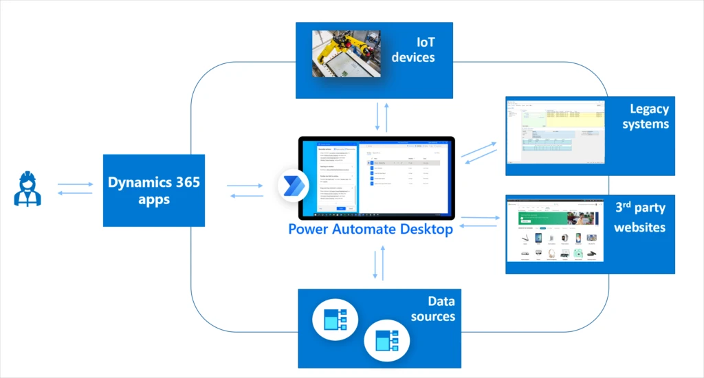

# Overview of RPA templates and Dynamics 365 (preview)

For many businesses, success increasingly depends on having the agility to innovate and adapt to rapid change, responding to customer needs, competitive pressure, and industry trends. But this is a difficult challenge when employees are buried in time-consuming busywork like repetitive tasks or complex processes.

That’s why we are dedicated to helping organizations like yours automate manual business processes, across both legacy and modern applications, so you can focus on what’s most important for your business and customers. In March, we released robotic process automation (RPA) capabilities in Microsoft Power Automate Desktop for Windows 10 users.

This month, we are introducing enhanced workplace automation capabilities for Microsoft Dynamics 365—a set of prebuilt RPA solution templates, now available for public preview, that seamlessly integrate with select Dynamics 365 applications.

Initially available for Dynamics 365 Customer Service, Dynamics 365 Supply Chain Management, and Dynamics 365 Finance, the prebuilt automation templates enable teams to rapidly automate common business scenarios—freeing time from day-to-day manual, repetitive, and error-prone tasks.

Developers can further extend any of those solutions by using custom actions, custom connectors, Microsoft Azure services, and APIs to take full advantage of Microsoft’s one cloud and data ecosystem.

## Save time across customer service, finance, and supply chain roles

Explore some of the ways that RPA can help streamline processes and save valuable time across the workforce.

## Dynamics 365 Customer Service: Helping call center agents rapidly validate customer credentials

Most contact centers require agents to validate or authenticate customer identities before proceeding with the service engagement. By enhancing Dynamics 365 Customer Service with RPA, agents can automate steps of the validation process, streamlining call times and helping agents to troubleshoot and solve customer issues faster.

## Dynamics 365 Supply Chain Management: Streamline ordering of replacement parts for manufacturing line equipment

We’ve heard from manufacturing customers about the need to improve the process of ordering replacement parts for equipment on the factory floor. Often, technicians who identify defective parts on the manufacturing line need to write down part numbers, and then place the orders into the tracking system one by one. This is an inefficient and error-prone process. By integrating RPA processes into Dynamics 365 Supply Chain Management, technicians can simply scan or enter part details and submit orders on the spot, saving time and effort. Since Power Automate natively integrates with Azure IOT connectors, this solution can be easily extended to use the Azure IoT management system.

[Watch a video](https://www.youtube.com/watch?v=LFbzJ6-H89w) to learn more about the new capabilities included in the latest update to Dynamics 365 Supply Chain Management.

## Dynamics 365 Finance: Streamline the creation of end-of-billing cycle reports
At the end of billing cycles, finance workers often have to generate many different end-of-cycle reports for every account. Traditionally, this is a manual, time-consuming, and error-prone process. Dynamics 365 Finance helps streamline many of these processes and now, by integrating RPA capabilities in Power Automate, finance teams can more easily automate many processes, allowing finance professionals to focus on more critical strategic tasks. These capabilities also improve the accuracy that is demanded by increasingly restrictive financial audit regulations.

## Next steps
Take the first step to enable your customer service, supply chain, and finance teams to automate processes in Dynamics 365. Get a free Power Automate RPA trial license and install Power Automate Desktop, and then import the three solutions mentioned above into your environment to set it up. Check out the documentation for steps to get started.