# Hosted RPA bots (preview)

[!INCLUDE [cc-beta-prerelease-disclaimer](../includes/cc-beta-prerelease-disclaimer.md)]

Hosted RPA bots (preview) allow you to run unattended automation at scale without the need to provide or set up any machines. You can create hosted RPA bots like any other machine group, and Power Automate will automatically provision the machines based on the defined configuration. 

Desktop flows assigned to a group of hosted RPA bots get queued to it when triggered to run. Then, like for any machine group, when a bot in the group is available, it's assigned the next desktop flow to be executed in the queue. Learn more about [the desktop flow queues](monitor-desktop-flow-queues.md).

## Licensing requirements

To be able to use hosted RPA bots, one of the following licensing options is required:

### Using the existing Power Automate per user plan with attended RPA or per flow plan and the Power Automate unattended RPA add-ons

During the preview period, hosted RPA bots will be available using the existing licenses to run unattended RPA. So there are no extra charges for the Power Automate per user or per flow plan with attended RPA and the Power Automate unattended RPA add-on. You need to assign to your environment as many add-ons as many bots you want to run in parallel in your environment.

### Using the Power Automate per user plan with attended RPA trial and the Power Automate unattended RPA add-on trials

The plans and add-ons mentioned above have trial versions that last 30 days and could be extended once to a total of 60 days. Organization admins could obtain up to 25 seats from the [Microsoft 365 admin center](../overview-cloud.md), assign those attended RPA trials to 25 individual makers, and assign the unattended add-ons to targeted environments. To learn more, refer to [Power Automate RPA license](../organization-q-and-a.md#power-automate-rpa-license).

### Using the 90-days self-assisted premium trial

Trial users can create up to 10 hosted RPA bots groups and can have up to two bots running in parallel in a given environment. To start a trial, select the **Try free** link under Per-user plan with attended RPAeither in the Power Automate [pricing page](https://powerautomate.microsoft.com/pricing/) or navigate to the Power Automate portal [desktop flow page](https://flow.microsoft.com/manage/uiflows).

## Prerequisites

### Getting access to the default VM image

To be able to create hosted RPA bots, you need to have access to the default VM image that is part of your environment. You can view the default image in **Monitor** > **Machines** > **VM images (preview)**

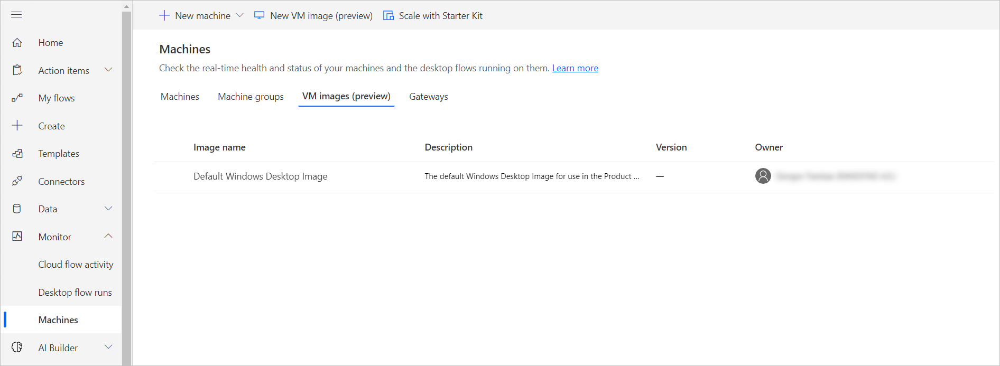

> [!NOTE]
> - Users need either the **System Administrator** or **Desktop Flow Machine Image Admin** role to be able to see and manage the default image.
> - For other users, the System Administrator or Desktop Flow Machine Image Admin has to first share the default image with them before they can use it.

### Sharing the default image

1. Sign in to the Power Automate portal.
1. Navigate to  **Monitor** > **Machines** > **VM images (preview)**.
1. Select the **Default Windows Desktop Image** from the list, and then **Manage access**.
1. Select the **Add people** field, and then enter the name of the person in your organization with whom you’d like to share the image.
1. Select the name of the person and which permissions they have to get access to the machine or co-own it as well.
1. Select **Save**

>[!NOTE]
> When a user isn't part of an environment anymore, you can continue to see it as a deactivated user. You'll be notified in the **Manage access** section of the image if it's shared with deactivated users. In this situation, remove access to them.

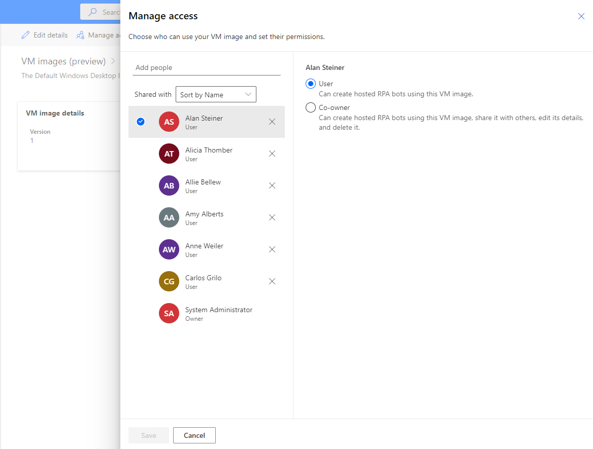

## Create hosted RPA bots (preview)

Hosted RPA bots can be created from the Power Automate portal:

1. Sign in to the Power Automate portal.
1. Select **Monitor**, then **Machines**.
1. Select **New machine**, and then **Group**.
1. Select "**Hosted RPA bots (preview)**" as your machine group type.
1. Enter a name for your hosted RPA bots, then optionally add a description.
1. Define how many bots maximum you want to assign to this group.

    > [!NOTE]
    > - You can't go beyond the total number of bots assigned to your environment.
    > - If multiple hosted RPA bots groups are used in the same environment, bots will be automatically load balanced between the groups. Learn more about [Hosted RPA bots load balancing](./hosted-rpa-bots.md#load-balance-hosted-rpa-bots-preview).

1. Select a **VM image** from the ones you have access to. We propose a default Windows 11 image called **Default Windows Desktop Image**. If you don't see it, make sure you follow the steps described in the [prerequisites](./hosted-rpa-bots.md#prerequisites) section.
1. Provide the local admin account you want to be created and that would be used to run your automations by the bots.
1. Select **Create**.

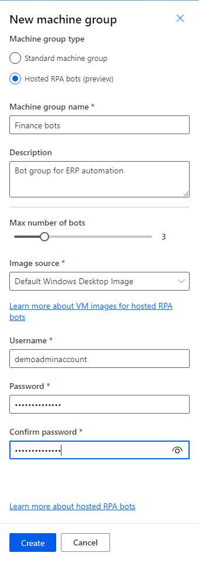

## Hosted RPA bots (preview) availability

Bots in a group are created when needed. Whenever a desktop flow waits in the queue and no bot is available, a bot is created automatically. A bot is created as long as the maximum number of bots for this group isn't reached and you have enough unattended add-ons assigned to your environment. Read more information about the [licensing requirements](./hosted-rpa-bots.md#licensing-requirements).

> [!NOTE]
> If the hosted RPA bots group has just been created or haven't been used for more than 24 hours, bots will be created before a run gets addressed from the queue. The creation of a bot can take 10 minutes or even more based on its setup.

## Use custom VM images (preview) for your hosted RPA bots (preview)

You can personalize your **Hosted RPA bots (preview)** by providing your own Windows image directly from your **Azure Compute Gallery**, it will allow you to have all your application installed on the Hosted RPA bots that we provision for you. 

### Create an Azure compute gallery in Azure and add an image
> [!NOTE]
> - To learn more about shared image gallery, refer to [Share a gallery with subscriptions or tenants](/azure/virtual-machines/share-gallery-direct).

> [!IMPORTANT]
> - During the preview, the gallery must be created as a private gallery. You can't use an existing gallery; the property can't currently be updated.
> - You need to first register to the [public preview program](https://aka.ms/directsharedgallery-preview).

1. Go to the [Azure portal](https://portal.azure.com).
2. Create a new Azure Compute Gallery, in the **Sharing** tab and select **RBAC + share directly (Preview)**
3. Select **Review + create**, and once you have validated all the settings, you can click on **Create**.

> [!NOTE]
> Before creating your image, please note that the image need to be created in the same location as we deploy your Hosted RPA bots. You can find the following mapping with your environment Geo:
> - US: West US
> - Europe: North Europe
> - Canada: Canada Central
> - Australia: Australia East
> - Brazil: Brazil South
> - France: France Central
> - India: Central India
> - Germany: Germany West Central
> - Switzerland: Switzerland North
> - Japan: Japan East
> - UK: UK West
> - Asia: East Asia
> - Norway: Norway East

Once you have created a gallery, you can create an image definition following the steps in [Create an image definition and an image version](/azure/virtual-machines/image-version).

### Share the gallery with Microsoft
To be able to use the image in Power Automate, you need to share the image with Microsoft, in the Azure Portal.

1. In your gallery, go to the **Sharing** settings.
2. Select the **Add** button and select **tenant outside of my organization** in the type list. 
3. Enter the following tenant id: **975f013f-7f24-47e8-a7d3-abc4752bf346**. It's the Microsoft tenant on which your Hosted RPA bots are being deployed.

### Share the gallery with Power Automate makers
The last step before being able to reference your image from Power Automate is to share the image with the Power Automate makers.

1. In the Azure Portal, go to your gallery.
2. Go to **Access Control (IAM)** settings.
3. Click on the **Add** > **Add role assignment** button.
4. You need to assign at least Reader permissions access to the Power Automate makers you want to share the gallery with. Then select **Next**.
5. Select the **Select members** button and search for the Power Automate makers you want to share with.
6. Once you have selected all the members to add, you can review the permissions and users and assign them.

### Add a new custom VM image (preview)

1. Sign in to the Power Automate portal.
1. Select **Monitor**, then **Machines**.
1. Select **New VM image (preview)**.
1. Enter an image name and a description.
    - **Image name**: A unique name to identify the image.
    - **Image description**: An optional description for the image.
1. Select one of the images that you have access to directly from Azure.

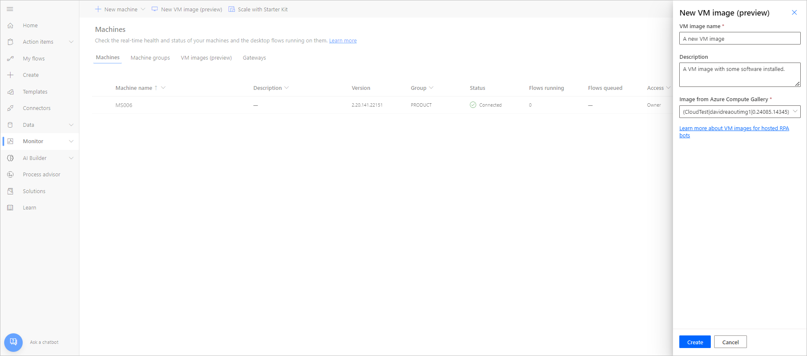

The image needs to be replicated in the same Azure region as the hosted RPA bot is deployed.

### Sharing the image

1. Sign in to the Power Automate portal.
1. Select **Monitor** > **Machines** > **VM images (preview)**.
1. Select the image you've created.
1. Select **Manage access**.
1. Select the **Add people** field, and then enter the name of the person in your organization with whom you’d like to share the image.
1. Select the name of the person to choose with which permissions they can access the machine.
1. Select **Save**.

>[!NOTE]
> When a user isn't part of an environment anymore, you can continue to see it as a deactivated user. You'll be notified in the **Manage access** section of the image if it's shared with deactivated users. In this situation, remove access to them.

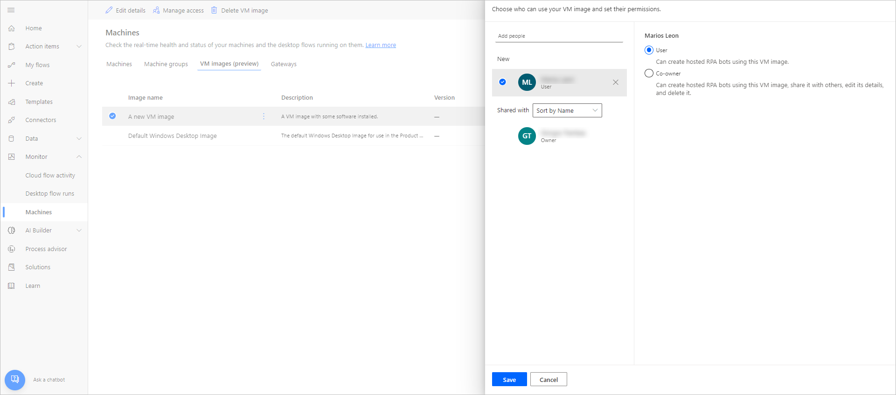

## View list of hosted RPA bots (preview)

Once you've created your hosted RPA bots group in an environment, you can view its details in the Power Automate portal. You can also view all other hosted RPA bots that you have access to.

1. Sign in to the Power Automate portal.
1. Select **Monitor** > **Machines**.
1. Select **Machine groups**.

The list contains both hosted RPA bots and standard machine groups, for each item in the list, you can view:

- The name of the item.
- The description of the item.
- The number of the machines in the group (only for standard machine groups).
- The number of flows running in the item.
- The number of flows queued in the item.
- The type of access you have to the item.
- The owner of the item.

Selecting a hosted RPA bot in the list will take you to the bot details page where you'll be able to:

- View and edit the details of the bots group.
- Monitor the bots run queue.
- View past runs.
- List existing connections referencing the bot.
- View provisioning errors on the bot (if any).
- Manage access by sharing (or not) the bot.
- Delete the group.

## Share hosted RPA bots (preview)

You can share hosted RPA bots with other users so they can create connections to them and run desktop flows on them. To share a hosted RPA Bot:

1. Sign in to the Power Automate portal.
1. Select **Monitor** > **Machines**.
1. Select the **Machine groups** tab.
1. Select a hosted RPA bot in the list, or navigate to the details page of the desired hosted RPA bot.
1. Select **Manage access**.
1. Populate the user name or email you want to share the hosted RPA bot with, and select the user you want to add.
1. For each user you can grant different permissions: **User** or **Co-owner**.

**User** permission will only allow the targeted user to run desktop flows on the selected hosted RPA bots. A **Co-Owner** can also edit the hosted RPA bots details.

>[!NOTE]
> When a user isn't part of an environment anymore, you may continue to see the user as a deactivated user. You'll be notified in the **Manage access** section of the hosted RPA bot if it's shared with deactivated users. In this situation, remove access to them.

## Trigger a desktop flow to run on your hosted RPA bots (preview)

   >[!IMPORTANT]
   > To trigger desktop flows to run on hosted RPA bots, you need:
   > - A machine group of type **Hosted RPA bots**. To create a machine group of type **Hosted RPA bots**, refer to the [Create hosted RPA bots (preview)](./hosted-rpa-bots.md#create-hosted-rpa-bots-preview) section.
   > - A connection targeting your hosted RPA bots.
   >
   > Hosted RPA bots setup limitations:
   > - Only direct connectivity connections are supported.
   > - Only local account credentials are supported for now. E.g.: the credentials that were provided upon hosted RPA bots creation.
   > - Only available for [unattended run mode](./run-pad-flow.md#unattended-mode).

### Trigger a desktop flow

You can trigger a desktop flow to run on your hosted RPA bots the same way you trigger desktop flows on standard machine groups. If you aren't familiar with how to trigger Power Automate desktop flows, refer to [this section](./link-pad-flow-portal.md).

1. While editing your Power Automate flow, add a **Run a flow built with Power Automate for desktop** action, and create a connection of type **Directly to machine**.

    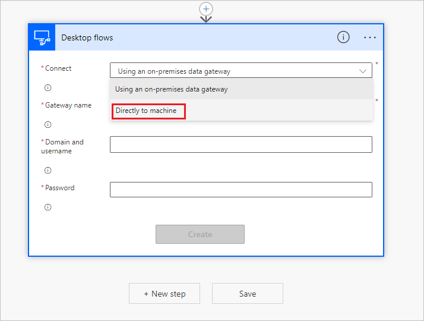

1. Select the hosted RPA bots you want to target. Hosted RPA bots will appear among the machines or standard machine groups.

    

1. Enter the credentials of the account you want to use.

    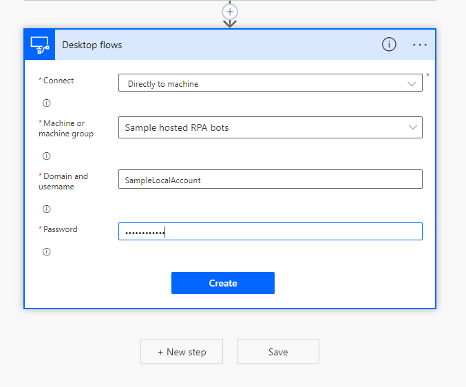

1. Select the Power Automate desktop flow to run.

    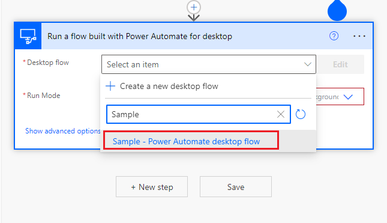

1. Set the run mode to **Unattended**.

   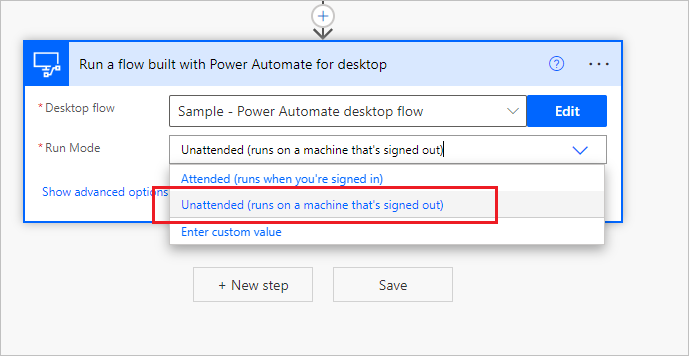

1. Now you can save your flow and run it like any other flow triggering a Power Automate desktop flow.

   >[!IMPORTANT]
   >
   > **Known issue**: Power Automate desktop flows targeting hosted RPA bots aren't yet compatible with the **Test flow** feature. It's possible that you observe errors (e.g. Flow run timed out. Please try again.) when trying to test your flow. This problem is due to the nature of the [bots availability](./hosted-rpa-bots.md#hosted-rpa-bots-preview-availability). The scheduled test run will still be accessible from the flow run history.

## Monitor your hosted RPA bots (preview)

You can't directly access or log into your hosted RPA bots. They're generally speaking not persisted unless they're running desktop flows.

Bots in a group are created based on the current size of the queue, the configuration of the group and the licenses assigned to the current environment.

For instance, if the group is newly created or it wasn't used for more than 24 hours, new bots may need to be provisioned before a desktop flow can run. The creation of a bot generally takes at least 10 minutes, depending on the type of VM Image in use. It's expected that the queue would appear **stuck** for more than 10 minutes before desktop flows start running.

After that, new bots will spawn to run desktop flows in the queue as efficiently as possible.

To monitor your bots:

1. Sign in to the Power Automate portal.
1. Select **Monitor** > **Machines**.
1. Select **Machine groups**.
1. Select one of your hosted RPA bots group.

In the example below, two bots are available to pick up the first two desktop flows in the queue, and three other desktop flows are queued. The desktop flow runs are marked as **Running** or **Queued** to indicate their state.

 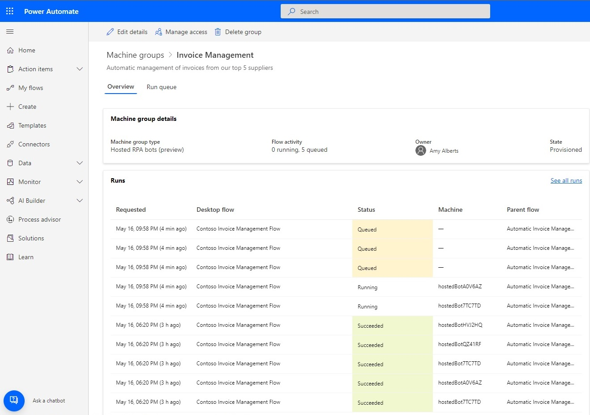

After a few minutes, another bot is provisioned to run a third flow as the queue is large enough.

 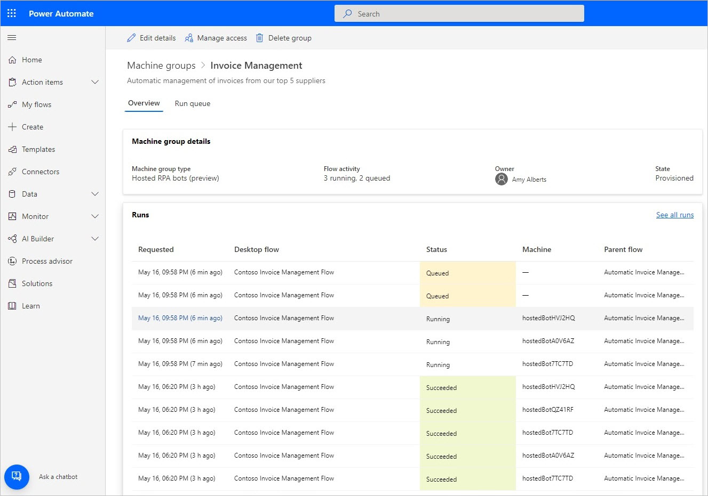

## Load balance hosted RPA bots (preview)

One key feature of hosted RPA bots is the ability reassign them to different groups and hence be able to seamlessly load balance your automation resources between your different workloads. For instance, you may have two groups of bots, one for your sales automations and one for finance in the same environment with 10 bots assigned. You can add more on one of the groups at any time by editing the hosted RPA bots group and using the max number of available bots.

1. Sign in to the Power Automate portal.
1. Select **Monitor** > **Machines**.
1. Select **Machine groups**.
1. Select one of your hosted RPA bots group.
1. Select the **Edit details** button at the top of the page.

 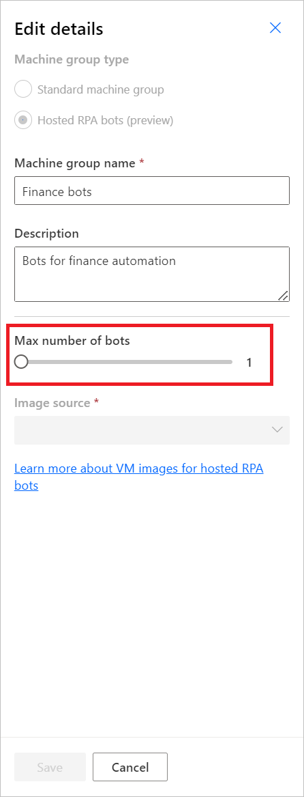

## Updated permissions based on security roles

Hosted RPA bots permissions and roles are iterations on top of Desktop Flows Machine Management permissions and roles. To find more information, refer to [Manage Machines - Update permissions based on security roles](./manage-machines.md#update-permissions-based-on-security-role). Using a previously created hosted RPA bots group follows the same rules and privileges as a regular group.

### Environment Maker Role

By default, Environment Maker role can create hosted RPA bots in their environment. The three entities that require privileges to use hosted RPA bots are:

- Flow Machine
- Flow Machine Group
- Flow Machine Image

 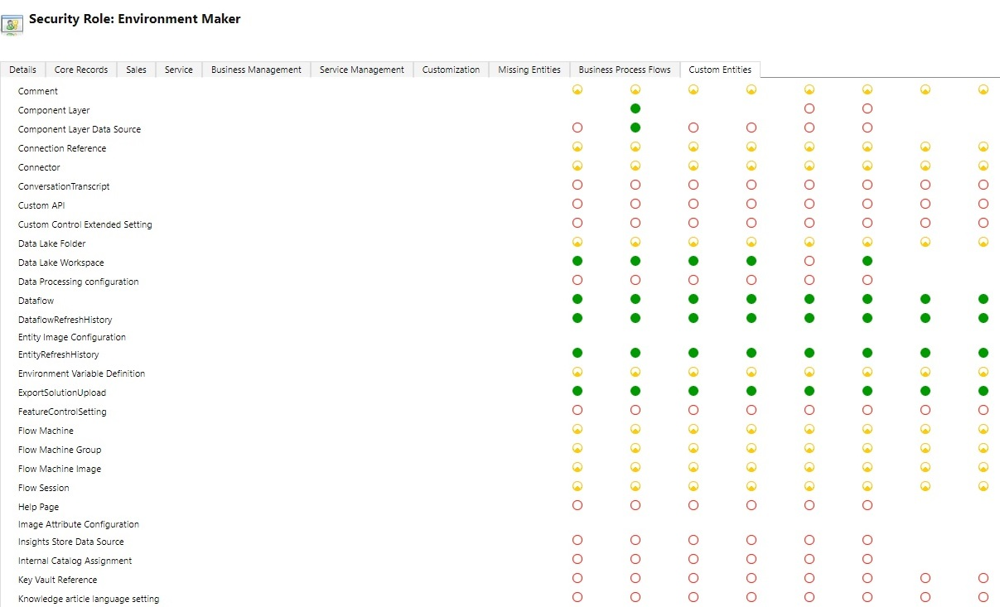

Environment Maker role can create and share custom VM images, as this functionality requires create and append privileges on the Flow Machine Image. You can find more information regarding custom VM images in [Use custom VM images for your hosted RPA bots](./hosted-rpa-bots.md#use-custom-vm-images-preview-for-your-hosted-rpa-bots-preview).

Admins can also use the roles provided as part of desktop flows. For more information, see [Manage Machines - Update permissions based on security roles](./manage-machines.md#update-permissions-based-on-security-role).

### Desktop Flows Machine Owner Role

By default, Desktop Flows Machine owners can create hosted RPA bots groups but can't create custom VM images. They can only use previously shared custom VM images in their own hosted RPA bots groups. For more information, see [Use custom VM images for your hosted RPA bots](./hosted-rpa-bots.md#use-custom-vm-images-preview-for-your-hosted-rpa-bots-preview).

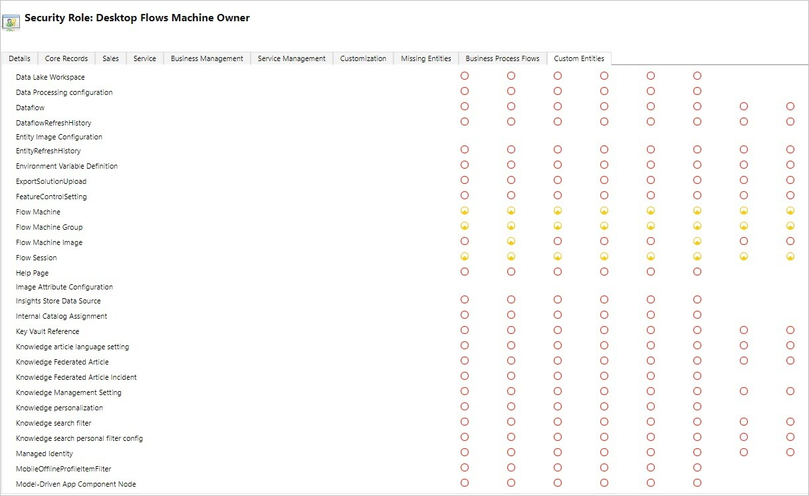

### Desktop Flows Machine Image Admin Role

The Desktop Flows Machine Image Admin role only brings full privileges on the Flow Machine Image entity. In particular, it allows users with this role to share / unshare VM images to be used for created hosted RPA bots in their environment. See also [Create hosted RPA bots ](./hosted-rpa-bots.md#create-hosted-rpa-bots-preview) for information about sharing pre-provisioned VM Images before creating your first hosted RPA bots group.

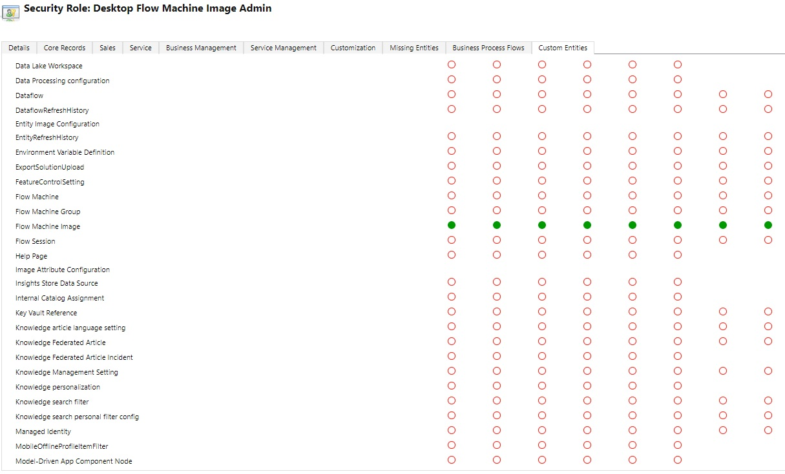

## Hosted RPA bots (preview) limitations

### Geographical availabilities/restrictions

Here's the list of supported geographies in the public clouds:

- United States
- Germany
- Brazil
- Canada
- Europe
- France
- Asia Pacific
- Australia
- Japan
- India
- United Kingdom
- Switzerland
- Norway

   > [!IMPORTANT]
   > Hosted RPA bots isn't yet available in sovereign clouds and isn't yet available in the following public cloud geographies:
   > - United Arab Emirates
   > - Korea

### Setup desktop flows connections for hosted RPA bots (preview)

Hosted RPA bots can be accessed only with local windows accounts.

   > [!NOTE]
   > When creating hosted RPA bots , you're asked to provide credentials for a local account. You can use this account to setup connections targeting the hosted RPA bots.

Active Directory and Azure Active Directory accounts aren't supported yet. This feature will be available in a next release.

### Network limitations for hosted RPA bots (preview)

Hosted RPA bots don't have access to on-premises data sources or other on-premises resources.
Hosted RPA bots can't be accessed from internet, the inbound traffic is blocked.

   > [!NOTE]
   > Connecting on-premises network to hosted RPA bots will be available in a next release.

### Remote desktop to hosted RPA bots (preview)

Remote desktop to hosted RPA bots isn't supported. Hosted RPA bots are meant to be used for unattended runs only, remote desktop access from internet isn't required to execute Power Automate desktop flows.

### Limit on the number of hosted RPA bots (preview) group per environment during Public preview

During the public preview, the number of bot groups is limited to 10 for each environment. If you reach this limit, delete an existing hosted RPA bots group to create a new one.

### Delete unused resources

During the public preview, we delete unused resources to ensure the service is available for everyone. Therefore, all hosted RPA bot groups that are inactive for more than 28 days are automatically deleted. The deleted groups remain visible, but they can't be used. An inactive group is one that hasn't run any desktop flows for the last 28 days.

> [!Note]
> You must delete the group and create a new one to continue using the hosted RPA bots feature. You'll need to reconfigure the connection associated with your cloud flow too.
