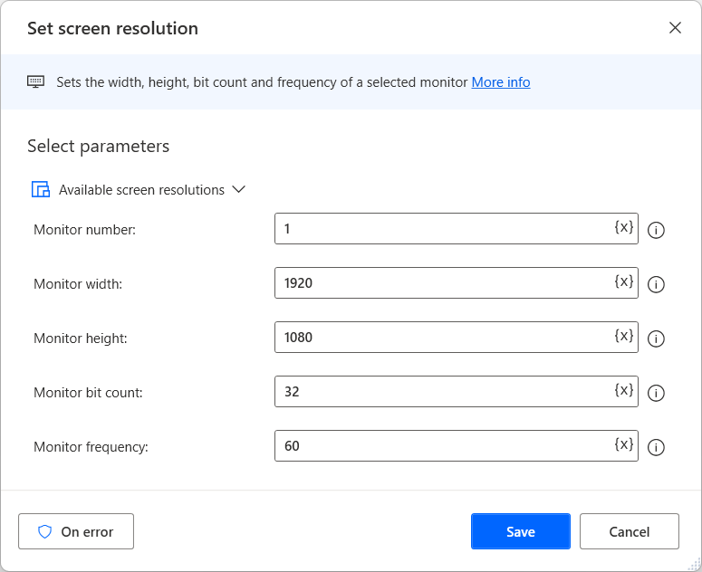
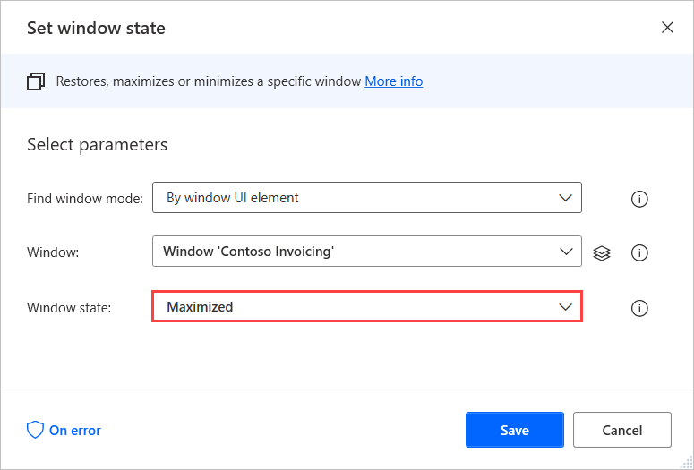

# Access elements that depend on how the window appears on the screen	

There are cases where Power Automate can't detect UI elements if they aren't visible on the computer screen.

These elements may be located in areas not directly visible on the screen or may not appear on the window at all. An element may be missing because the window's zoom level isn't suitable or the screen resolution is low.

To resolve this issue, you can:

- Increase the resolution of the screen manually or using the **Set screen resolution** action.

    

    > [!Important]
    >To use the **Set screen resolution** action in flows triggered through the Power Automate portal, you have to be connected to the console session of your machine, where you can manually change the screen resolution. For example, you can use your machine's physical screen to connect to the machine. In remote sessions, such as unattended scenarios that use remote desktop clients, the action has no effect, as users can't manually change the resolution.

- Maximize the window of the application using the **Set window state** action.

    

- Zoom in or out of the window.

In some cases, you can create dynamic selectors that adapt to the state of the window or application. You can find more information about dynamic selectors in [Build a custom selector](..\build-custom-selectors.md).
