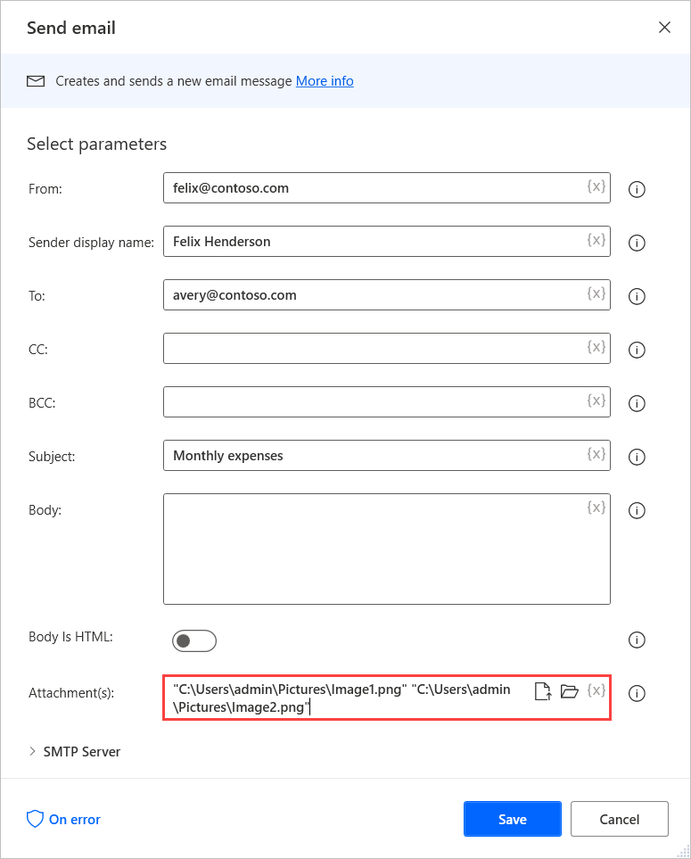
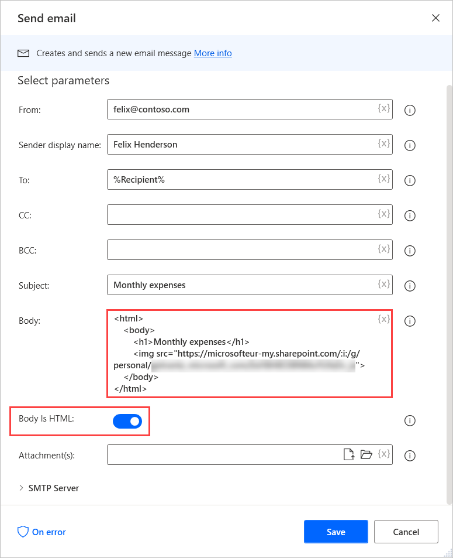

# Add images to email messages

Sending emails that contain images is common in many business procedures. Power Automate enables users to include images in their emails by attaching them or embedding them to the email body.

## Send images as email attachments

To attach images to an email, use the **Attachment(s)** field in the **Send email**, **Send email message through Outlook**, **Respond to Outlook message**, and **Send Exchange email message** actions.

You can populate the **Attachment(s)** field with file paths or a variable containing files. To populate multiple file paths, enclose them in double quotes (**""**) and separate them by a space character.



## Embed images to email body

Apart from attaching images to emails, Power Automate allows you to embed images to email bodies using HTML.

To embed an image, check the **Body is HTML** option in the appropriate email action and populate the **Body** field with the following code.



> [!NOTE]
> After copying the following code, replace the **image-url** placeholder with the URL of the image you want to embed or a variable containing it.

``` HTML
<html>
    <body>
        <h1>Title</h1>
        <p>This is a paragraph.</p>
        
    </body>
</html>
 ```

Where:

- The URL is a link to the image. This can be a public link or dynamic content from a previous action, such as a link for an image in SharePoint.
- The URL can also be a Base64 encoded image. You can find a tool or website online that will encode it for you. Or use the Base64 text that has been generated by a previous "Convert file to Base64" action.
- You can specify additional attributes, such as configuring the size of the image or `alt` text, in case the image can't load. See the Resources section below for more information.

Example image with a link and size:

```html

```

Example image with base64 (clipped for readability) and the `alt` attribute:

```html

```

### Resources

More ways to configure \: [Image Embed element reference](https://developer.mozilla.org/en-US/docs/Web/HTML/Element/img).
