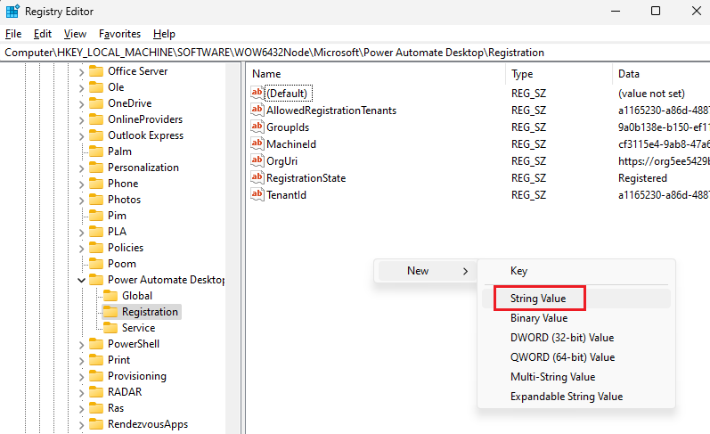

# Allow-list your Power Automate tenant to allow registration and connect with sign-in

For added security, connect with sign-in now requires your Power Automate tenant to be allow-listed to authorize connections on Active Directory domain-joined machines that are not Entra ID-joined. You can learn more about this security patch [here](https://go.microsoft.com/fwlink/?linkid=2283248).

Allow-listing a tenant will also allow this machine to register to that tenant.

## How to find your Power Automate tenant id

Once signed-in to the Power Automate portal, press Ctrl + Alt + A. The tenant id can be found in the `tenantId` property.

## How to allow-list a tenant id on your machine

> [!IMPORTANT]
> These steps explain how to allow-list your tenant on a single machine. We recommend that you consult with your domain admins to create a GPO that sets the appropriate allow-list on all of your machines and centrally defines which tenants are trusted to use Power Automate Desktop on your machines.

1. Open the registry editor and navigate to this key `Computer\HKEY_LOCAL_MACHINE\SOFTWARE\WOW6432Node\Microsoft\Power Automate Desktop\Registration`

2. If the `AllowedRegistrationTenants` registry value doesn't already exist, create it with right click > New > string value, and name it `AllowedRegistrationTenants`.

3. Right click the `AllowedRegistrationTenants` registry value and select `Modify`. Edit the value to add your tenant id. The expected value is a comma separted list of tenant ids such as "12345678-0000-0000-0000-000000000000" or "12345678-0000-0000-0000-000000000000,87654321-0000-0000-0000-000000000000".