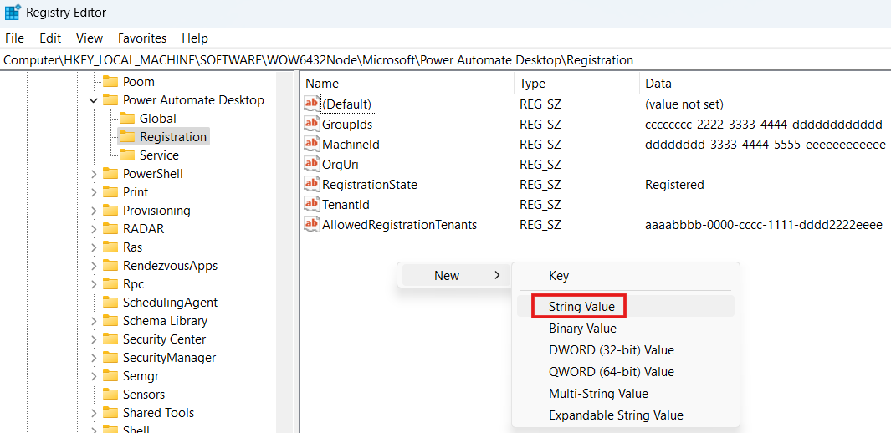

# Allowlist your Power Automate tenant to allow registration and connect with sign-in

For added security, connect with sign-in now requires your Power Automate tenant to be allowlisted to authorize connections on Active Directory domain-joined machines that aren't Microsoft Entra joined. Learn more about this security patch [here](https://go.microsoft.com/fwlink/?linkid=2283248).

Allowlisting a tenant also allows this machine to register to that tenant.

## How to find your Power Automate tenant ID

Use the following steps if you don't know your tenant ID:

1. Sign into the [Power Automate portal](https://make.powerautomate.com/).
1. Select <kbd>Ctrl</kbd> + <kbd>Alt</kbd> + <kbd>A</kbd>.
1. Locate the tenant ID in the `tenantId` property.

## How to allowlist a tenant ID on your machine

> [!IMPORTANT]
> The following steps can be used to allowlist your tenant on a single machine. However, we recommend consulting with your domain administrators to create a Group Policy Object (GPO) that applies the appropriate allowlist across all your machines. Creating a GPO like this can centrally specify which tenants are trusted to use Power Automate Desktop on the machines in your tenant.

1. Open the registry editor and navigate to this key `Computer\HKEY_LOCAL_MACHINE\SOFTWARE\WOW6432Node\Microsoft\Power Automate Desktop\Registration`

1. If the `AllowedRegistrationTenants` registry value doesn't already exist, create it by right-clicking and selecting **New** > **String Value**. Name it `AllowedRegistrationTenants`.

    

1. Right click the **AllowedRegistrationTenants** registry value and select **Modify**. Edit the value to add your tenant ID. The expected value is a comma-separated list of tenant IDs such as "aaaabbbb-0000-cccc-1111-dddd2222eeee" or "aaaabbbb-0000-cccc-1111-dddd2222eeee,bbbbcccc-1111-dddd-2222-eeee3333ffff".