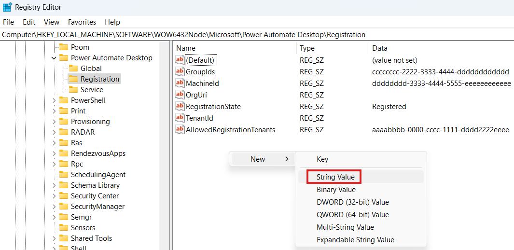

# Allow list your Power Automate tenant to allow registration and connect with sign-in

For added security, **connect with sign-in** now requires that you **allow list** your Power Automate tenant to authorize connections on Active Directory domain-joined machines that aren't Microsoft Entra joined. To learn more about this security patch, see [Security update for *connect with sign-in* connections on AD domain-joined machines in Power Automate for desktop](https://go.microsoft.com/fwlink/?linkid=2283248).

When you allow list a tenant, it also registers the machine to that tenant.

## How to find your Power Automate tenant ID

Use the following steps if you don't know your tenant ID:

1. Sign in to the [Power Automate portal](https://make.powerautomate.com/).
1. Select <kbd>Ctrl</kbd> + <kbd>Alt</kbd> + <kbd>A</kbd>.
1. Locate the tenant ID in the `tenantId` property.

## How to allow list a tenant ID on your machine

> [!IMPORTANT]
> Take the following steps to allow list your tenant on a single machine. However, consult with your domain administrators to create a Group Policy Object (GPO) that applies the appropriate allow list across all your machines. By creating a GPO like this, you can centrally specify which tenants are trusted to use Power Automate Desktop on the machines in your tenant.

1. Open the registry editor and go to this key: `Computer\HKEY_LOCAL_MACHINE\SOFTWARE\WOW6432Node\Microsoft\Power Automate Desktop\Registration`

1. If the `AllowedRegistrationTenants` registry value doesn't already exist, create it by right-clicking and selecting **New** > **String Value**. Name it `AllowedRegistrationTenants`.

    

1. Right-click the **AllowedRegistrationTenants** registry value and select **Modify**. Edit the value to add your tenant ID. The expected value is a comma-separated list of tenant IDs such as `aaaabbbb-0000-cccc-1111-dddd2222eeee` or `aaaabbbb-0000-cccc-1111-dddd2222eeee,bbbbcccc-1111-dddd-2222-eeee3333ffff`.