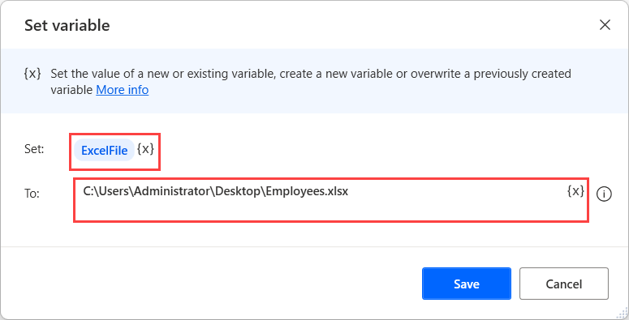
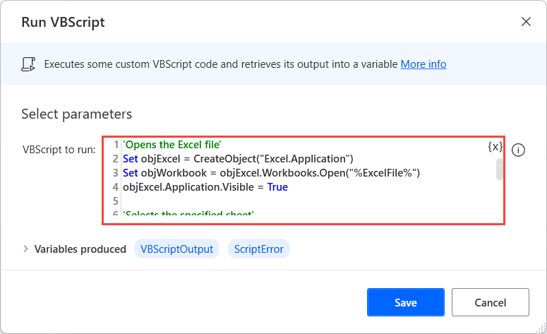

# Autofit Excel columns using VBScript

The autofit feature in Excel enables users to resize cells in worksheets to accommodate different-sized data without manually changing the column width and row height.

To autofit Excel columns using Power Automate:

1. Use the **Set variable** action to create a new variable containing the path of the Excel file you want to manipulate. In this example, the variable is named **ExcelFile**.

    

1. Deploy the **Run VBScript** action and populate the following code. Before running the flow, replace the **SheetName** placeholder with the name of the sheet you want to autofit or a variable containing it.

    ``` VBScript
    'Opens the Excel file'
    Set objExcel = CreateObject("Excel.Application")
    Set objWorkbook = objExcel.Workbooks.Open("%ExcelFile%")
    objExcel.Application.Visible = True

    'Selects the specified sheet'
    Set objSheet = objWorkbook.Sheets("SheetName")

    'Autofits the columns of the sheet'S
    for col=1 to 19
    objSheet.columns(col).AutoFit()
    next

    'Saves and closes the Excel file'
    objWorkbook.Save
    objWorkbook.Close SaveChanges = True
    ```

    

