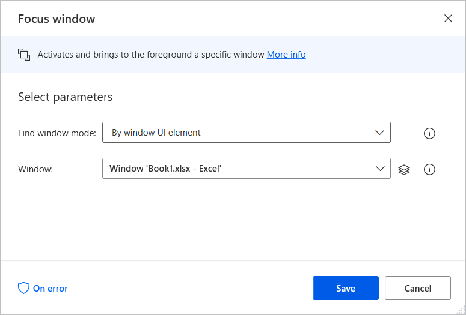
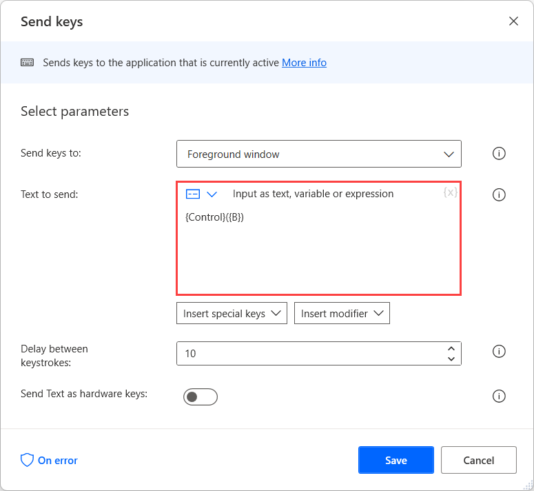

# Automate applications using keyboard shortcuts

Many desktop applications provide keyboard shortcuts that make multi-step tasks easy and fast to perform. Power Automate allows you to apply these shortcuts to create shorter and less complicated flows.

> [!IMPORTANT]
> Before sending keystrokes to an open application, use the **Focus window** action to activate the respective window. To select a specific element in the window, use the appropriate UI automation action, such as the **Click UI element in windows** action.

When the window is activated or the required element is selected, use the **Send keys** action to send the intended keystrokes.

To send a key, enclose its name inside curly brackets (**{}**). The curly brackets notation makes the action simulate the key's physical press. To populate hardcoded text values in a field, enter the respective text without any notations.

> [!NOTE]
> To send a specific key multiple times, you can use the following expression instead of entering the key numerous times: **{Key:numberOfTimes}**.

Apart from sending keys individually, you can use the **Send keys** action to send combinations of keys. To achieve this functionality, enclose the modifier inside curly brackets and the rest of the keys inside a pair of parentheses. The parentheses indicate that the keys inside them will be pressed simultaneously with the modifier key. 

For example, you can use the **Ctrl + B** shortcut to apply bold formatting in the currently selected Excel cell. To use this shortcut, populate the **Text to send** field of the **Send keys** action with the following expression: **{Control}({B})**

> [!NOTE]
> You can find all the available Excel keyboard shortcuts in [this article](https://support.microsoft.com/office/keyboard-shortcuts-in-excel-1798d9d5-842a-42b8-9c99-9b7213f0040f).

