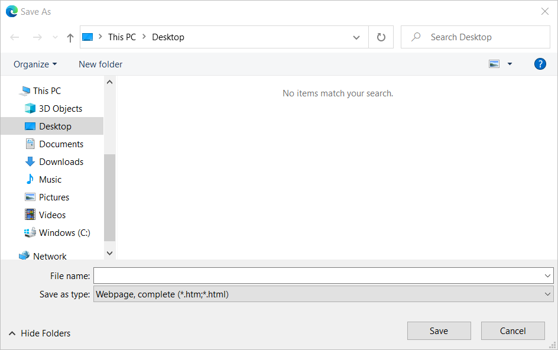

# Automate browser prompts

Many web pages display **Save as**, **Open**, and **Upload** dialogs to prompt users to select destination folders and files, respectively.

These dialogs aren't part of the web page, but they're handled by the web browser application or Windows File Explorer. As a result, you can't use the browser automation actions to automate them.

To automate these dialogs, use either the [recorder](../recording-flow.md) or the [UI automation group of actions](../actions-reference/uiautomation.md). 

