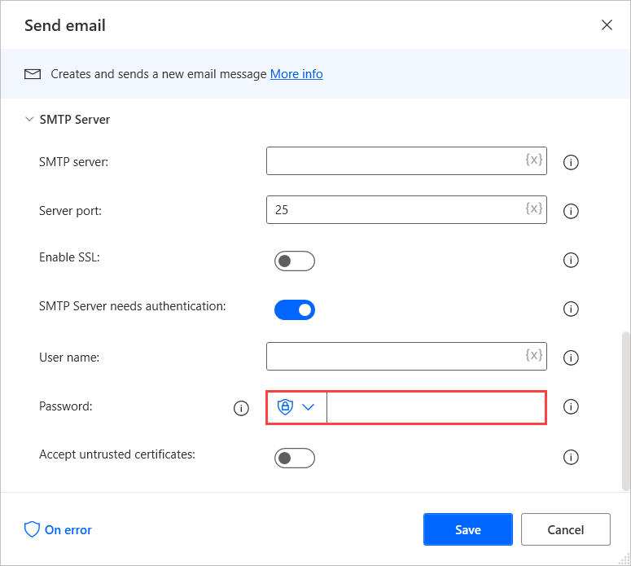

# Automate email accounts with two-step verification

To automate an email account protected with two-step verification, you need to create an app password.

App passwords are randomly generated passwords that can be used only once when you sign in to an application or device that doesn't support two-step verification.

To create app passwords for Microsoft personal or organizational accounts, follow the instructions in [Create new app passwords](/azure/active-directory/user-help/multi-factor-authentication-end-user-app-passwords#create-new-app-passwords). To create app passwords for other webmail services, search for information on their help page or community site. 

After creating an app password, populate it in the **Password** field of the **IMAP server** or **SMTP server** section of the email actions.

