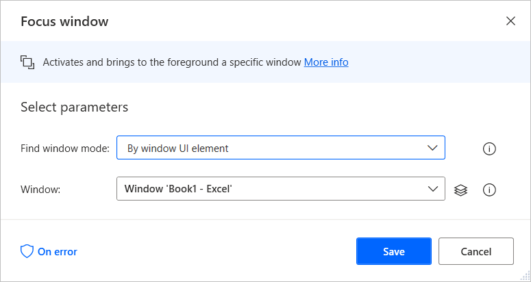
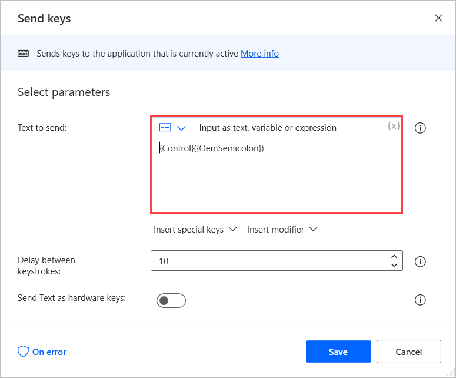

# Automate Excel using keyboard shortcuts

Apart from the Excel actions, Power Automate Desktop enables users to perform tasks in Excel using keyboard shortcuts.

Before sending keystrokes to an open Excel workbook, use the **Focus window** action to activate the respective window. 

To select a specific element in the window, use the appropriate UI automation action, such as the **Click UI element in windows** action.

When the Excel window is activated or the required element is selected, use the **Send keys** action to send the intended keystrokes.

For example, you can use the **Ctrl + ;** shortcut to insert the current date into the currently activated cell. To use this shortcut, populate the **Text to send** field of the **Send keys** action with the following expression: **{Control}({OemSemicolon})**

> [!NOTE]
> You can find all the available Excel keyboard shortcuts in [this article](https://support.microsoft.com/office/keyboard-shortcuts-in-excel-1798d9d5-842a-42b8-9c99-9b7213f0040f).
