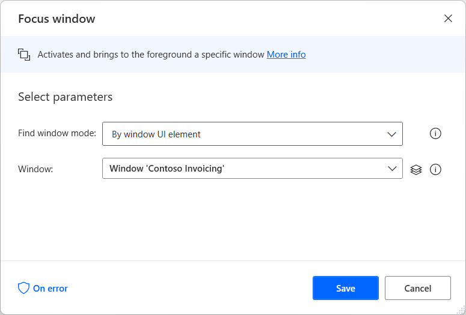

# Automate with mouse, keyboard, and OCR actions (recommended for automation in VDI)

For cases that a user isn’t able to access the UI elements of web or UI applications and thus can’t automate using Browser or UI actions or the recorders, it’s strongly recommended to use alternative methods of automation such as the use of Images or mouse and keyboard.

The image method, captures sections of the screen which are then used as references to perform clicks, send text and mouse clicks. Image-based automation can be either recorded by the [image-based recorder](../recording-flow.md#image-based-recording) or developed manually. Read more on how to automate using images in [this topic](../images.md).

Conversely, for cases that an image can't be used as a point of reference, consider using the OCR capabilities to navigate through the screen. Information on OCR capabilities can be found in the respective [actions reference](../actions-reference/ocr.md).

In both alternatives described above, the best way to navigate is using mouse clicks and keystrokes which are explained in the [actions reference](../actions-reference/mouseandkeyboard.md).

Before building your automation, ensure that the appropriate window is focused and maximized using the **Focus window** and **Set window state** actions.

If you need to wait for specific components to load before running an action, use the wait group of actions. 

Use the **Wait** action to wait for a set amount of time, the **Wait for image** action to wait for an image to appear/disappear, or the **Wait for text on screen (OCR)** action to wait for a text to appear/disappear.

To navigate through the web page or application and interact with its components, use the mouse and keyboard actions.

For example, deploy the **Send keys** action to use the available keyboard shortcuts, or the **Move mouse to image** and **Move mouse to text on screen (OCR)** actions to move the cursor to a specific image or text, respectively.

To retrieve text from the screen and store it into a variable, deploy either the clipboard actions or the **Extract text with OCR** action. To store a text in the clipboard, highlight the text using either the **Send keys** or the **Send mouse click** action.

You can configure the **Send keys** action to send the **CTRL + A** keyboard shortcut that selects all the text on the web page or application.

> [!NOTE]
> You can find more information regarding automation using keyboard shortcuts in [Automate applications using keyboard shortcuts](automate-applications-keyboard-shortcuts.md).

Alternatively, you can use the **Send mouse click**  action to send a **Left button down** at the beginning of the text you want to select and then a **Left button up** at the end. 

After highlighting, deploy the **Send keys** action to send the **CTRL + C** keyboard shortcut that stores the selected text in the clipboard. After storing the text in the clipboard, use the **Get clipboard text** action to store the clipboard content into a variable. 

