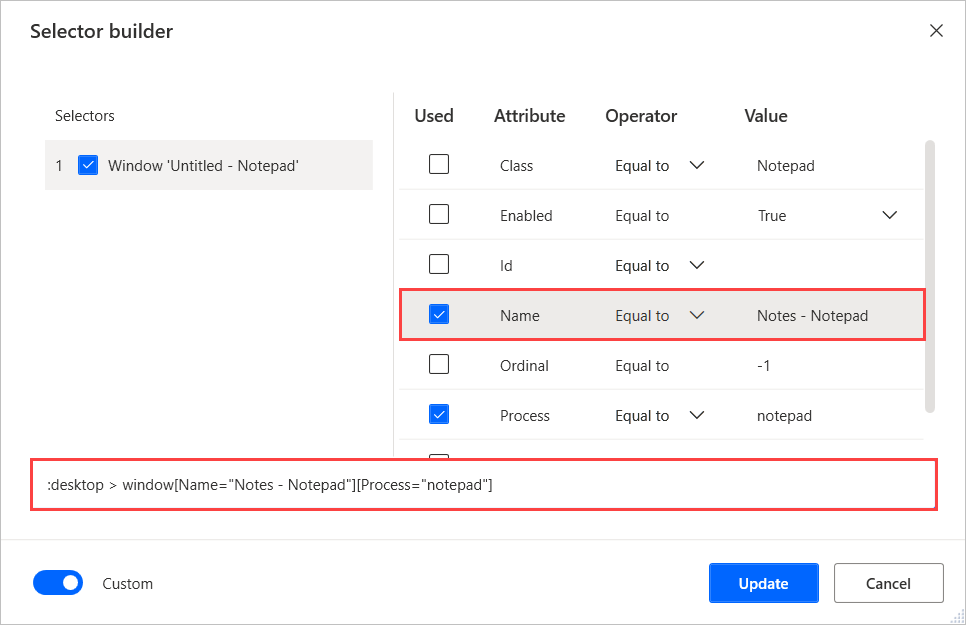
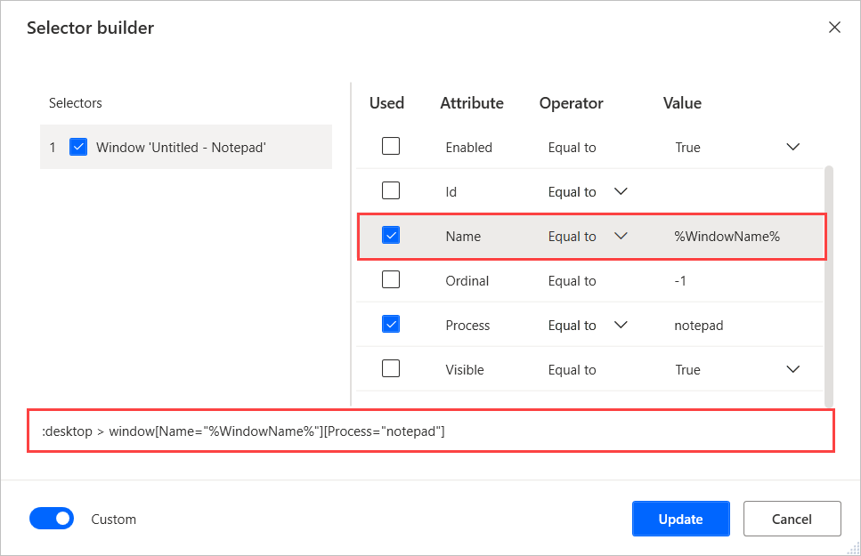

# Build a custom selector

Power Automate Desktop enables you to interact with web and desktop applications through UI elements. You can consider UI elements as application components, such as buttons and text fields.

To specify a UI element, you have to create selectors that pinpoint the specific component you want to interact with.

> [!NOTE]
> Power Automate Desktop supports the creation of multiple selectors for a UI element. If a selector fails to access the element, the following selector is used.

Although Power Automate Desktop enables you to create selectors automatically, some particular scenarios need manually created selectors. A common scenario is the automation of applications that display dynamic content.

When a custom selector is needed, you can modify an existing selector or build one from scratch.

To edit an existing selector, select the appropriate UI element and choose the selector you want to edit. 

To create a new selector, select the appropriate UI element and then the **New** button.

Selectors use the **>** notation to indicate the hierarchical structure of the selected elements. Each element in the selector is contained within the element on its left and displayed in the following form: **element[Attribute1=”Attribute1Name”][Attribute2=”Attribute2Name”]...[Attributen=”AttributenName”]**

For example, the following selector pinpoints the **File** menu option in an untitled Notepad window. 

> [!NOTE]
> The menu option and the Notepad window are different UI elements, but they have a parent-child relationship. 

Now, assume that you want to edit the selector to work with a Notepad window named **Notes**. To achieve this functionality, change the **Name** attribute of the selector to **Notes - Notepad**. The new selector should be: ****:desktop > window[Name="Notes - Notepad"][Process="notepad"]**

## Use operators in a custom selector

In the previous example, the selector located a Notepad window with a specific title. To make the selector more dynamic, you can replace the **Equals to** operator with other operators or regular expressions.

> [!Note]
> Power Automate Desktop's regular expression engine is .NET. You can find more information in [Regular Expression Language - Quick Reference](https://docs.microsoft.com/dotnet/standard/base-types/regular-expression-language-quick-reference).

The **Equals to** operator makes the selector search for a specific hard-coded value. Although this functionality is effective in static applications, hard-coded values can be a barrier in dynamic applications.

You can use the **Contains** operator to locate elements that don't have fixed values but always contain a specific keyword. For example, you can apply the **Contains** operator in the Notepad selector to make it work with all Notepad windows.

## Use variables in a custom selector

Apart from various operators, Power Automate Desktop enables you to create dynamic selectors using variables.

If the value of a selector's attribute depends on calculations and results of previous actions, you can replace the hard-coded value with a variable.

To use a variable in a selector, launch the **Custom selector builder** and populate the variable's name enclosed by percentage signs (**%**). You can find more information about the percentage notation in [Use variables and the % notation](../variable-manipulation.md).

If you use a variable in the **Name** attribute of the Notepad example, the selector will be **:desktop > window[Name="%WindowName%"][Process="notepad"]**.

