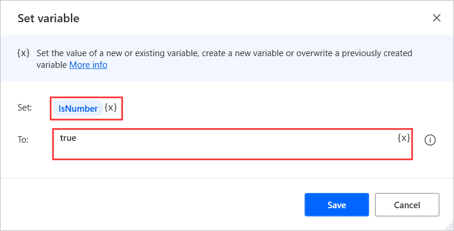
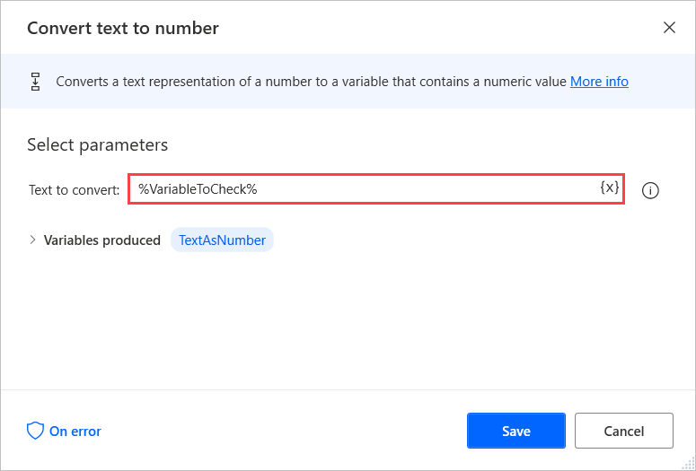
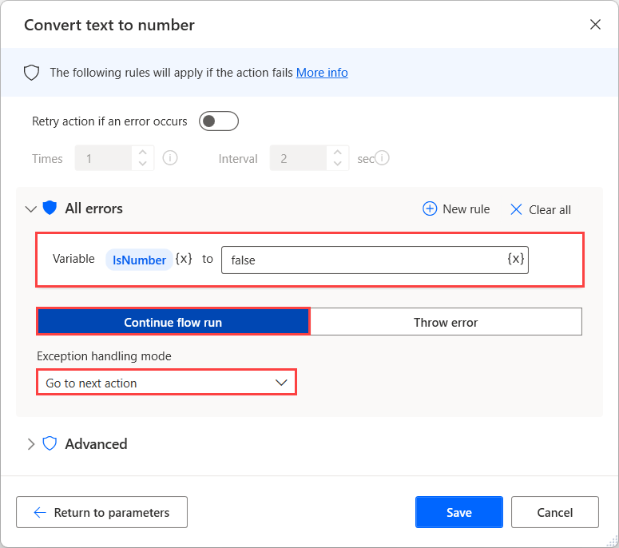
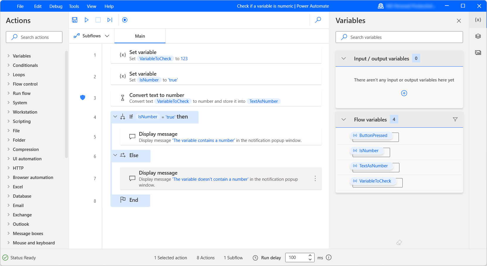

# Check if a variable is numeric

Power Automate enables users to insert data into flows using message boxes. In some scenarios, you may want to ensure that the entered data are numbers to make your flow robust to unexpected failures.

To check whether a variable contains a number or not:

1. Use the **Set variable** action to create a new variable that indicates whether the variable you want to check contains a number or not. Initialize this variable to **true**. In the following example, the created variable is named **IsNumber**.

    

1. Deploy the **Convert text to number** action and configure it to convert the variable you want to check to number.

    

1. Select the **On error** option in the action, and create a new rule that sets the **IsNumber** variable to false every time the action fails. Additionally, configure the flow to continue running when an error occurs.

    

1. Now, you can use conditionals to implement different behavior depending on the value of the **IsNumber** variable.

    
