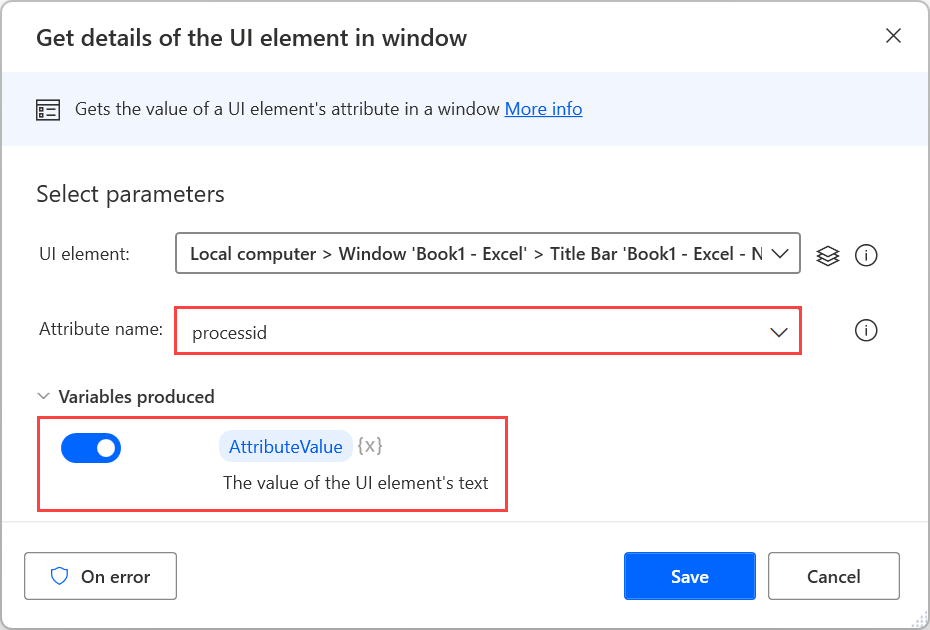
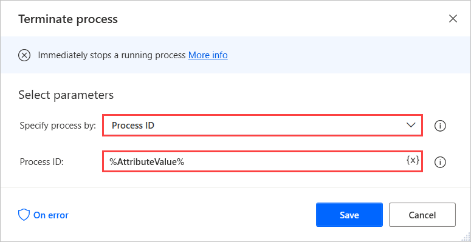

# Close any window through its process ID

When you handle desktop application, you may meet scenarios in which applications don't have static titles or have the same title as other windows. Power Automate allows users to close these applications using their process ID. 

To get the process ID of a window, use the **Get details of a UI element in window** action and retrieve the attribute **processid** from a random element within the window. The retrieved attribute is stored by default in a variable named **AttributeValue**.

> [!NOTE]
> The **Get details of a UI element in window** action requires a UI element that specifies the selected element in the window. You can find more information regarding UI elements in [Automate using UI elements](../ui-elements.md).

To close the window, use the **Terminate process** action and set it to stop the process with the previously retrieved ID.

