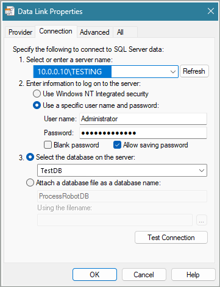
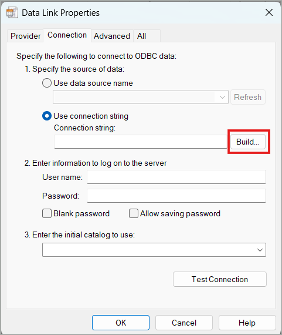
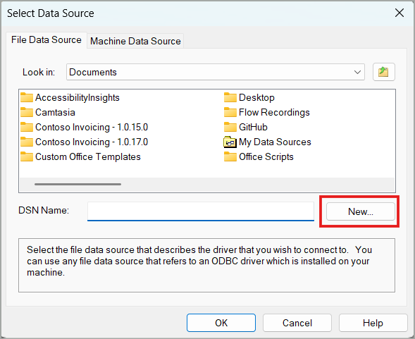
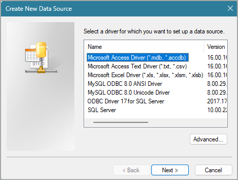
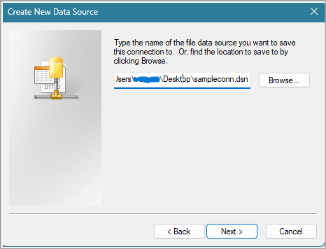
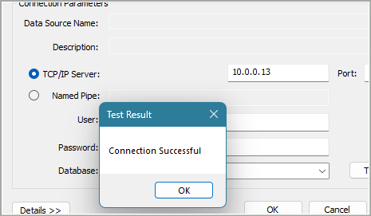

# Configure connection strings for Database related actions

## Summary

This article provides a detailed explanation of how to properly configure and test a connection string for database related actions.

## Open SQL Connection Guide

Power Automate for desktop uses the same functionality provided in Windows when creating UDL files ([Test OLE DB connectivity to SQL Server by using a UDL file](https://learn.microsoft.com/troubleshoot/sql/database-engine/connect/test-oledb-connectivity-use-udl-file)) and any file created like {file name}.udl triggers the procedure described below. **That means you can manually create a udl file to test the connection with the database**.

The available providers below refer to different kinds of relational databases:
 

The most common database providers used are MSQL, Oracle, MySQL or PostgreSQL.

## MSQL

MSQL (Microsoft SQL server) requires “Microsoft OLE DB Provider for SQL Server” for which the configuration is seen below:

Assuming the server can be pinged, the server name can also be {ServerDNS}{SQLDNS} and if the server has access to active directory, Windows NT can be used for authentication.

## MySQL, Oracle SQL, PostgreSQL and other relational providers

MySQL, Oracle SQL, PostgreSQL and other relational providers will work with “Microsoft OLE DB Provider for ODBC”. In order to create a connection with the SQL server, you need to download and install the relevant ODBC driver. Creating a connection follows the same procedure for every provider, with the login only being different. Below is an example for MySQL:

Select **Use connection string** and build the connection string manually using the provider’s menu.

Here you choose the file name of the connection. Creating a connection file allows you to use a previously created login and generate the connection string immediately, without having to login to the SQL server again.

At this point, if you’ve successfully installed the relevant ODBC driver you will see it in the list.

Create a data source file by providing the full path. When the data source file is created, we get into the provider’s config screen (note: each provider will have different configuration steps when arriving at this point, **this example only refers to MySQL**):

Fill all the info and test the connection. If the connection works the test will be successful:

Click OK and the connection string will be generated:

Check the **Allow saving password** option, so that the provider also includes the password in the connection string, and click OK, otherwise the connection will fail.

> [!NOTE]
> Due to a known issue in the connection string builder tool (Windows related udl functionality), the connection string sometimes has to be manually copied and pasted from the provider's connection string field into the “Open SQL connection” action input.

## Potential solutions to connectivity issues other than wrong configuration

- Check SQL server configuration:
  - Ensure that the SQL server is configured to listen to the appropriate network interface or IP address.

- Verify network connectivity:
  - Make sure that both the host machine and the target server are connected to the same network and can communicate with each other. Ping is a good initial test, but you should also confirm that there are no network-level restrictions or firewalls blocking the SQL server port between the host and the target machine.

- Check firewall settings:
  - Ensure that the firewall on the target machine allows incoming connections to the SQL port. You may need to add a rule to the firewall configuration to permit incoming traffic on SQL’s port. The exact steps depend on the operating system and firewall software running on the target machine.

- Verify SQL server user and permissions:
  - Check if you have a SQL user account that allows connections from the host machine. Ensure that there is a user account that allows connections from the IP address or network range of the host machine.

- Test connectivity using SQL client:
  - From the host machine, try connecting to the SQL server on the target machine using an SQL client tool (such as MySQL Workbench or the command-line client). Specify the IP address or hostname of the target machine, the port number, and the appropriate SQL user credentials. If the connection fails, note any error messages you receive, as they can provide further insights into the problem.

- Verify SQL service status:
  - Check if the SQL service is running on the target machine. If it's not running, you'll need to start it using the appropriate commands for your operating system (e.g., systemctl start MySQL for systems that use Systemd).
