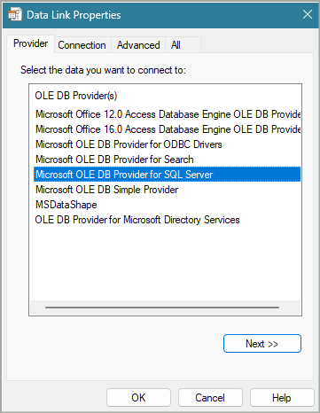

# Configure connection strings for Database related actions

## Summary

This article provides a detailed explanation of how to properly configure and test a connection string for database related actions.

## Open SQL Connection Guide

Power Automate for desktop uses the same functionality provided in Windows when creating UDL files ([Test OLE DB connectivity to SQL Server by using a UDL file](https://learn.microsoft.com/troubleshoot/sql/database-engine/connect/test-oledb-connectivity-use-udl-file)) and any file created like {file name}.udl triggers the procedure described below. That means you can manually create a udl file to test the connection with the database.

The available providers below refer to different kinds of relational databases:
 

