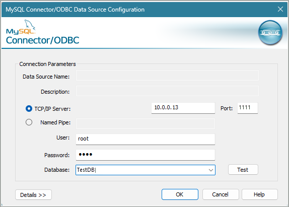

# Configure connection strings for database related actions

## Summary

This article provides a detailed explanation of how to properly configure and test a connection string for database related actions.

## Open SQL Connection Guide

Power Automate for desktop uses the same functionality provided in Windows when creating Universal Data Link (UDL) files ([Test OLE DB connectivity to SQL Server by using a UDL file](/troubleshoot/sql/database-engine/connect/test-oledb-connectivity-use-udl-file)). Any file created like {file name}.udl triggers the procedure described in the following documentation. This means you can manually create a UDL file to test the connection with the database.

The following available providers refer to different kinds of relational databases:

The most common database providers used are Microsoft SQL Server, Oracle, MySQL, and PostgreSQL.

## Microsoft SQL Server

Microsoft SQL server (MSQL) requires Microsoft OLE DB Provider for SQL Server, which is shown in the following configuration:

Assuming the server can be pinged, the server name can also be `{ServerDNS}{SQLDNS}`. If the server has access to active directory, Windows NT can be used for authentication.

## MySQL, Oracle SQL, PostgreSQL, and other relational providers

MySQL, Oracle SQL, PostgreSQL, and other relational providers work with “Microsoft OLE DB Provider for ODBC”. In order to create a connection with the SQL server, you need to download and install the relevant ODBC driver. Creating a connection follows the same procedure for every provider, with the sign in only being different. The following screenshot is an example for MySQL:

Select **Use connection string** and build the connection string manually using the provider menu.

Here you choose the file name of the connection. Creating a connection file allows you to use a previously created login and generate the connection string immediately, without having to sign in to the SQL server again.

At this point, if you successfully installed the relevant ODBC driver, you see it in the list.

Create a data source file by specifying the full path. Once the data source file is created, you are directed to the provider configuration screen. Each provider has different configuration steps at this point. The following example shows configuration for MySQL:

Enter all the required information and test the connection. If the connection is successful, the test will confirm it:

Select **OK** and the connection string is generated.

Check the **Allow saving password** option, so that the provider also includes the password in the connection string, and select **OK**, otherwise the connection fails.

> [!NOTE]
> Due to a known issue in the connection string builder tool (Windows related UDL functionality), the connection string sometimes has to be manually copied and pasted from the provider's connection string field into the “Open SQL connection” action input.

## Potential solutions to connectivity issues other than wrong configuration

- Check SQL server configuration:
  - Make sure the SQL server is configured to listen to the appropriate network interface or IP address.

- Verify network connectivity:
  - Make sure that both the host machine and the target server are connected to the same network and can communicate with each other. Ping is a good initial test, but you should also confirm that there are no network-level restrictions or firewalls blocking the SQL server port between the host and the target machine.

- Check firewall settings:
  - Make sure the firewall on the target machine allows incoming connections to the SQL port. You might need to add a rule to the firewall configuration to permit incoming traffic on SQL’s port. The exact steps depend on the operating system and firewall software running on the target machine.

- Verify SQL server user and permissions:
  - Check if you have a SQL user account that allows connections from the host machine. Make sure there's a user account that allows connections from the IP address or network range of the host machine.

- Test connectivity using SQL client:
  - From the host machine, attempt to connect to the SQL server on the target machine using a SQL client tool, such as MySQL Workbench or the command-line client. Specify the IP address or hostname of the target machine, the port number, and the appropriate SQL user credentials. If the connection fails, take note of any error messages, as they can provide further insights into the issue.

- Verify SQL service status:
  - Verify that the SQL service is running on the target machine. If it isn't running, start it using the appropriate commands for your operating system (for example, `systemctl start MySQL` for systems that use Systemd).
