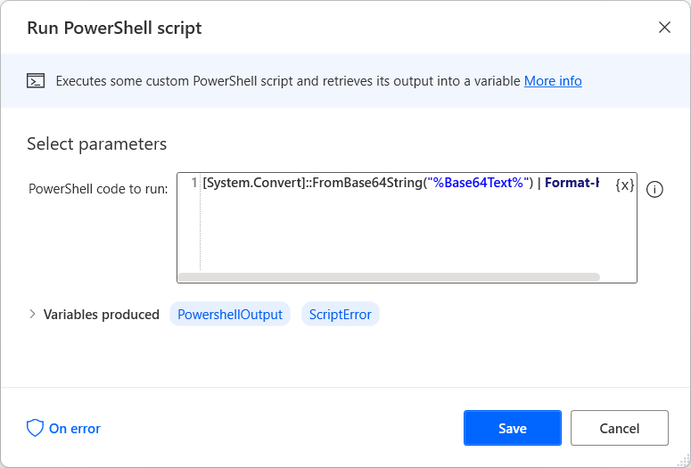

# Convert Base64 text to hexadecimal format

Although cryptography actions produce variables encoded in Base64 format, some cryptography engines use the hexadecimal representation of the encrypted value.

To convert the Base64 text to hexadecimal format, use the **Run PowerShell script** action and populate the following command. Before deploying the **Run PowerShell script** action, use a **Set variable** action to store the text you want to convert into a variable. In this example, the script converts the text stored into the **Base64Text** variable.

``` PowerShell
[System.Convert]::FromBase64String("%Base64Text%") | Format-Hex
```

> [!NOTE]
> You can find more information regarding PowerShell utility cmdlets in [this article](/powershell/module/microsoft.powershell.utility).

The action produces the PowershellOutput variable that stores the encrypted or hashed value in hexadecimal format.


