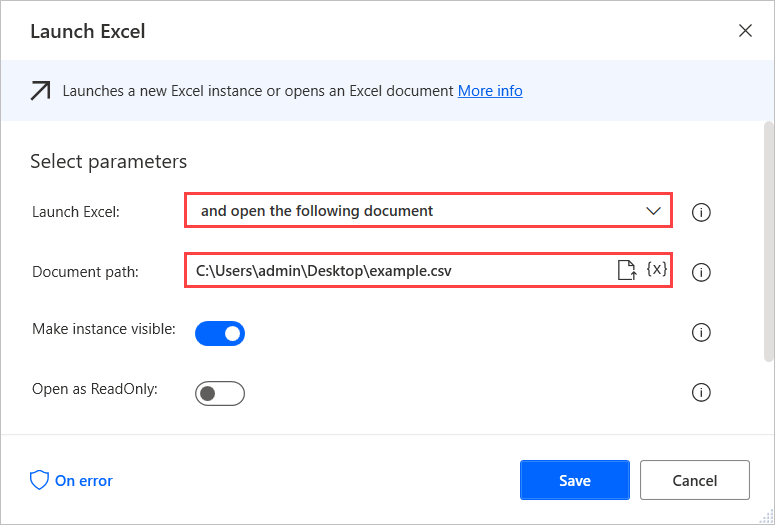
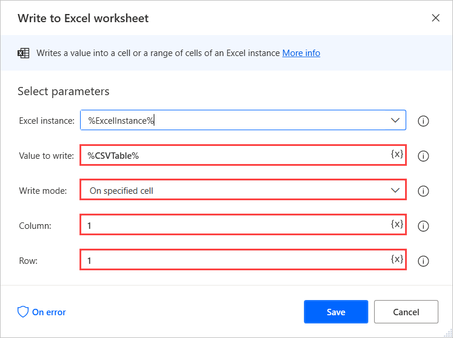
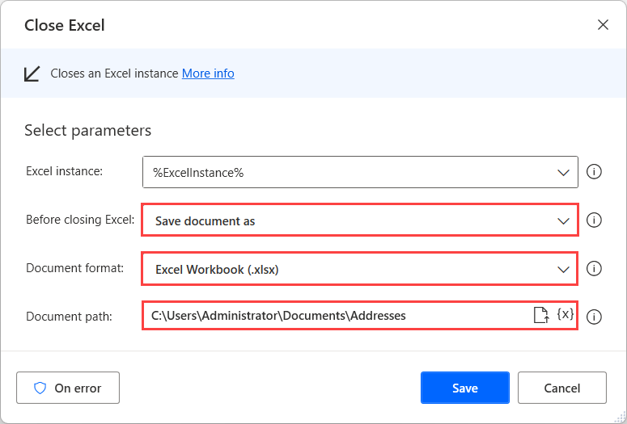
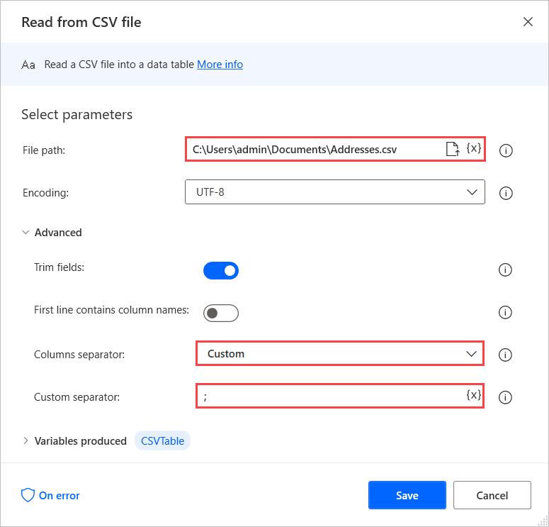

# Convert a CSV file into an Excel spreadsheet

A comma-separated values file (CSV) is a delimited text file that uses a specific character to separate a series of values. Power Automate allows you to open comma-delimited and tab-delimited CSV files directly through the **Launch Excel** action.

> [!NOTE]
>
> - Excel uses the list separators defined in the Windows regional settings. In some regions, you have to manually set the semicolon character as a separator or apply the following workaround.

## Run the Launch Excel action

> [!NOTE]
> If your comma delimited file uses semi-colons, go to [Semicolon-delimited CSV files](#semicolon-delimited-csv-files).

1. Open Power Automate desktop.
1. Open an existing flow for editing or select **New flow** to create a new one.
1. In the flow designer, on the left **Actions** pane, expand **Excel**, and then double-click **Launch Excel**.
1. Enter the parameters you want, and then select **Save**.
    

Next, launch a blank Excel document using the **Launch Excel** action and paste the CSV table into cell A1 using the **Write to Excel worksheet** action.

Now, you can deploy the **Close Excel** action to save the Excel worksheet as a new XLSX file. To do this, select **Save document as**, and for **Document format**, select **Excel Workbook (.xlsx)**.

## Semicolon-delimited CSV files

Although the **Launch Excel** action can handle the previously mentioned cases, semicolon-delimited CSV files might require a different approach.

To overcome this limitation, deploy the **Read from CSV file** action and set the semicolon character (**;**) as a **Custom separator** in the **Advanced** options. If the first row of the CSV file contains headers, enable the **First line contains column names** option to use the respective headers at the retrieved data table.

## See also

[Excel actions reference](/power-automate/desktop-flows/actions-reference/excel)