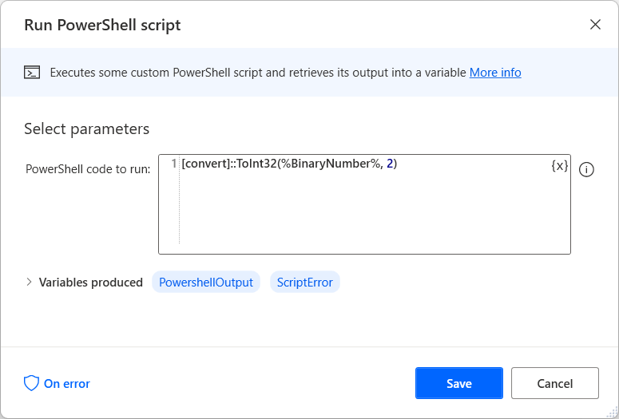

# Convert data using PowerShell

Data conversion is an essential functionality in desktop flows, as different actions and applications may require data in specific formats. Power Automate offers various actions to direct convert data formats, such as the **Convert text to number** and **Convert file to Base64** actions. 

However, there are conversion scenarios that can't be handled by the available actions. To address these cases, run a PowerShell script that performs the desired conversion.

To run a PowerShell script, use the **Run PowerShell script** action and populate the appropriate command for the conversion you want to do. For example, the following PowerShell script converts a binary number stored in the **BinaryNumber** variable to decimal. 

The action produces the **PowershellOutput** variable that stores the result of the conversion as a text. 

> [!NOTE]
> You can find more information regarding PowerShell conversion methods in [this article](/dotnet/api/system.convert.toint32).

