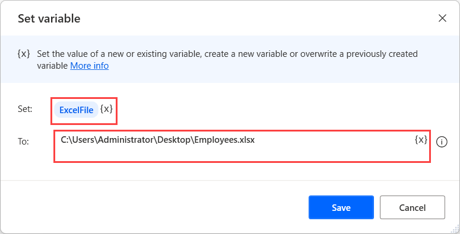

# Convert Excel to PDF using VBScript

To convert an Excel file to PDF:

1. Use the **Set variable** action to create a new variable containing the path of the Excel file you want to convert. In this example, the variable is named **ExcelFile**.

    

1. Use a second **Set variable** action to create a variable containing the path of the PDF file you want to create. In this example, the variable is named **PdfFile**.

    

1. Deploy the **Run VBScript** action and populate the following code. 

    ``` VBScript
    Dim Excel
    Dim ExcelDoc

    'Opens the Excel file'
    Set Excel = CreateObject("Excel.Application")
    Set ExcelDoc = Excel.Workbooks.open("%ExcelFile%")

    'Creates the pdf file'
    Excel.ActiveSheet.ExportAsFixedFormat 0, "%PdfFile%" ,0, 1, 0,,,0

    'Closes the Excel file'
    Excel.ActiveWorkbook.Close
    Excel.Application.Quit
    ```

    
