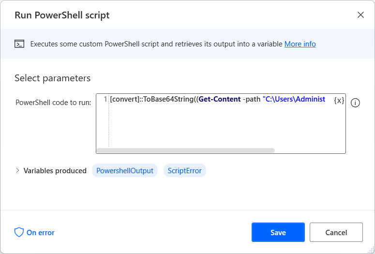

# Convert a file to Base64 string format

In some web services, you can upload files via the POST method only if the files are in Base64 string format. 

To convert a file to this format, you can use the **Run PowerShell script** to run the following command. Before running the flow, replace the **file-path** placeholder with the path of the file you want to convert or a variable containing it.

``` PowerShell
[convert]::ToBase64String((Get-Content -path "file-path" -Encoding byte))
```
The action produces the **PowershellOutput** variable that stores a text value representing the contents of the specified file in Base64 format.



