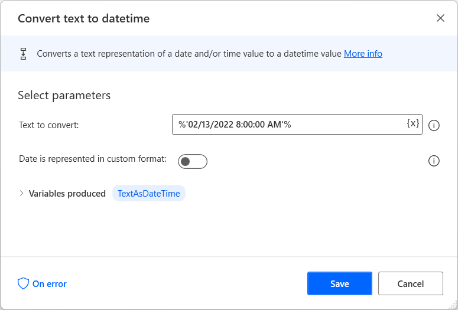
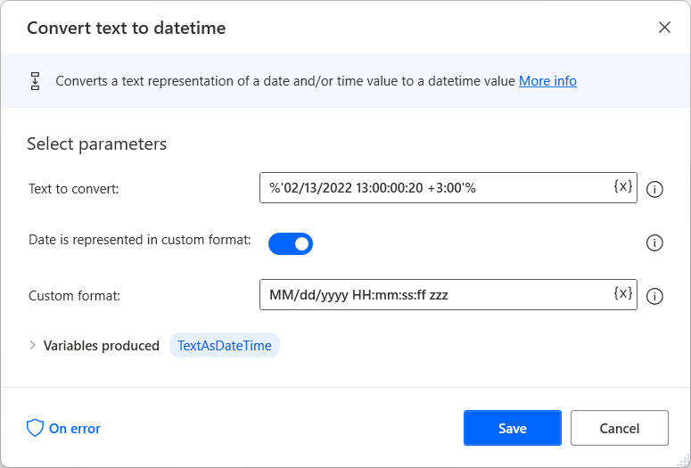

# Convert a text value to datetime

When a desktop flow reads entries from files or extracts values from applications, the returned values usually are texts.

It's common in flow development to convert these values to other datatypes to perform additional operations. For example, you could convert a text value that represents a date to a datetime variable for later use in datetime actions.

Power Automate provides the **Convert text to datetime** action to perform the conversion. This action enables you to convert a date represented in the default format of your system or a custom format. 

The default format is specified by the region and language settings of your machine. For example, the default date format for the United States is **MM-dd-yyyy**. The time part, if it exists, can be represented in both 12-hour and 24-hour formats. 

> [!NOTE]
> If the value doesn't contain a time part, the time of the generated datetime variable will be automatically set to  **12:00:00 AM**.

> [!NOTE]
> Power Automate allows you to use all the standard date separators for the different parts of the date value. In the previous example, dates represented in the **MM-dd-yyyy** and **MM/dd/yyyy** notations will have the same result. 

If the value to convert is represented in a custom format, enable the **Date is represented in custom format** option and populate the respective format. 

You can find all the available notations in the following table:

| Notation | Description  |
|----------|--------------|
| **yyyy** | Year         |
| **MM**   | Month        |
| **dd**   | Day          |
| **HH**   | Hour         |
| **mm**   | Minutes      |
| **ss**   | Seconds      |
| **ff**   | Milliseconds |
| **zzz**  | UTC Offset	  |

To separate the different parts of the date, you can use all the standard date separators, like forward slashes (**/**), dashes (**-**), and dots (**.**). 

