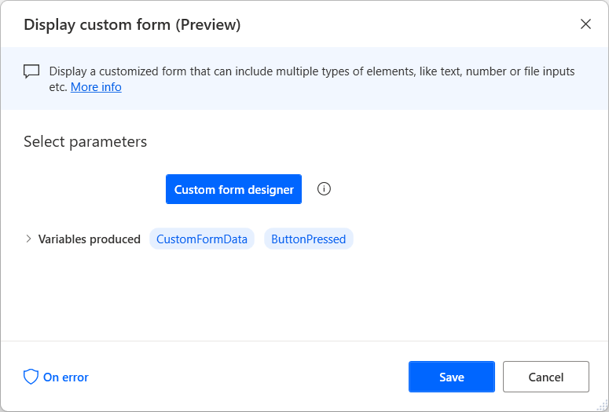
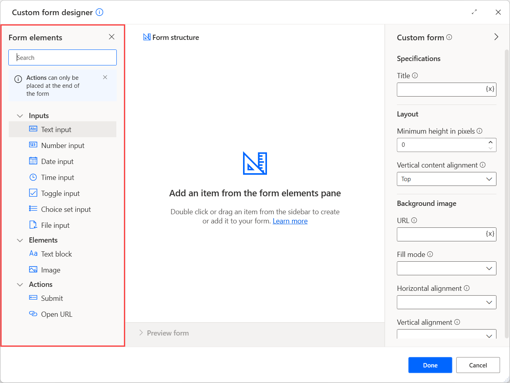
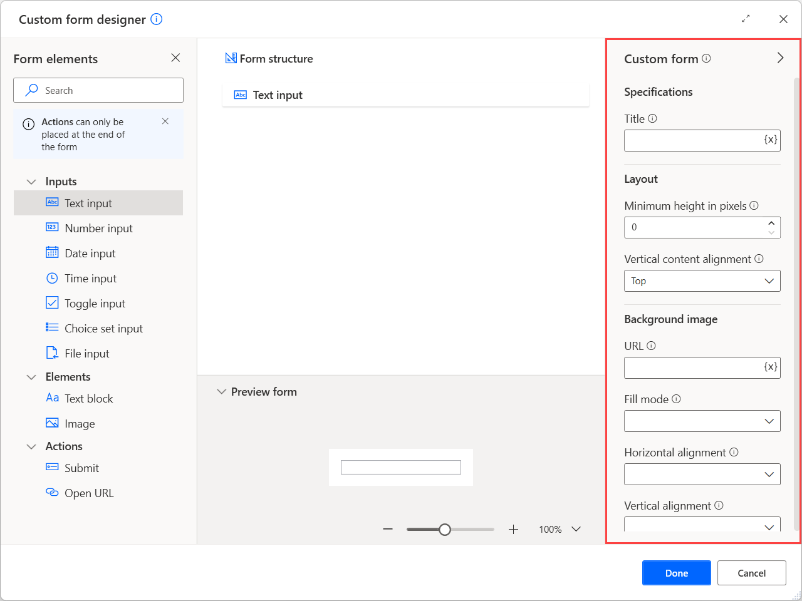

# Create and use custom forms

## The Display custom form action

Power Automate offers a wide variety of message boxes actions that prompt users to enter various types of elements, such as text, dates, and files.

Although these actions can handle scenarios where a single input is required, they aren't practical when multiple inputs are needed. The best approach to address these scenarios is the **Display custom form** action. 

After deploying the action, press the **Custom form designer** button to open the designer of the custom form.

On the left side of the designer, there's a list with all the available input elements you can add to the form, such as text, date, and file inputs. All the inputs provided by the users are stored in the **CustomFormData** variable. Apart from the input elements, you can also add non-interactive elements, such as texts and images.

> [!NOTE]
> The **CustomFormData** variable is a custom object. You can find more information regarding custom objects and how to handle them in [Advanced data types](../variable-data-types.md#advanced-data-types)

To gather and store the provided data for later use in your flow, you must add a **Submit** action. Each action has a unique ID, while the ID of the last pressed action is stored into the **ButtonPressed** variable. When a form contains multiple actions, use this variable to check which one is pressed and implement different functionality for each scenario.

After adding an element to the form, you can see all the available configurations on the right side of the form designer. The available options may differ depending on the nature of the selected element. For example, all input elements offer specification, layout, and validation options.

## Handle custom form data

After creating a custom form, it's typical to check which button is pressed and handle the gathered data accordingly.

To become familiar with this functionality, create a new custom form  containing the following elements:

- A text input with ID **Name** that stores the name of a customer 
- A text input with ID **LastName** that stores the last name of a customer 
- A submit action with ID **Save**
- A submit action with ID **Cancel** and the option **Ignore provided inputs** enabled. 

The purpose of the flow is to check which form action is pressed. When the **Save** action is pressed, the flow stores the gathered data in an Excel spreadsheet. When the **Cancel** action is pressed, the flow stops and returns an error. 

To implement this behaviour:

1. Deploy an **If** action and check whether the **ButtonPressed** variable contains the value **Save**.

    

1. Inside the if block, launch an Excel spreadsheet. For this example, the spreadsheet must contain two columns for the name and last name of the customer.

    

1. Use a **Get first free column/row from Excel worksheet** action to find the first available row in the spreadsheet.

    

1. Deploy a **Write to Excel worksheet** action and write the customer's name in the first column of the first available spreadsheet row. 

    All the form inputs are stored in the **CustomFormData** custom object variable. To access the value of a specific element of the custom object, use the following notation: **CustomFormData['ElementID']**.

    > [!NOTE]
    > You can find more information regarding custom objects in [Advanced data types](../variable-data-types.md#advanced-data-types)

    

1. Use a second **Write to Excel worksheet** action to write the customer's last name in the second column of the first available spreadsheet row.

    

1. Save and close the Excel file using the **Close Excel** action.

    

1. Add an **Else** action inside the if block and use a **Stop flow** action to stop the flow when the if statement is false. 

    