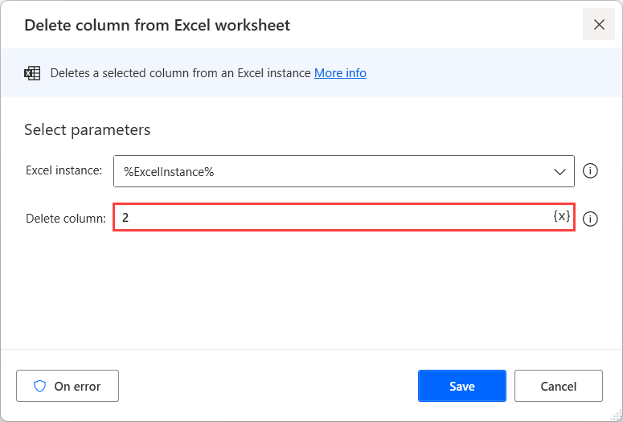
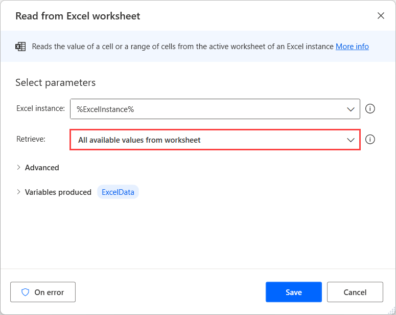
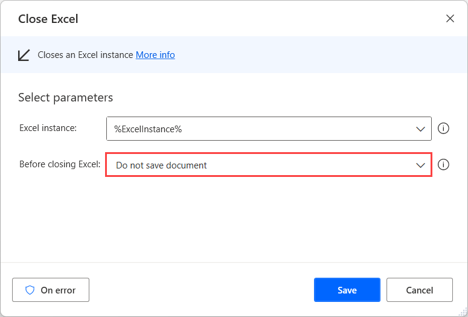

# Delete columns from a datatable

Although Power Automate doesn't provide a direct way to delete columns from datatables, this functionality is feasible with the following workaround:

1. Use the **Launch Excel** action to launch a new blank Excel worksheet.

    

1. Deploy the **Write to Excel worksheet** action and configure it to write the datatable to the previously launched worksheet.

    

1. Use the **Delete column from Excel worksheet** action to delete the wanted column of the datatable.

    

1. Deploy the **Read from Excel worksheet** action and read all the available values from the Excel worksheet. The updated datatable is now stored in a variable named **ExcelData**.

    

1. Close the Excel worksheet without saving using the **Close Excel** action.

    
