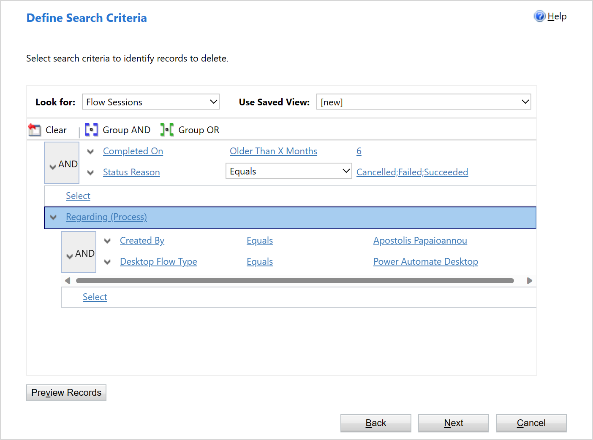
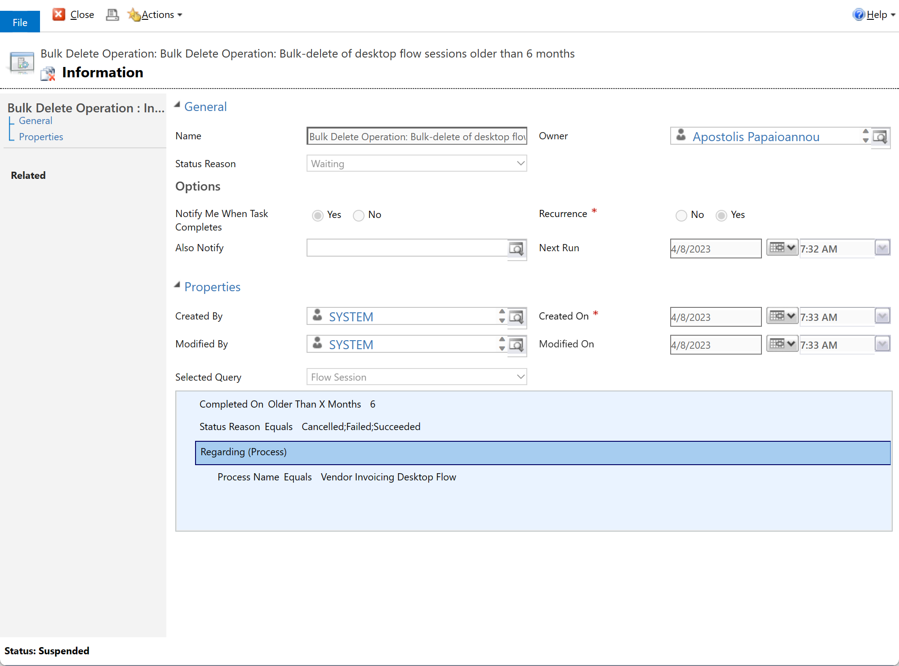

# Delete desktop flow run history data  

Effective management of historical data generated by [Microsoft Power Automate](https://powerautomate.microsoft.com/) can be important to ensure that your Dataverse environments remain efficient and cost-effective. By implementing data retention policies and utilizing features like [Bulk Record Deletion](power-platform/admin/delete-bulk-records) of [Microsoft Dataverse](power-apps/maker/data-platform/data-platform-intro) and the Power Platform admin center, you can proactively manage the accumulation of historical data. This can help free up valuable storage space for other important data and ensure that your Dataverse environments remain optimized.

In the following sections, we'll walk you through the steps on how to purge historical desktop flow data from your environment using Microsoft Dataverse's built-in [bulk-delete feature](power-platform/admin/delete-bulk-records). This feature allows you to quickly and easily [remove large amounts of data](power-apps/developer/data-platform/delete-data-bulk) from your environment in compliance with your specific data retention policies, ensuring efficient data storage and performance management. In addition to ad-hoc bulk-delete jobs, you could also schedule recurrent bulk-delete jobs that will find and delete records in a table that are ***"OlderThanXDays"*** for instance.

We'll cover how to identify the desktop flow data that could be purged, how to create a bulk delete job to delete the data, and how to monitor the progress of the job.

> [!CAUTION]
> Before deleting any Dataverse data, either manually or by creating bulk delete jobs, it is important to understand that the data is permanently deleted from your Dataverse environment, and there's no way to recover the data individually once it's been deleted. If you accidentally delete important data, or if the bulk delete job doesn't work as expected, you could lose valuable data, configurations and even put functional product areas at risk.
>
> Having a validated Dataverse backup in place before any delete operation may help mitigate this risk. Please note though that backup and recovery is outside the scope of this document, but there are resources available for learning more about how to back up and restore your Dataverse environment [here](power-platform/admin/backup-restore-environments).

> [!NOTE]
> To create bulk-delete jobs in Microsoft Dataverse, you need to have the **Bulk Delete** privilege in at least one of the roles that have been assigned to you.

## Desktop flow tables with potentially large data volumes

| Display name    | System name    | Details                                                      |
| --------------- | -------------- | ------------------------------------------------------------ |
| Flow Session    | flowsession    | The Flow Session table stores metadata about desktop flow runs, such as the start time, completion time, context, detailed action logs and status of the run. The **Regarding** field in this table is referencing a desktop flow Id (workflowid) for which the flow session record has been created for. |
| Workflow Binary | workflowbinary | The Workflow Binary table stores binary data for all types of workflow runs, such as the input and output data and exceptions screenshots in case of desktop flow runs. |

> [!IMPORTANT]
> The Flow Session and Workflow Binary tables in Microsoft Dataverse have a **cascade relationship**. The cascade relationship between these two tables ensures that when a desktop flow run is deleted from the Flow Session table, all associated Workflow Binary records are also deleted. This helps to keep the Microsoft Dataverse database clean and avoids orphaned records.

### Creating a bulk-delete job to delete desktop flow run history

To bulk-delete data in Dataverse, you should open a browser window and navigate to the [Power Platform Admin Center](https://admin.powerplatform.microsoft.com/) and follow the detailed steps below.

> [!IMPORTANT]
> Bulk-delete operations are **irreversible** and can't be undone. So, it's really important that you thoroughly test and review your filter results to make sure it's right for your intended use case before you perform any bulk delete operations.

1. Sign in to the **Power Platform admin center**.

2. Select **Environments** in the left navigation pane, **select your environment**, and then select **Settings** on the top menu bar.

3. Select Data management > **Bulk deletion**.

4. From the Bulk Record Deletion grid, select **New** on the command bar. This will open the Bulk Deletion wizard that allows you to define a query for the records you want deleted.

5. In the **Look for** list, select the **Flow Sessions** table from the list.

6. In the search criteria area, add desired filter that should return the records that you want to be deleted. Here’s an example that will find all **desktop flow runs that are older than 6 months** (format: Field | Filter Type | Value):

   ```Completed On | Older Than X Months | 6```

7. Select **Next**.

8. In the Name text box, type a name for the bulk deletion job e.g. “**Bulk-delete of desktop flow sessions older than 6 months**”.

9. Select a date and time for the job start time (preferably a time when users are typically not online).

10. Select the **Run this job after every** check box, and then in the days list, select the frequency you want the job to run.

11. If you want a notification e-mail sent, select the **Send an email to me** (email@domain.com) when this job is finished check box.

12. Select **Next**, review the bulk deletion job, and then select **Submit** to create the recurring job.

### Advanced record filtering

Using Microsoft Dataverse's Bulk Deletion Wizard, you can create more advanced queries to filter your records using more complex filter criteria options. For instance, you could use grouping features such as AND and OR and even search for data in related tables to combine multiple conditions into a single query.

In the following filter example screen we are searching for all **Flow Session** records that are **older than six months**, with a status of **Cancelled**, **Failed** or **Succeeded**, and associated with a specific desktop flow. For this you will apply the **Group AND** option and use the **Regarding (Process)** field of the related desktop flow table to filter based on **desktop flow name.**



### Monitoring bulk-delete jobs

To monitor Microsoft Dataverse bulk-delete jobs, please follow these steps:

1. Sign in to the **Power Platform admin center**.
2. Select **Environments** in the left navigation pane, **select your environment**, and then select **Settings** on the top menu bar.
3. Select Data management > **Bulk deletion**.
4. From the Bulk Record Deletion grid, you can use the view selector to view the **completed**, **in-progress**, **pending**, and **recurring bulk deletion system jobs**.
5. The **Recurring Bulk Deletion System Jobs** view shows the job definitions for the bulk deletion system jobs that you've just created together with the ones that are included out of the box. If you open one of these recurring bulk deletion system job records, you can see the query the job uses to identify which records to delete and the schedule the job runs on. For these out-of-the-box system jobs, you can't modify the query used by the system job, but you can modify the schedule the job runs on.
   

6. If you update the view selector to show jobs that have already been scheduled, are in progress, or executed, you can cancel, resume, or postpone the job. You can find these options in the Actions menu when you open the record.

### See also

[Remove a large amount of specific, targeted data with bulk deletion](power-platform/admin/delete-bulk-records)
[Delete data in bulk](power-apps/developer/data-platform/delete-data-bulk)
[View and take action on bulk deletion jobs](power-platform/admin/view-take-action-bulk-deletion-jobs)
