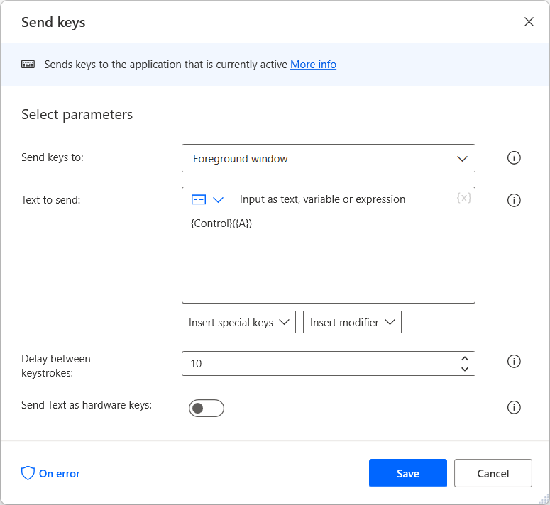

# Ensure that application windows become focused 

Although Power Automate provides the **Focus window** action, depending on the nature of the selected application, the action may not bring the window to focus.

To verify that the **Focus window** action can't bring a specific window to focus, send some keystrokes using the **Send keys** action. If the window isn't focused, the keystrokes won't work as expected.

To ensure that the window will become focused, send a click on it after deploying the **Focus window** action. Depending on the scenario, you can use either of the following actions to send a click on the window: 

- [Click UI element in window](../actions-reference/uiautomation.md#click)
- [Move mouse to image](../actions-reference/mouseandkeyboard.md#movemousetoimagebase) - Enable the **Send a click after moving mouse** option
- [Send mouse click](../actions-reference/mouseandkeyboard.md#sendmouseclick)
- [Move mouse to text on screen (OCR)](../actions-reference/mouseandkeyboard.md#movemousetotextonscreenwithocraction) - Enable the **Send a click after moving mouse** option

> [!NOTE]
> You can find more information regarding sending keystrokes in [Automate applications using keyboard shortcuts](automate-applications-keyboard-shortcuts.md).
