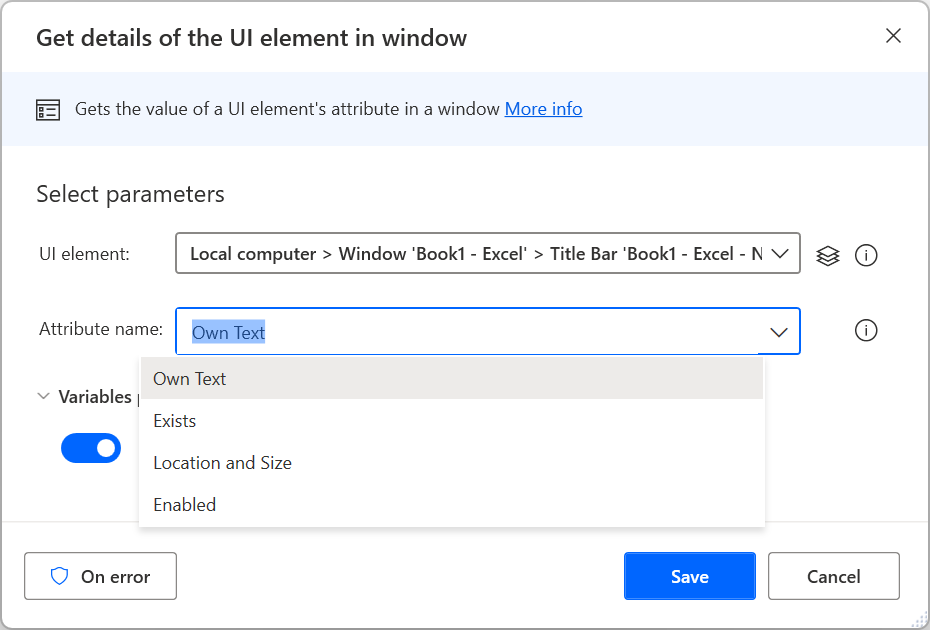

# Extract attributes from window elements

The **Get details of a UI element in window** action enables users to retrieve the values of various attributes that window elements may have.

These values can be used in various operations, such as [managing windows by their handles](identify-window-handle.md) and [closing windows through their process IDs](close-window-process-id.md).

Apart from the four predefined attributes that the action provides, you also retrieve the following attributes:

| Attribute            | Description                                                                                     |
| -------------------- | ----------------------------------------------------------------------------------------------- |
| Acceleratorkey       | The accelerator key combinations for the automation element.                                    |
| Accesskey            | The access key that allows you to quickly navigate to the web server control.                   |
| bulktext             | The text of the element regardless of whether the element or its subelements are hidden or not. |
| class                | The class of the element.                                                                       |
| controltype          | The control tyoe of the element.                                                                |
| haskeyboardfocus     | Indicates whether the element has keyboard focus                                                |
| helptext             | The help text of the element.                                                                   |
| id                   | The id of the element.                                                                          |
| iscontentelement     | Indicates whether the element is a content element.                                             |
| iscontrolelement     | Indicates whether the element is a control element.                                             |
| Iskeyboardfocusable  | Indicates whether the element is keyboard focusable.                                            |
| isoffscreen          | Indicates whether the element is visible on the screen.                                         |
| ispassword           | Indicates whether the element is a password.                                                    |
| localizedcontroltype | A localized description of the control type.                                                    |
| name                 | The name of the element.                                                                        |
| parentwindowhandle   | The handle of the parent window.                                                                |
| processid            | The process ID of the parent window.                                                            |
| processname          | The process name of the parent window.                                                          |
| windowtitle          | The  title of the parent window.                                                                |
