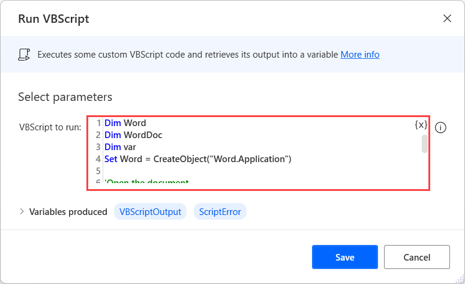
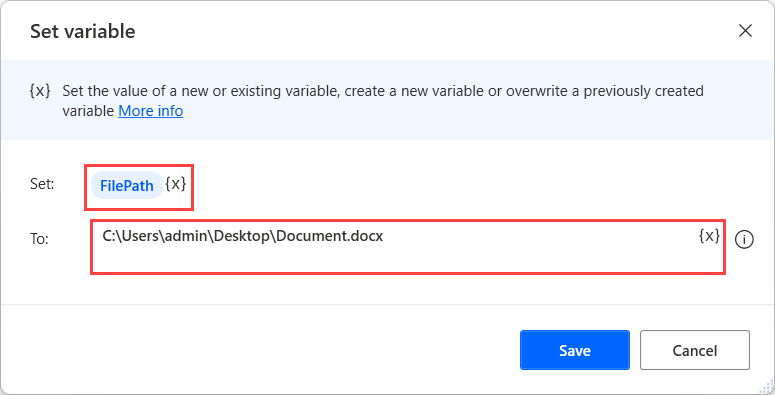

# Extract text from a Word document using VBScript

Although you can use optical character recognition (OCR) to extract text from Word documents, this approach can become complicated for multi-page documents that require scrolling.

A more efficient way to extract text from Word documents is the use of VBScript. Power Automate provides the **Run VBScript** action that enables you to run scripts on your desktop.

To extract text from a Word document, deploy the **Run VBScript** action and paste the following code in the **VBScript to run** field.

``` VBScript
Dim Word
Dim WordDoc
Dim var
Set Word = CreateObject("Word.Application")

'Open the document
Set WordDoc = Word.Documents.open("%FilePath%")

'Read the document
NumberOfWords = WordDoc.Sentences.count
For i = 1 to NumberOfWords
WScript.Echo WordDoc.Sentences(i)
Next

'Close the document
WordDoc.Save
Word.Quit

'Release the object variables
Set WordDoc = Nothing
Set Word = Nothing
```



The script contains a variable named **FilePath** that specifies the file path of the Word document. You can initialize this variable using a **Set variable** action before the **Run VBScript** action or replace it with a hardcoded value.



The **Run VBScript** action stores the extracted text by default in a variable named **VBScriptOutput**. You can use this variable as an input in the available Text actions to manipulate the retrieved text.


