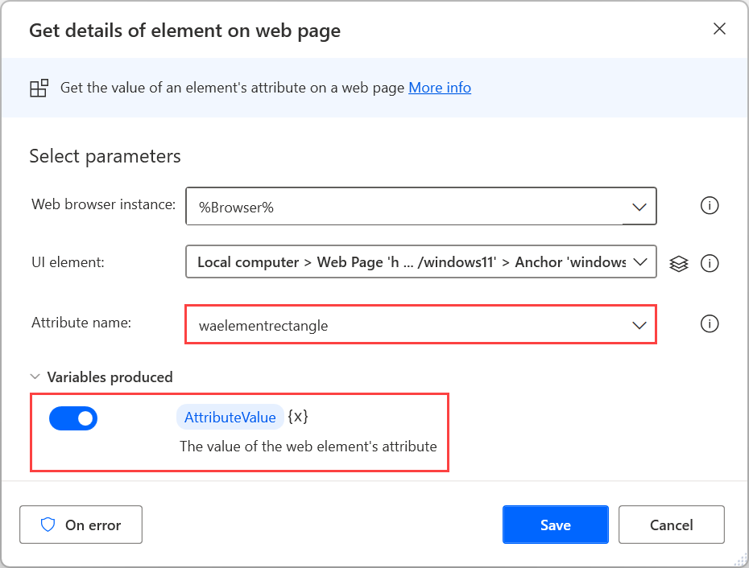
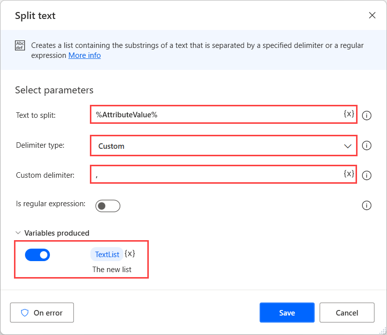
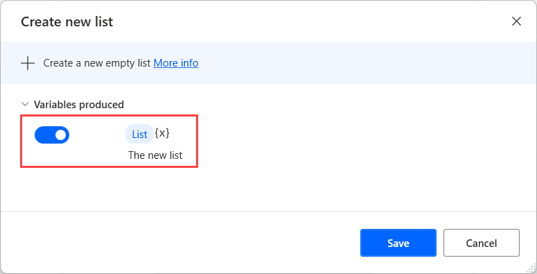
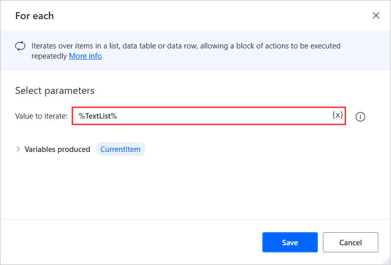
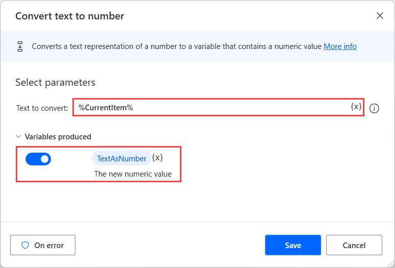
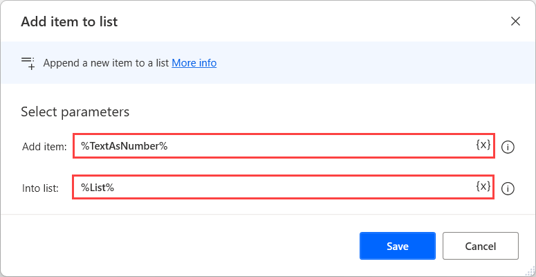
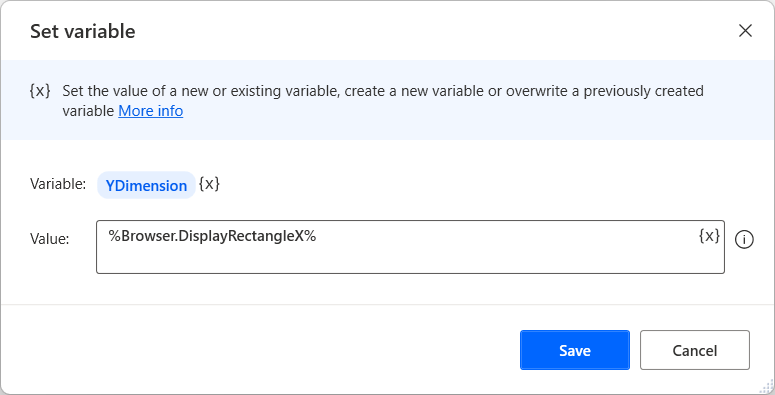

# Get the coordinates and size of a web element

When you automate web applications and web pages, you may need to know the exact location and size of a specific element. 

To retrieve this information, create a browser instance and deploy the **Get details of element on web page** action. In the action's properties, set the **Attribute name** option to **waelementrectangle**. The action stores the retrieved values in a text variable named **AttributeValue**.

> [!NOTE]
> The **Get details of element on web page** action requires a UI element that specifies the web element from which it will retrieve the selected attrubite. You can find more information regarding UI elements in [Automate using UI elements](../ui-elements.md).

After retrieving the **AttributeValue** text value, you have to split it into separate values and convert them to numbers.

To split the text value, deploy the **Split text** action and separate the values using the comma character (**,**) as a delimiter. The separated values are stored in a list variable named **TextList**.

Before converting the texts to numbers, use the **Create new list** action to create a list that will store the converted numbers in the following steps.

To access each item of the **TextList** independently,  deploy a **For each** loop.

Inside the loop, use a **Convert text to number** action to convert the current text item of the loop to number.

Next, use the **Add item to list** action to store the produced number to the previously created list.

To access the final coordinates and size values later in your flow, use the following notations:

- **List[0]** - The left point of the web element, relative to the top left corner of the HTML page
- **List[1]** - The top point of the web element, relative to the top left corner of the HTML page
- **List[2]** - The width of the web element
- **List[3]** - the height of the web element

To calculate the right and bottom points of the window, you can use the following expressions:

- **%List[0] + List[2]%** - The right point of the web element
- **%List[1] + List[3]%** - The bottom point of the web element

> [!NOTE]
> You can find more information about lists and the **VariableName\[ItemNumber\]** notation in [Variable datatypes](../variable-data-types.md).

To find the coordinates of the top left corner of an HTML page, you can use the web browser's instance properties **DisplayRectangleX** and **DisplayRectangleY**.

After storing a browser's instance into a variable named **%Browser%**, use the **%Browser.DisplayRectangleX%** and **%Browser.DisplayRectangleY%** expressions to retrieve the X and Y dimensions.

Additionally, you can retrieve the coordinates specifying the center of a web element using the **waelementcentercoords** attribute in the **Get details of element on web page** action.
