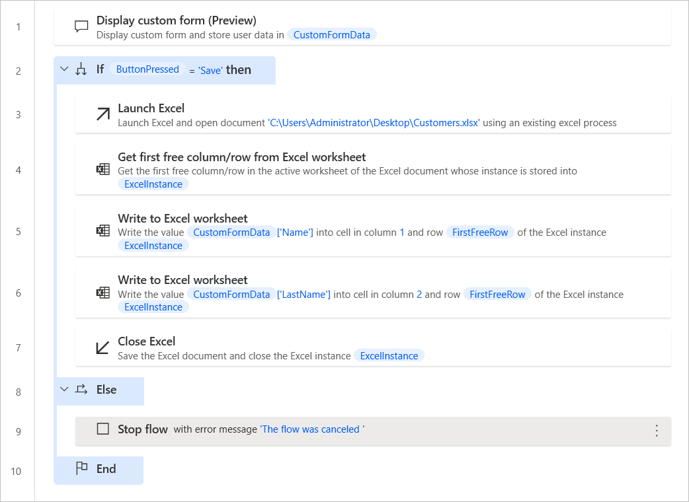

# Handle custom forms

After [creating a custom form](../custom-forms.md), it's typical to check which button is pressed and handle the gathered data accordingly.

To become familiar with this functionality, create a new custom form  containing the following elements:

- A text input with ID **Name** that stores the name of a customer 
- A text input with ID **LastName** that stores the last name of a customer 
- A submit action with ID **Save**
- A submit action with ID **Cancel** and the option **Ignore provided inputs** enabled. 

The purpose of the flow is to check which form action is pressed. When the **Save** action is pressed, the flow stores the gathered data into an Excel spreadsheet. When the **Cancel** action is pressed, the flow stops and returns an error. 

To implement this behaviour:

1. Deploy an **If** action and check whether the **ButtonPressed** variable contains the value **Save**.

    

1. Inside the if block, launch an Excel spreadsheet. For this example, the spreadsheet must contain two columns for the name and last name of the customer.

    

1. Use a **Get first free column/row from Excel worksheet** action to find the first available row in the spreadsheet.

    

1. Deploy a **Write to Excel worksheet** action and write the customer's name in the first column of the first available spreadsheet row. 

    All the form inputs are stored in the **CustomFormData** custom object variable. To access the value of a specific element of the custom object, use the following notation: **%CustomFormData['ElementID']%**.

    > [!NOTE]
    > You can find more information regarding custom objects in [Advanced data types](../variable-data-types.md#advanced-data-types)

    

1. Use a second **Write to Excel worksheet** action to write the customer's last name in the second column of the first available spreadsheet row.

    

1. Save and close the Excel file using the **Close Excel** action.

    

1. Add an **Else** action inside the if block and use a **Stop flow** action to stop the flow when the if statement is false. 

    

1. When running the desktop flow, the displayed form will be similar to the one presented in the following screenshot:

    
