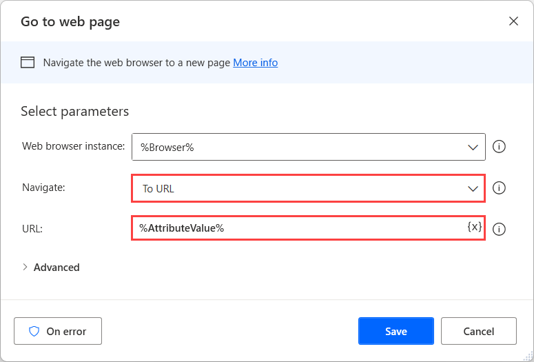

# Handle iframes on a web page

Iframes are HTML documents embedded inside other HTML documents. These elements are often used to insert content from external sources into web pages.

When an iframe belongs to the same domain as the original page, you can use the browser automation actions to automate it. You can find more information about browser automation in [Automate web flows](..\automation-web.md).

If the browser automation actions don't work correctly with a particular iframe, you can use the UI automation actions to handle it. You can find more information about UI automation in [Automate desktop flows](..\desktop-automation.md).

If an iframe is cross-domain, deploy the **Get details of element on web page** to retrieve the **Source Link** attribute of the element.

Next, use the **Go to web page** action or the **Create new tab** action to navigate to the retrieved source. Now, you can use the browser automation actions to interact with the iframe.

