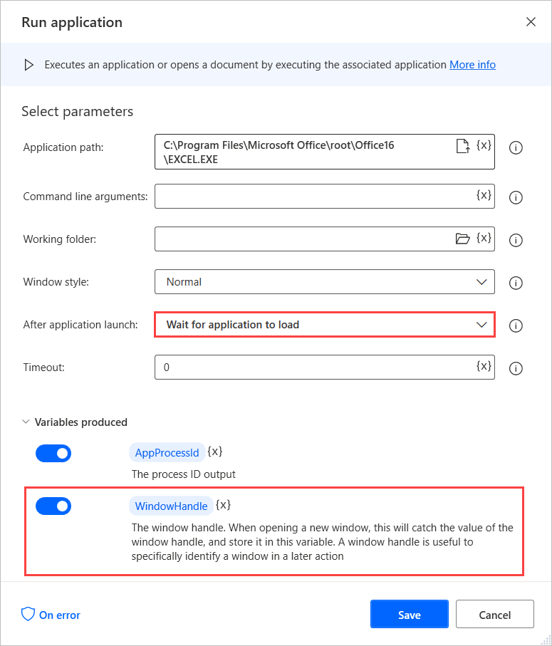
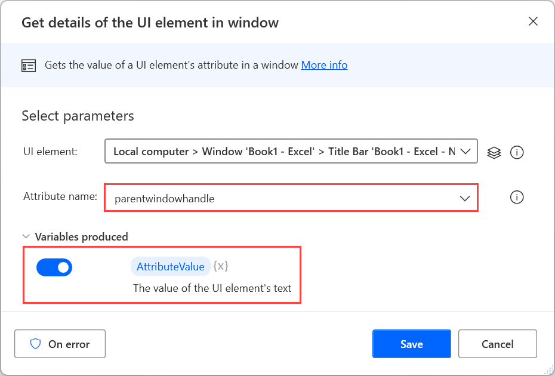

# Identify a window by its handle

It's common in flow development to create flows that use several windows with the same title and class.

Power Automate Desktop enables users to distinguish identical windows using handles. Handles are numbers that uniquely identify each window.

To retrieve the handle of a window, launch the application with the **Run application** action and set the **After application launch** drop-down menu to **Wait for application to load**. The handle is stored by default in a variable named **WindowHandle**.

Alternatively, you can use the **Get details of a UI element in window** action to retrieve the handle from an already open window. 

Select to retrieve the attribute **parentwindowhandle** from a random element within the window. The retrieved attribute is stored by default in a variable named **AttributeValue**.

> [!NOTE]
> The **Get details of a UI element in window** action requires a UI element that specifies the selected element in the window. You can find more information regarding UI elements in [Automate using UI elements](../ui-elements.md).

You can use handles to manipulate windows through the following Windows actions of the UI automation group:
- [Focus window](../actions-reference/uiautomation.md#focuswindowbase)
- [Set window state](../actions-reference/uiautomation.md#setwindowstatebase)
- [Set window visibility](../actions-reference/uiautomation.md#setwindowvisibilitybase)
- [Move window](../actions-reference/uiautomation.md#movewindowbase)
- [Resize window](../actions-reference/uiautomation.md#resizewindowbase)
- [Close window](../actions-reference/uiautomation.md#closewindowbase)

