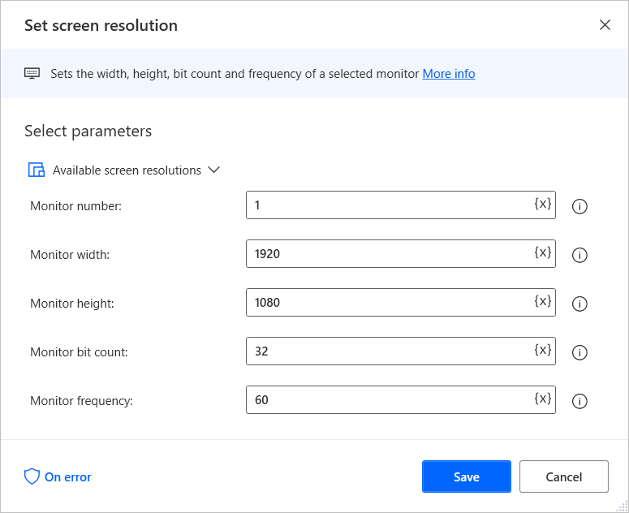

# Use image recognition on machines with different screen resolutions

When you capture images in Power Automate, the stored images are affected by the source machine's screen resolution and DPI scaling.

In cases where flows perform image recognition on different screens or machines, you must ensure that all the screens have the exact screen resolution.

To achieve this functionality, you can use the **Set screen resolution** action to change the screen resolution of the target machines.

The new resolution has to be the same as the source machine from which the image was captured. To find the resolution of the source machine, use a temporary **Get screen resolution** action or check the Windows display settings.

> [!Important]
>To use the **Set screen resolution** action in flows triggered through the Power Automate portal, you have to be connected to the console session of your machine, where you can manually change the screen resolution. For example, you can use your machine's physical screen to connect to the machine. In remote sessions, such as unattended scenarios that use remote desktop clients, the action has no effect, as users can't manually change the resolution.

> [!NOTE]
> Before using image recognition, ensure that DPI scaling stays the same among the screens. The use of varying DPI scalings may cause the flow to fail.

If you want to roll back to the original resolution later in the flow, add a **Get screen resolution** before the **Set screen resolution** action.

When all the image recognition procedures are completed, use the retrieved values and a second **Set screen resolution** action to set the screen back to the original resolution.

