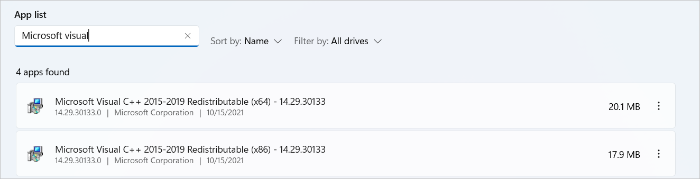

# Automate Java applications

## Installing Java configuration

In order to automate Java applications, particular settings must be in place. 

To install the Java configuration manually, after Power Automate for desktop has been installed, navigate to the installation folder (**C:\Program Files (x86)\Power Automate**) and run the **PAD.Java.Installer.exe** as an administrator. 

Logs for Java automation with Power Automate for desktop can be found in the **%temp%/ java_automation_log** folder (e.g. **C:\Users\username\AppData\Local\Temp\java_automation_log**). 

## Uninstalling Java configuration

To uninstall the Java configuration (revert all changes applied to the machine by the Java installer): 

1. Launch the Command Line tool (cmd) 

1. Run the following command: 

    ``` CMD
    PAD.Java.Installer.exe -u 
    ```

## Troubleshooting 

If you come across any issues while automating Java applications:

1. Make sure that you have Java installed on your machine:

    - Open the Command Line tool (cmd) and run the following command: 

      ``` CMD
      java –version
      ```

    - If Java isn't installed on your machine, you'll receive an error message similar to: **'java' is not recognized as an internal or external command, operable program or batch file.**

1. The Java Access Bridge option from the Control Panel should be disabled: 

    Navigate to **Control Panel -> Ease of Access -> Optimize visual display -> Java Access Bridge from Oracle, Inc. Providing Assistive Technology access to Java applications** and disable (uncheck) the **Enable Java Access Bridge** option. 

    

1. Specific files have to exist in the Java folder(s) of the machine after the Power Automate for desktop installation.  

    To check the installed Java version and installation path on your machine: 

      1. Type **Configure Java** in the Search bar of Windows 

      1. Launch the Java Control Panel 

      1. Navigate to the **Java** tab and select **View**

          

      1. Check the values in the **Path** column. The row with **Architecture** equal to **x86** refers to a 32-bit Java installation, while the row with value **x86x64** refers to a 64-bit Java installation. 

                

    Additionally, you can check the following files: 

    For 64-bit Java installation: 

    - File **Microsoft.Flow.RPA.Desktop.UIAutomation.Java.Bridge.Native.dll** should have been replaced in the folder **C:\Program Files\Java\jre1.8.0_271\bin**. (**jre1.8.0_271** could be replaced with your machine’s Java installation) 

    - File **accessibility.properties** should have been replaced in the folder **C:\Program Files\Java\jre1.8.0_271\lib**. (**jre1.8.0_271** could be replaced with your machine’s Java installation) 

      If you edit the file with a notepad, it should have the following value: **assistive_technologies=com.sun.java.accessibility.AccessBridge, microsoft.flows.rpa.desktop.uiautomation.JavaBridge** 

    - File **PAD.JavaBridge.jar** should have been inserted in the folder **C:\Program Files\Java\jre1.8.0_271\lib\ext**. (**jre1.8.0_271** could be replaced with your machine’s Java installation) 

    For 32-bit Java installation: 

    - Same actions for the same files as above but in the folder path **C:\Program Files (x86) \Java\…**. 

1. Make sure that there isn't an **.accessibility.properties** file present in your user folder. Check if a file named **.accessibility.properties** is present in the **C:\Users\user** folder. If yes, then rename it. 

1. Ensure that **VC_redist.x64.exe** and/or **VC_redist.x86.exe** have been run.  

       