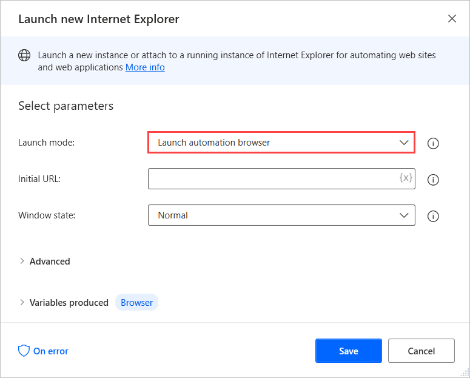
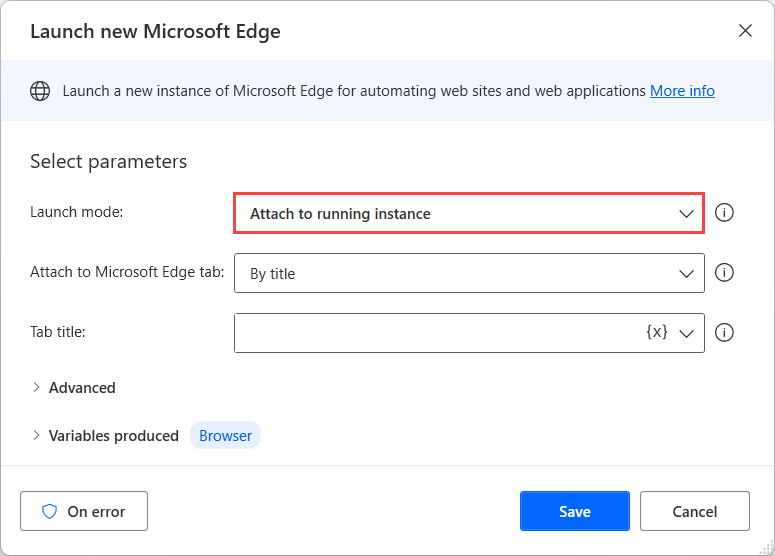

# Handle links that open new tabs

Desktop flows use browser instances to pinpoint specific web pages located in specific tabs on browser windows. 

If a flow clicks a link that opens a new tab, you have to apply additional configuration to continue automating inside this new tab.

The most straightforward approach is the use of the embedded automation browser that doesn't support tabs. It opens all the links in the same instance.

> [!NOTE]
> You can find more information about the features and limitations of the automation browser in [Use browsers and manage extensions](../using-browsers.md).

To navigate back to the previous page, you can use the **Go to web page** action.

If your flow uses Edge, Internet Explorer, Chrome, or Firefox, there are also methods to handle links that open new tabs.

You can retrieve the URL behind the link using the **HRef** option in the **Attribute name** field of the **Get details of element on web page** action. Then, you can navigate to the retrieved link in the same tab using the **Go to web page** action.

If the link is in JavaScript, you can retrieve the JavaScript function and run it as a URL in the **Go to web page** action. In this case, you should enter **JavaScript:** and the function to run.

Another approach is to click the link and then use the **Attach to running instance** option of the previously mentioned browsers to attach your flow to the newly created tab.

