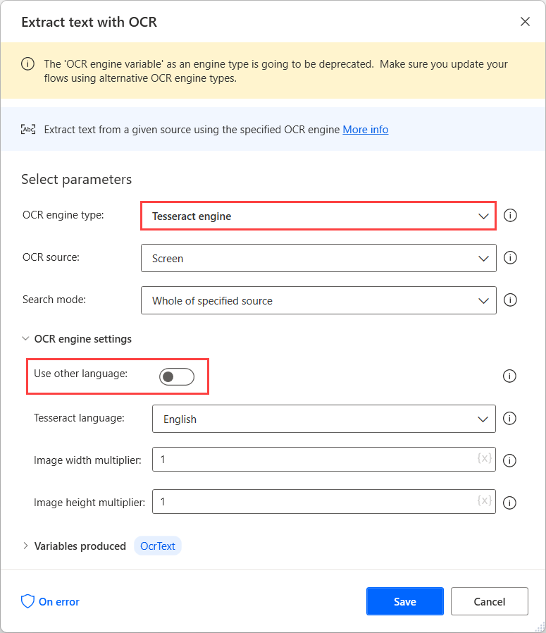
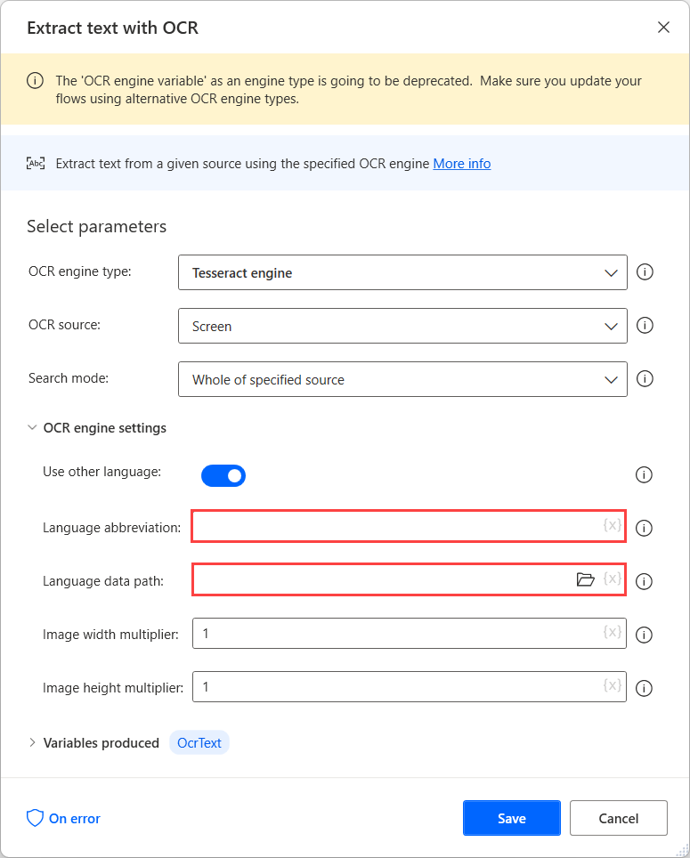
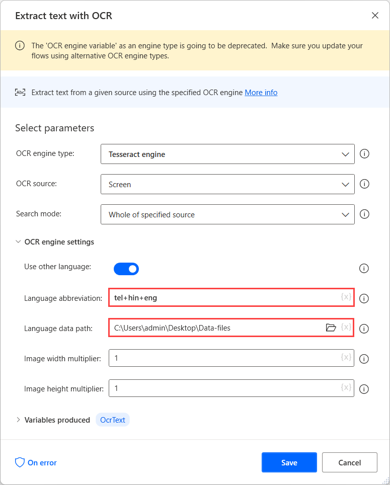

# Perform OCR on multilingual documents

Optical character recognition (OCR) enables you to locate and extract text from images or the screen.

Although most scenarios require you to handle text in a specific language, there are cases where the sources are multilingual.

To perform OCR on these sources, use a Tesseract engine in the respective OCR action and enable the **Use other languages** option in the engine settings.

When the **Use other languages** option is enabled, the action displays two additional settings: the **Language abbreviation** and **Language data path** fields.

The **Language abbreviation** field indicates to the engine which language to look for during OCR. 
The **Language data path** field contains the language data files (**.traineddata**) used to train the OCR engine.

After downloading the data files for the needed languages, move them to a common folder to make them available under the same path.

Next, select the created folder in the **Language data path** field, and populate the corresponding language codes in the **Language abbreviation** field. To separate the language codes, use the plus character (**+**).

> [!NOTE]
> You can find all the available language codes in the source of the language data files. In the following example, the used codes represent Telugu, Hindi, and English.

